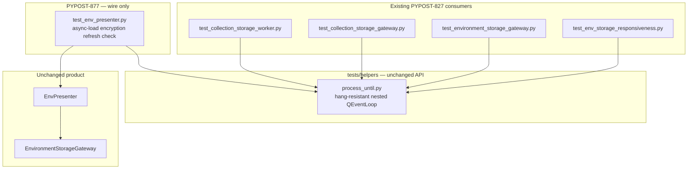

# PYPOST-877: Hang-resistant wait for env-presenter async-load check

## Research

### Problem and scope

- Jira: [PYPOST-877](https://pypost.atlassian.net/browse/PYPOST-877), follow-up from
  [PYPOST-827](https://pypost.atlassian.net/browse/PYPOST-827).
- Requirements: `ai-tasks/PYPOST-877/10-requirements.md`.
- Debt source: `ai-tasks/PYPOST-827/60-tech-debt.md` — Medium item: env-presenter async-load
  nested wait still timer-only.
- Target check (locate only; name not a design mandate):
  `tests/test_env_presenter.py::test_async_load_refreshes_combo_when_encryption_enabled`.

After PYPOST-823/827, hang-resistant nested waits live in shared
`tests/helpers/process_until.py` and are consumed by responsiveness plus three
gateway/worker siblings. One related check remains on the old pattern: the
environment-presenter test that async load with encryption refreshes the combo.

### Current nested wait (unsafe)

In `TestEnvPresenter.test_async_load_refreshes_combo_when_encryption_enabled`
(approx. lines 597–620):

1. Enable encryption on settings, connect `environments_loaded`, call
   `load_environments()`.
2. Nested `QEventLoop` + 10 ms `QTimer` that quits **only** when `loaded` is
   truthy — no wall-clock deadline, no posted quit, no `AssertionError` on
   timeout.
3. Then assert load signal once and environment list contents
   (`environment_count() == 2`, display name `"Production"`).

Hang class (same as pre-PYPOST-823/827 siblings):

1. Quit path runs only from a `QTimer` slot.
2. If timer slots stop delivering Python callbacks, `exec()` stays in Qt C++.
3. Module `pytestmark = pytest.mark.timeout(60)` uses SIGALRM (project rule: no
   `method="thread"` for Qt). SIGALRM does not interrupt nested C++ `exec()`
   without periodic return to Python
   ([pytest-timeout](https://github.com/pytest-dev/pytest-timeout)).

### Shared hang-resistant wait (already shipped)

`tests/helpers/process_until.process_until` (PYPOST-823 / PYPOST-827 / PYPOST-828):

1. Nested `QEventLoop.exec()` for queued `QThread` / async signal delivery.
2. Optional 10 ms poll timer: quit when `predicate()` or
   `time.monotonic() >= deadline`.
3. Daemon `threading.Timer` posts `QTimer.singleShot(0, loop, loop.quit)` onto
   the GUI-thread loop so a silent poll timer cannot hang past the deadline.
4. Raises `AssertionError` with neutral timeout text (optional
   `timeout_detail` for gateway diagnostics — out of this task’s DoD).

Hang-regression proofs (keep; do not duplicate unless Step 3 needs a local red):

- `tests/test_env_storage_responsiveness.py::test_process_until_exits_on_wall_clock_deadline`
- `tests/test_env_storage_responsiveness.py::test_process_until_exits_via_posted_quit_without_poll_timer`

Documented contract: `doc/dev/gui_testing.md` § Bounded nested `QEventLoop` waits.

### Why not other waits

| Option | Verdict |
| --- | --- |
| `tests/helpers/qt_wait.wait_until` | ProcessEvents settle; no nested `exec()`. Wrong contract for async load signals that historically need nested loop. |
| New local hang-defense copy | Violates DoD “shared definition / no independently drifting copy”. |
| pytest-qt `waitUntil` / `waitSignal` | Project does not depend on pytest-qt; out of scope vs reusing proven helper. |
| Product `EnvPresenter` change | Not required by default (harness reliability only). |

### External guidance

- [Qt QTimer](https://doc.qt.io/qt-6/qtimer.html) — `singleShot(msec, context, functor)`
  runs on the context object’s thread; matches why posted quit targets the GUI
  `QEventLoop`.
- [Qt QEventLoop](https://doc.qt.io/qt-6/qeventloop.html) — nested `exec()` / `quit()`.
- Nested-loop / timer pitfalls ([Qt Forum: nested event loops](https://forum.qt.io/topic/164910/beware-of-nested-event-loops);
  [pytest-qt #284](https://github.com/pytest-dev/pytest-qt/issues/284)) — reinforce dual-path
  hang defense (poll + cross-thread posted quit), not timer-only `exec()`.
- Project priors: `ai-tasks/PYPOST-827/20-architecture.md`,
  `ai-tasks/PYPOST-823/20-architecture.md`.

### Placement decision

**Chosen: reuse shared helper at the call site (option: wire only).**

No new helper module. No change to `qt_wait.py`. No product presenter/gateway
changes unless Step 3/4 uncover a genuine defect that blocks honest verification.
Module-local `QApplication` via `setUpClass` stays as-is (PYPOST-830).

## Implementation Plan

Test-harness only.

1. **Import** `process_until` from `tests.helpers.process_until` in
   `tests/test_env_presenter.py`.
2. **Replace** the inline `QEventLoop` + `QTimer` block in
   `test_async_load_refreshes_combo_when_encryption_enabled` with:

   ```python
   process_until(lambda: bool(loaded), timeout_ms=5_000)
   ```

   (or equivalent predicate on `len(loaded) >= 1`). Keep existing post-wait
   business assertions unchanged.
3. **Drop** unused `QEventLoop` / `QTimer` imports if nothing else in the module
   needs them (today only this check uses them).
4. **Do not** add `timeout_detail` / gateway diagnostics here (PYPOST-828).
5. **Do not** migrate `setUpClass` `QApplication` to shared `qapp` (PYPOST-830).
6. **Verify** focused: that test method + existing
   `process_until` hang regressions under `QT_QPA_PLATFORM=offscreen`
   (`make test` or focused pytest).
7. **Docs (Step 8):** note env-presenter consumer in
   `doc/dev/gui_testing.md` consumer list (Step 7/8 per roadmap).

### Mandatory — Failing Repro (next Step 3)

Behavioral change: the presenter async-load wait must finish by success or
deadline under timer stall (same contract as PYPOST-823/827). Shared helper
hang proofs already exist and are green; the gap is this **call site** still
using timer-only `exec()`.

**Red test design (write before the wire-up fix):**

| Item | Plan |
| --- | --- |
| What it asserts | Desired hang-resistant behavior for this check’s wait: with a never-true completion condition, the wait ends near a short wall-clock timeout (~300 ms) with a clear failure (`AssertionError` / timeout message), elapsed &lt; ~2 s — including when the poll timer path is disabled / silent. |
| Where it lives | Prefer a focused method next to the target in `tests/test_env_presenter.py` (e.g. `test_async_load_wait_exits_near_deadline_when_never_complete`), so the red proof sits with the unsafe call site. Reuse of responsiveness hang tests alone is **not** sufficient for Step 3 (they already pass against the shared helper and do not exercise this module’s wait). |
| How to force failure without live deps | No network/disk encryption key required: use in-memory `FakeStorage` / existing `_make_presenter` (or a minimal nested-loop wait that mirrors today’s lines 605–616). Force failure by waiting on a never-true predicate (do not emit `environments_loaded` / do not satisfy `loaded`). Do **not** rely on a live timer-stall flake in CI. |
| Why it is red today | Current wait has **no** deadline and **no** posted quit: a never-true `loaded` leaves `loop.exec()` stuck; pytest SIGALRM cannot cut nested C++ `exec()`. The new assertion “exits near 300 ms with AssertionError” fails (hang or module-timeout kill) until the wait uses `process_until`. |
| Sequencing | Research (done) → add red hang-exit test against current timer-only wait (or a local extract of it) → Step 4 replace business wait + red wait with shared `process_until` → red goes green; business assertions on the encryption refresh check stay green. |
| After green | Keep a thin call-site hang proof **only if** it adds presenter-module coverage beyond responsiveness; otherwise delete the temporary extract and rely on shared helper regressions + the wired business check (avoid duplicating PYPOST-823 proofs). Prefer wiring the business check to `process_until` and converting the Step 3 red into a short `process_until(lambda: False, timeout_ms=300)` style proof in this module **or** documenting reliance on existing responsiveness proofs once the call site is wired — Step 4 chooses based on duplication pain. |

Not N/A: this task changes runtime wait behavior of an automated check (hang → finishing fail/pass).

## Architecture

### Module diagram



### Module responsibilities

| Module | Responsibility |
| --- | --- |
| `tests/helpers/process_until.py` | Unchanged shared hang-resistant wait (single definition). |
| `tests/test_env_presenter.py` | Wire async-load encryption refresh check to `process_until`; keep business assertions; remove timer-only nested wait. |
| Responsiveness hang regressions | Remain the canonical proof of wall-clock + posted-quit for the helper. |
| `EnvPresenter` / encryption / gateway | Unchanged by intent. |

### Interaction scheme

1. Test enables encryption, starts `load_environments()`, tracks `environments_loaded`.
2. Test calls shared `process_until(lambda: bool(loaded), timeout_ms=...)`.
3. Helper pumps nested `exec()`; poll timer and/or load signal satisfy the predicate.
4. If timers stall, daemon posted quit ends `exec()` at the wall-clock deadline.
5. Helper asserts predicate (timeout → clear `AssertionError`); test runs existing
   combo/list assertions.
6. Suite never depends on timer-only quit for this check.

### Patterns

- **Reuse Shared Helper** — no second hang-defense implementation (DoD).
- **Dual-deadline nested wait** — wall-clock + poll + posted quit (proven PYPOST-823).
- **Call-site port** — architecture is a consumer rewire, not a new abstraction.
- **Test harness isolation** — helper stays under `tests/helpers/`; product untouched.
- **Separation of wait strategies** — still do not merge with `qt_wait.wait_until`.

### Main interfaces

No new public API. Consumer sketch:

```python
from tests.helpers.process_until import process_until

# was: QEventLoop + QTimer polling `if loaded: loop.quit()` then bare loop.exec()
process_until(lambda: bool(loaded), timeout_ms=5_000)

self.assertEqual(len(loaded), 1)
self.assertEqual(p.environment_count(), 2)
self.assertEqual(p.environment_display_name_at(1), "Production")
```

Defaults: **5000 ms** matches sibling gateway waits and is enough for this
in-memory/fake-storage async path. Omit `timeout_detail` (presenter list refresh,
not gateway busy/pending diagnostics).

### Out of architecture scope (separate tickets)

- Richer timeout diagnostics — [PYPOST-828](https://pypost.atlassian.net/browse/PYPOST-828).
- Production worker lifecycle hygiene — [PYPOST-829](https://pypost.atlassian.net/browse/PYPOST-829).
- Align `test_env_presenter.py` onto shared `qapp` fixture —
  [PYPOST-830](https://pypost.atlassian.net/browse/PYPOST-830).

## Q&A

- Q: Extract another helper or only wire the call site?
  A: **Wire only.** Shared `process_until` already exists from PYPOST-827.
- Q: Must hang-regression tests move into `test_env_presenter.py`?
  A: No. Step 3 needs a red proof that this call site’s wait is unsafe until
  ported; after green, prefer not duplicating responsiveness proofs permanently.
- Q: Why not switch this check to `wait_until` / processEvents?
  A: Equivalence to PYPOST-823/827 requires nested-loop + posted-quit hang defense;
  requirements mandate the shared hang-resistant wait (or same contract).
- Q: Product `EnvPresenter` changes?
  A: None by default. Harness-only unless a real defect blocks honest verification.
- Q: `timeout_detail` for this wait?
  A: Out of scope (PYPOST-828). Default timeout message is enough.
- Q: Links used?
  A:
  - [Qt QTimer](https://doc.qt.io/qt-6/qtimer.html)
  - [Qt QEventLoop](https://doc.qt.io/qt-6/qeventloop.html)
  - [pytest-timeout](https://github.com/pytest-dev/pytest-timeout)
  - [Qt Forum: nested event loops](https://forum.qt.io/topic/164910/beware-of-nested-event-loops)
  - [pytest-qt #284](https://github.com/pytest-dev/pytest-qt/issues/284)
  - Project: `doc/dev/gui_testing.md`, `tests/helpers/process_until.py`,
    `ai-tasks/PYPOST-827/20-architecture.md`, `ai-tasks/PYPOST-877/10-requirements.md`
