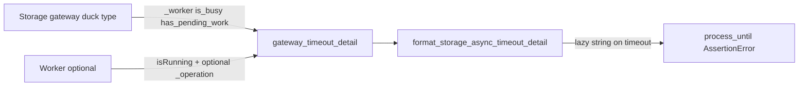

# PYPOST-878: Wire worker_operation into env gateway timeout detail

## Research

### Current state (codebase)

- `format_storage_async_timeout_detail` in `tests/helpers/process_until.py`
  already accepts `worker_operation: str | None` and appends
  `worker_operation=…` when not `None` (PYPOST-828).
- `gateway_timeout_detail(gateway)` reads `is_busy`, `has_pending_work`, and
  `worker.isRunning()`, but **does not** pass `worker_operation`.
- `EnvironmentStorageWorker` sets `self._operation` to `"load"` or `"save"`.
- `CollectionStorageWorker` has no `_operation` attribute (load-only).
- Focused coverage lives in `tests/test_process_until_diagnostics.py`; the
  fake gateway worker used there has no `_operation`, so the omission is not
  currently asserted as a regression for env wiring.

### Design choice

Prefer reading `getattr(worker, "_operation", None)` inside
`gateway_timeout_detail` over adding a public accessor on env workers:

- Matches the existing private `_worker` duck-typed snapshot (accepted in
  PYPOST-828 debt notes).
- Collection workers naturally omit the field (no attribute → `None` → omit).
- Keeps the change to one helper (~few LOC) with no product API surface.

### Alternatives considered

| Option | Pros | Cons |
| --- | --- | --- |
| `getattr(worker, "_operation", None)` | Minimal; collection-safe | Relies on private attr |
| Public `operation` property on env worker | Cleaner API | Extra product change for harness-only need |
| Env-only wrapper helper | Explicit | Duplicates gateway snapshot; call sites must switch |

Selected: duck-typed `getattr` in `gateway_timeout_detail`.

## Implementation Plan

1. Extend focused unit tests so a fake env-style worker with `_operation`
   produces `worker_operation=load` / `worker_operation=save` in
   `gateway_timeout_detail()` output; assert a worker without `_operation`
   still omits the field.
2. Confirm the new assert is **red** on current code (Step 3).
3. Wire `worker_operation` from the gateway worker into
   `format_storage_async_timeout_detail` inside `gateway_timeout_detail`
   (Step 4; ≤100 LOC).
4. Lint/format; document observability (diagnostic text only); update
   `doc/dev/gui_testing.md` (and env async notes if needed).

**Failing Repro (Step 3):** Not N/A — behavioral harness change.

- **File:** extend `tests/test_process_until_diagnostics.py` (module already
  has `pytestmark = pytest.mark.timeout(30)`).
- **Assert:** `gateway_timeout_detail` on a fake gateway whose `_worker` has
  `_operation="save"` (and `isRunning() -> True`) returns a string containing
  `worker_operation=save` alongside existing busy/pending/worker_running.
- **Also assert:** worker without `_operation` omits `worker_operation=`
  (collection-style).
- **Force without live deps:** pure fakes; no Qt storage I/O required for the
  detail callable itself.
- **Sequencing:** research → red test → wire getattr → green → cleanup/docs.

## Architecture



### Modules

| Module | Responsibility |
| --- | --- |
| `tests/helpers/process_until.py` | Pass `worker_operation` when worker exposes `_operation` |
| `tests/test_process_until_diagnostics.py` | Regression for env include / collection omit |
| Env / collection workers | Unchanged; env already has `_operation` |

### Patterns

- **Duck typing** for gateway/worker snapshot (existing).
- **Omit-None** formatting (existing); new field follows same rule.
- **No product behavior change** — harness diagnostics only.

### Interfaces

```python
def gateway_timeout_detail(gateway: _StorageAsyncGateway) -> Callable[[], str]:
    # detail() includes worker_operation=... when
    # getattr(gateway._worker, "_operation", None) is not None
```

## Q&A

| Q | A |
| --- | --- |
| Touch product workers? | No — read existing env `_operation`. |
| Collection regression? | Assert omit when attribute missing. |
| Docs? | Update `gui_testing.md` example failure text in Step 8. |
