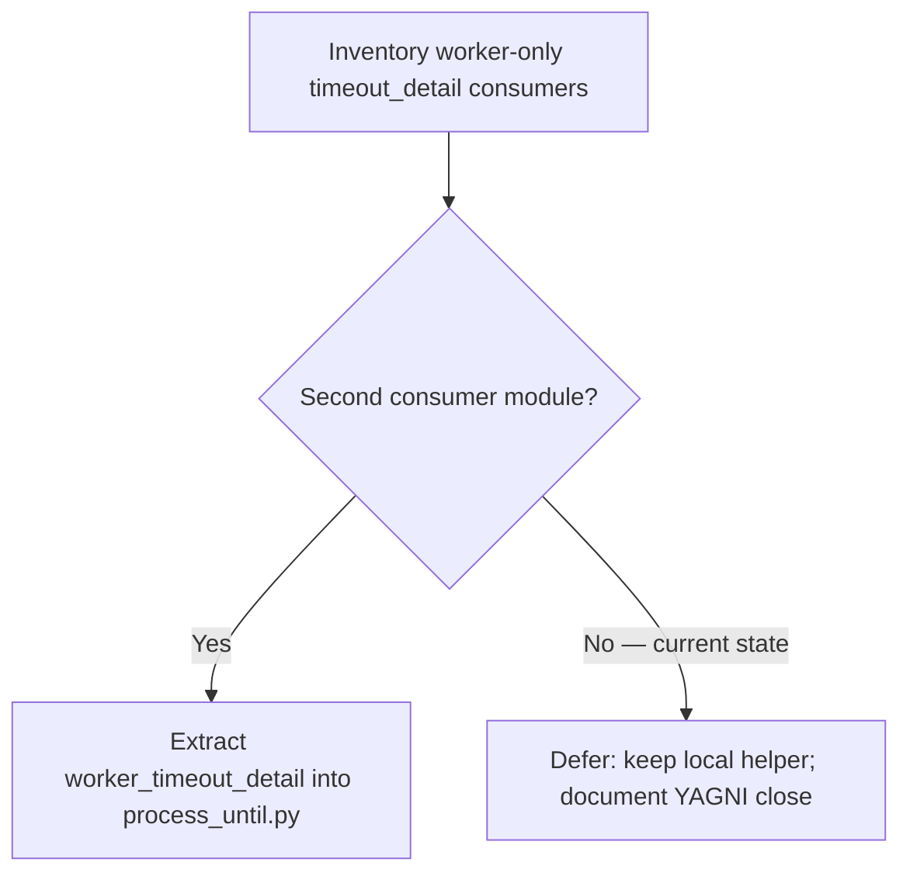

# PYPOST-879: Optional shared worker timeout detail helper

## Research

### Origin and requirements

- Jira: [PYPOST-879](https://pypost.atlassian.net/browse/PYPOST-879), Lowest
  Debt (1 SP), from [PYPOST-828](https://pypost.atlassian.net/browse/PYPOST-828)
  TD-2 (`ai-tasks/PYPOST-828/60-tech-debt.md`).
- Requirements: `ai-tasks/PYPOST-879/10-requirements.md`.
- Ticket guidance: extract local `_worker_timeout_detail` into
  `tests/helpers/process_until.py` **only if** a second worker-only consumer
  appears; otherwise valid path is YAGNI deferral with inventory evidence.

### Inventory (architecture time, 2026-07-22)

| Location | Pattern | Consumer? |
| --- | --- | --- |
| `tests/test_collection_storage_worker.py` | Local `_worker_timeout_detail` used by 2 waits | **Yes — sole worker-only consumer** |
| Gateway / env / H3 / probe modules | `gateway_timeout_detail(gateway)` | Gateway path (already shared) |
| `tests/helpers/process_until.py` | `gateway_timeout_detail`, formatter | Shared helpers; **no** `worker_timeout_detail` |
| Other worker modules | No local `*_timeout_detail` helper | None |

Search evidence:

- Definition of `_worker_timeout_detail`: only in
  `tests/test_collection_storage_worker.py`.
- Call sites of that helper: two waits in the **same** module (load finished /
  load failed).
- No second module defines or imports a worker-only timeout-detail helper.

### YAGNI / extraction criteria

From ticket + requirements:

- **Extract** when ≥2 distinct worker-only consumer modules need the same
  `worker_running=` lazy detail shape.
- **Defer** when still a single consumer module (two call sites in one file
  do not qualify).

### Related shared API (leave unchanged)

`tests/helpers/process_until.py` already exposes:

- `format_storage_async_timeout_detail(...)` — used by the local helper
- `gateway_timeout_detail(gateway)` — gateway busy/pending/worker snapshot

Extracting a thin `worker_timeout_detail(worker)` wrapper would duplicate
almost nothing beyond the local five-line helper unless another consumer
appears.

### External / project guidance

- Prefer colocation until reuse is proven (same spirit as PYPOST-699 empty
  `utils/` removal and PYPOST-828 leaving the local helper intentionally).
- Shared gateway helper was extracted only after **multiple** gateway modules
  duplicated the same closure (PYPOST-828 cleanup).

## Implementation Plan

**Selected path: defer extraction (YAGNI).**

1. Record inventory evidence in architecture + tech-debt artifacts.
2. Step 3: **N/A — no behavioral change** (no red test; decision is process /
   documentation).
3. Step 4: no harness refactor; roadmap records defer decision.
4. Steps 5–7: cleanup/observability N/A notes; SAFE TO CLOSE verdict.
5. Step 8: brief note in `doc/dev/gui_testing.md` that worker-only detail stays
   local until a second consumer appears (revisit then).

**Alternate path (not taken):** If inventory had found a second worker-only
consumer, extract `worker_timeout_detail` next to `gateway_timeout_detail`,
update both consumers, and add a small unit assert in
`tests/test_process_until_diagnostics.py`.

**Mandatory — Failing Repro (next Step 3):**
`N/A — no behavioral change` — YAGNI deferral documents decision only; no
runtime acceptance behavior is being added or fixed.

## Architecture

### Decision diagram

### Module responsibilities (unchanged)

| Module | Responsibility |
| --- | --- |
| `tests/helpers/process_until.py` | Shared waits + `gateway_timeout_detail` |
| `tests/test_collection_storage_worker.py` | Local `_worker_timeout_detail` (single consumer) |
| Product workers / gateways | Unchanged |

### Selected patterns and justification

| Pattern | Choice | Why |
| --- | --- | --- |
| Shared worker helper | **Not extracted** | Single consumer; YAGNI |
| Local helper | Keep | Same shape as PYPOST-828 intentional leave |
| Gateway helper | Unchanged | Already multi-consumer |
| Docs | Note deferral trigger | Future extract when demand appears |

### Explicit non-goals

- Do not invent a second consumer to justify extraction.
- Do not change `gateway_timeout_detail` or product code.
- Do not reticket this deferral unless a second consumer appears later.

## Q&A

- Q: Why is Step 3 N/A?
  A: Closing as YAGNI deferral adds no runtime behavior; an inventory document
  cannot meaningfully go red/green.
- Q: When should this be reopened?
  A: When another worker-only test module needs the same lazy
  `worker_running=` detail and would otherwise copy the local helper.
- Q: Links / sources?
  A: PYPOST-828 TD-2; `ai-tasks/PYPOST-828/60-tech-debt.md`; ticket PYPOST-879.
