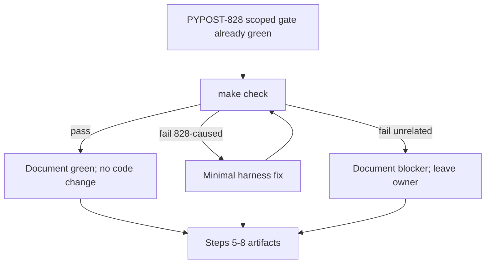

# PYPOST-880: Re-run full make check after harness timeout diagnostics

## Research

### Current state

- PYPOST-828 landed richer `process_until` timeout diagnostics
  (`timeout_detail`, `format_storage_async_timeout_detail`,
  `gateway_timeout_detail`) under `tests/helpers/process_until.py`, with
  focused coverage in `tests/test_process_until_diagnostics.py` and consumer
  wiring in storage-async / hang-wait tests.
- Step 4 of PYPOST-828 used a **scoped gate**: `make lint` + focused
  helper/consumer tests (28 passed). Full `make check` was deferred as TD-3
  → this ticket ([PYPOST-880](https://pypost.atlassian.net/browse/PYPOST-880)).
- Sibling harness polish (PYPOST-877 hang-resistant env-presenter wait,
  PYPOST-878 `worker_operation` wiring) is already on the branch history;
  this ticket does not re-implement those.
- Default quality gate (`Makefile`): `make check` → `lint` + `test` +
  `verify-ai-tasks`.

### Design choice

Treat this as a **verification / quality-gate** task:

1. Run full `make check`.
2. If green → document pass; no production/harness code change required.
3. If red with failures attributable to PYPOST-828 harness diagnostics →
   minimal fix only for those regressions; re-run until green or document
   remaining unrelated blockers.
4. Do **not** expand into unrelated suite noise, flaky siblings, or other
   Debt tickets.

### Alternatives considered

| Option | Pros | Cons |
| --- | --- | --- |
| Scoped gate only (status quo) | Fast | Leaves TD-3 open; no sibling confidence |
| Full `make check` + fix 828-caused only | Matches DoD; bounded scope | May hit unrelated noise (document, don't expand) |
| Full suite cleanup of all failures | Greenest tree | Out of scope for Low SP:2 Debt |

Selected: full `make check` with narrow regression fixes only.

## Implementation Plan

1. Confirm Step 3 N/A (no new runtime behavior; gate is the verification).
2. Run `make check` (Step 4).
3. Classify failures:
   - **828-caused harness regression** → fix narrowly, re-run.
   - **Unrelated / pre-existing / sibling noise** → document in
     `60-tech-debt.md`; do not expand scope.
4. Cleanup / observability / review / docs reflecting verification outcome.

**Failing Repro (Step 3):** `N/A — no behavioral change`.

Justification: this Debt item does not add product or harness features. The
acceptance behavior is “full quality gate passes (or blockers documented).”
If `make check` fails for a regression caused by PYPOST-828, that red suite
outcome **is** the repro evidence for Step 4; no separate new unit test is
written solely to fail. If the gate is green, there is nothing to turn red
first.

## Architecture



### Modules

| Module | Responsibility |
| --- | --- |
| `Makefile` `check` | Lint + fast tests + verify-ai-tasks |
| `tests/helpers/process_until.py` | Touch only if 828 regression found |
| `tests/test_process_until_diagnostics.py` | Confirm still green after gate |
| `ai-tasks/PYPOST-880/*` | Record plan, gate result, debt |

### Patterns

- **Verification-first** — no speculative code edits before gate evidence.
- **Narrow blast radius** — fix only 828-attributable failures.
- **Document blockers** — sibling noise does not expand scope.

### Interfaces

No new APIs. Gate command:

```text
make check
```

## Q&A

| Q | A |
| --- | --- |
| New red unit test? | N/A unless architecture revisits after a clear 828 regression needing a permanent assert. |
| Touch product `pypost/`? | Only if a proven 828-caused failure requires it (unexpected). |
| Docs? | Note verification outcome in `doc/dev` if useful; otherwise task-folder artifacts suffice. |
