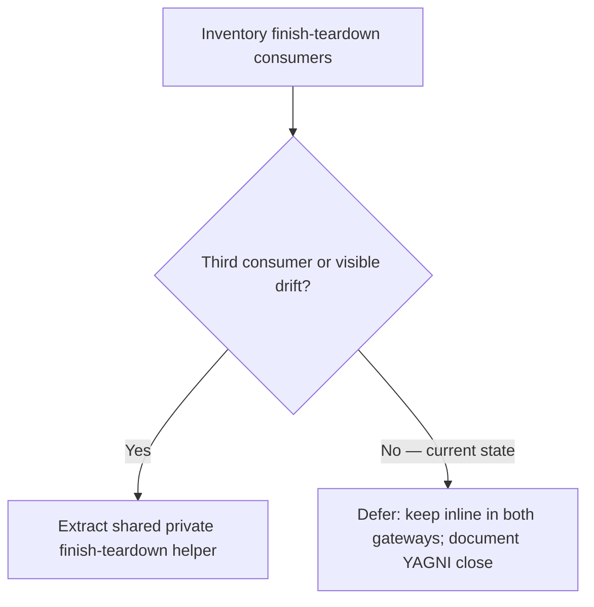

# PYPOST-881: Optional shared finish-teardown helper for storage gateways

## Research

### Origin and requirements

- Jira: [PYPOST-881](https://pypost.atlassian.net/browse/PYPOST-881), Lowest
  Debt (2 SP), from [PYPOST-829](https://pypost.atlassian.net/browse/PYPOST-829)
  TD-1 (`ai-tasks/PYPOST-829/60-tech-debt.md`).
- Requirements: `ai-tasks/PYPOST-881/10-requirements.md`.
- Ticket guidance: optional shared private helper — extract only if a **third**
  consumer appears or drift becomes likely; not required for DoD of
  PYPOST-829. Prefer YAGNI deferral unless drift already visible.

### Inventory (architecture time, 2026-07-22)

| Location | Pattern | Consumer? |
| --- | --- | --- |
| `pypost/core/qt/environment_storage_gateway.py` | Module `_WORKER_FINISH_WAIT_MS = 100`; `_on_worker_finished` capture → clear → `deleteLater` → `wait` → WARNING → pending save/load | **Yes** |
| `pypost/core/qt/collection_storage_gateway.py` | Same constant + same teardown order → WARNING → pending load | **Yes** |
| Other `pypost/` modules | No `_WORKER_FINISH_WAIT_MS`; tabs/code_editor use `finished.connect(deleteLater)` without this ordered finish-slot pattern | **No** |

Search evidence (`_WORKER_FINISH_WAIT_MS`, finish-slot `deleteLater` + short
`wait`):

- Constant definitions: **exactly two** (env + collection gateways).
- Ordered finish-slot consumers: **exactly two** (same modules).
- No third storage gateway or shared private helper module today.

### Drift check (same date)

| Aspect | Env gateway | Collection gateway | Drift? |
| --- | --- | --- | --- |
| Wait bound | 100 ms | 100 ms | No |
| Order | capture → clear → deleteLater → wait → WARNING → pending | Same | No |
| WARNING fields | `wait_ms`, `pending_save`, `pending_load` | `wait_ms`, `pending_load` | Intentional (different pending model) |
| Pending restart | save then load | load only | Intentional |

Sequences remain the symmetric pair landed by PYPOST-829. Differences are
domain pending models / log names, not divergent teardown hygiene.

### YAGNI / extraction criteria

From ticket + requirements:

- **Extract** when a **third** distinct consumer needs the same ordered
  finish-slot teardown, **or** when the two gateways’ teardown sequences /
  wait bounds have visibly drifted (or a change is about to touch only one).
- **Defer** when still only the two gateways and sequences remain aligned.

### Related patterns (leave unchanged)

- Tabs / code_editor: `finished.connect(worker.deleteLater)` — different
  ownership model; not a finish-slot ordered teardown with pending restart.
- H3 stress canary: `tests/test_storage_gateway_h3_stress.py` — remains the
  regression probe; not a third production consumer.

### External / project guidance

- Prefer colocation until reuse beyond the original pair is proven (same
  spirit as PYPOST-879 worker-timeout-detail YAGNI deferral and PYPOST-829
  intentional inline leave).
- Qt guidance already documented in PYPOST-829: short bounded `wait` after
  `finished` on the GUI thread; do not invent unbounded joins.

## Implementation Plan

**Selected path: defer extraction (YAGNI).**

1. Record inventory + drift evidence in architecture + tech-debt artifacts.
2. Step 3: **N/A — no behavioral change** (no red test; decision is process /
   documentation).
3. Step 4: no production refactor; roadmap records defer decision.
4. Steps 5–7: cleanup/observability N/A notes; SAFE TO CLOSE verdict.
5. Step 8: brief note in env + collection finish-teardown docs that the
   pattern stays inline until a third consumer or real drift appears.

**Alternate path (not taken):** If inventory had found a third consumer or
visible drift, extract a private shared helper (e.g. module-local utility next
to both gateways), keep WARNING event names / pending drain at call sites, and
re-run focused H3 + gateway isolation.

**Mandatory — Failing Repro (next Step 3):**
`N/A — no behavioral change` — YAGNI deferral documents decision only; no
runtime acceptance behavior is being added or fixed.

## Architecture

### Decision diagram

### Module responsibilities (unchanged)

| Module | Responsibility |
| --- | --- |
| `environment_storage_gateway.py` | Env finish teardown + pending save/load |
| `collection_storage_gateway.py` | Collection finish teardown + pending load |
| Shared private helper | **Not introduced** |
| H3 stress canary | Unchanged regression probe |

### Selected patterns and justification

| Pattern | Choice | Why |
| --- | --- | --- |
| Shared finish helper | **Not extracted** | No third consumer; no drift |
| Inline finish slots | Keep | Matches PYPOST-829 intentional leave |
| Wait bound constant | Keep duplicated `100` | Same value; colocation with WARNING |
| Docs | Note deferral triggers | Future extract when demand/drift appears |

### Explicit non-goals

- Do not invent a third consumer to justify extraction.
- Do not change finish-path wait bound or pending-restart order.
- Do not reticket this deferral unless a third consumer or real drift appears.

## Q&A

- Q: Why is Step 3 N/A?
  A: Closing as YAGNI deferral adds no runtime behavior; an inventory document
  cannot meaningfully go red/green.
- Q: When should this be reopened?
  A: When a third module needs the same ordered finish-slot teardown, or when
  someone must change wait bound / order in only one gateway and the other
  would lag.
- Q: Links / sources?
  A: PYPOST-829 TD-1; `ai-tasks/PYPOST-829/60-tech-debt.md`; ticket PYPOST-881;
  sibling YAGNI pattern PYPOST-879.
