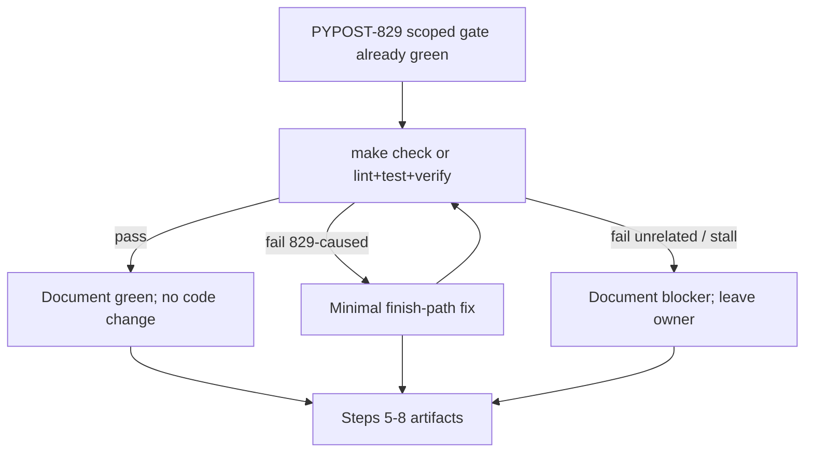

# PYPOST-882: Full make check after gateway H3 finish-path fix

## Research

### Current state

- PYPOST-829 landed symmetric finish-path hygiene in both storage
  gateways: on worker `finished`, capture pending → `deleteLater()` →
  short `wait(100)` (`_WORKER_FINISH_WAIT_MS`) → WARNING on wait timeout
  → drain pending restart. Stress canary:
  `tests/test_storage_gateway_h3_stress.py`.
- Step 4 of PYPOST-829 used a **scoped gate**: `make lint` + focused
  gateway + responsiveness + H3 stress (**20 passed**). Full `make check`
  was deferred as TD-2 → this ticket
  ([PYPOST-882](https://pypost.atlassian.net/browse/PYPOST-882)).
- Sibling verification ticket PYPOST-880 (after PYPOST-828) already
  documented that plain `make check` can stall on
  `test_save_async_emits_save_completed` under the default signal timeout
  method inside nested Qt `exec()`. Completing the suite with
  `--timeout-method=thread` is an accepted evidence path when that hang
  appears; do not change default pytest-timeout policy here.
- Default quality gate (`Makefile`): `make check` → `lint` + `test` +
  `verify-ai-tasks`.

### Design choice

Treat this as a **verification / quality-gate** task:

1. Prefer attempting full `make check`; if it stalls on known nested-Qt
   timeout noise, complete evidence via `make lint` + `make test` with
   `--timeout-method=thread` (+ `verify-ai-tasks` separately).
2. If green → document pass; no production code change required.
3. If red with failures attributable to PYPOST-829 finish-path → minimal
   fix only for those regressions; re-run until green or document
   remaining unrelated blockers.
4. Do **not** expand into unrelated suite noise, flaky siblings, or other
   Debt tickets (PYPOST-830 / 881 / SOLID / ai-tasks baseline).

### Alternatives considered

| Option | Pros | Cons |
| --- | --- | --- |
| Scoped gate only (status quo) | Fast | Leaves TD-2 open; no sibling confidence |
| Full gate + fix 829-caused only | Matches DoD; bounded | May hit unrelated noise |
| Full suite cleanup of all failures | Greenest tree | Out of scope (Low SP:2) |

Selected: full quality-gate evidence with narrow regression fixes only.

## Implementation Plan

1. Confirm Step 3 N/A (no new runtime behavior; gate is the verification).
2. Run quality gate (Step 4): try `make check`; on known stall, use
   `make lint` + `make test PYTEST_ARGS='… --timeout-method=thread'` +
   `make verify-ai-tasks`.
3. Reconfirm focused PYPOST-829 cluster (gateway + responsiveness + H3).
4. Classify failures:
   - **829-caused finish-path regression** → fix narrowly, re-run.
   - **Unrelated / pre-existing / sibling noise** → document in
     `60-tech-debt.md`; do not expand scope.
5. Cleanup / observability / review / docs reflecting verification
   outcome.

**Failing Repro (Step 3):** `N/A — no behavioral change`.

Justification: this Debt item does not add product or harness features.
The acceptance behavior is “full quality gate passes (or blockers
documented).” If the gate fails for a regression caused by PYPOST-829,
that red suite outcome **is** the repro evidence for Step 4; no separate
new unit test is written solely to fail. If the gate is green (for
829-attributable surface), there is nothing to turn red first.

## Architecture



### Modules

| Module | Responsibility |
| --- | --- |
| `Makefile` `check` | Lint + fast tests + verify-ai-tasks |
| `pypost/.../environment_storage_gateway*` | Touch only if 829 regression found |
| `pypost/.../collection_storage_gateway*` | Touch only if 829 regression found |
| `tests/test_storage_gateway_h3_stress.py` | Confirm still green after gate |
| `ai-tasks/PYPOST-882/*` | Record plan, gate result, debt |

### Patterns

- **Verification-first** — no speculative code edits before gate evidence.
- **Narrow blast radius** — fix only 829-attributable failures.
- **Document blockers** — sibling noise does not expand scope.
- **Hang-aware gate** — prefer thread timeout method if signal method
  stalls on nested Qt (evidence from PYPOST-880).

### Interfaces

No new APIs. Gate commands:

```text
make check
# or, if nested-Qt stall:
make lint
make test PYTEST_ARGS='tests/ -m "not slow" --timeout-method=thread'
make verify-ai-tasks
```

## Q&A

| Q | A |
| --- | --- |
| New red unit test? | N/A unless a clear 829 regression needs a permanent assert. |
| Touch product `pypost/`? | Only if a proven 829-caused failure requires it. |
| Docs? | Note outcome in `doc/dev/gui_testing.md`; task folder has evidence. |
