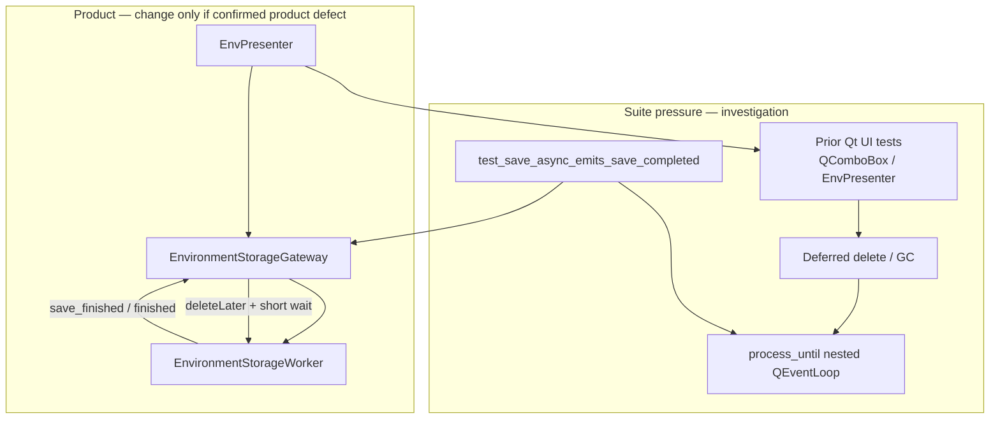

# PYPOST-883: Investigate intermittent hang on save-async completion check

## Research

### Origin and requirements

- Jira: [PYPOST-883](https://pypost.atlassian.net/browse/PYPOST-883), Medium Debt
  (5 SP), follow-up from [PYPOST-830](https://pypost.atlassian.net/browse/PYPOST-830)
  TD-1 (`ai-tasks/PYPOST-830/60-tech-debt.md`).
- Requirements: `ai-tasks/PYPOST-883/10-requirements.md`.
- Observed once during PYPOST-830 Step 3 full `make test` on
  `tests/test_environment_storage_gateway.py::TestEnvironmentStorageGateway::test_save_async_emits_save_completed`.
- Sample pointed at Qt GC / `QComboBox` teardown vs `EnvironmentStorageWorker`
  cross-thread conflict. Did **not** recur on retry or focused presenter /
  gateway clusters. Ruled out as caused by `usefixtures("qapp")` alignment
  (focused gateway runs stayed green).

This ticket settles that open hang risk with evidence: reproduce under suite
pressure and harden lifecycle ordering, **or** document unreproducible with
enough attempts that maintainers can close without speculative product change.

### What this is not (sibling tickets)

| Ticket | Concern | Relation to PYPOST-883 |
| --- | --- | --- |
| [PYPOST-827](https://pypost.atlassian.net/browse/PYPOST-827) | Shared hang-resistant `process_until` | Reuse wait; do not re-design |
| [PYPOST-828](https://pypost.atlassian.net/browse/PYPOST-828) | Timeout diagnostics (`busy=` / `pending=`) | Reuse for triage fingerprint |
| [PYPOST-829](https://pypost.atlassian.net/browse/PYPOST-829) | H3 stranded completion after finish | Already hardened `deleteLater` + short `wait` on both gateways; different fingerprint |
| [PYPOST-830](https://pypost.atlassian.net/browse/PYPOST-830) | Shared `qapp` on gateway TestCases | Parent of TD-1; fixture alignment not the cause |
| PYPOST-884–886 / 882 | TD-2–TD-5 consistency / SOLID noise | Out of scope |

**H3 vs this hang:** PYPOST-829’s fingerprint was *idle gateway + missing
completion signal* (stranded outcome). PYPOST-883’s observed symptom was a
*stall* on the save-completed wait under full-suite pressure, with a sample
implicating widget teardown (`QComboBox`) interacting with a live / finishing
storage worker. Gateway finish teardown already includes:

```113:125:pypost/core/qt/environment_storage_gateway.py
    def _on_worker_finished(self) -> None:
        finished = self._worker
        self._worker = None
        if finished is not None:
            finished.deleteLater()
            if not finished.wait(_WORKER_FINISH_WAIT_MS):
                logger.warning(
                    "environment_storage_gateway_worker_finish_wait_timeout "
                    ...
                )
```

So this investigation starts from a post-H3 baseline. Speculative further
lifecycle edits without reproduction are out of scope.

### Current test surface (stall target)

```35:49:tests/test_environment_storage_gateway.py
    def test_save_async_emits_save_completed(self):
        storage = MagicMock()
        gateway = EnvironmentStorageGateway(storage)
        spy = QSignalSpy(gateway.save_completed)
        envs = [self._make_env("Staging")]
        gateway.save_async(envs)
        process_until(
            lambda: spy.count() == 1,
            timeout_ms=5_000,
            timeout_detail=gateway_timeout_detail(gateway),
        )
        ...
```

- Module uses `@pytest.mark.usefixtures("qapp")` and
  `pytestmark = pytest.mark.timeout(120)`.
- Wait is hang-resistant nested `QEventLoop` via
  `tests.helpers.process_until.process_until` (wall-clock + daemon quit).
- The check itself does **not** create a `QComboBox`. The sample’s combo box
  almost certainly came from **earlier suite modules** (e.g. `EnvPresenter`
  owns `self._env_selector = QComboBox()` and an
  `EnvironmentStorageGateway`) whose deferred deletes / GC ran while this wait
  pumped events under full-suite ordering.

### Why suite pressure matters

Focused gateway / presenter clusters stay green because they do not recreate
the full-suite interleaving: many Qt widget tests leave deferred deletes,
timers, and affinity state on the shared process `QApplication`, then a later
gateway test runs `process_until` (nested `exec`) while a storage `QThread` is
active or finishing. That combination is the investigation hypothesis:

1. Prior UI test constructs widgets (`QComboBox`, presenters) and/or a gateway.
2. Teardown schedules `deleteLater` / drops Python refs; GC may run later.
3. `test_save_async_emits_save_completed` starts a worker and enters nested
   `process_until`.
4. Nested loop delivers deferred widget destruction **and** worker
   finish/`wait`/`deleteLater` on the GUI thread in an order that stalls
   (cross-thread join vs destructor needing the other side).

External Qt guidance supporting this class of failure:

- [QThread docs](https://doc.qt.io/qt-6/qthread.html) — never destroy a running
  `QThread`; `wait()` joins after `finished`; TLS cleanup may still run after
  `finished`.
- [pytest-qt #276](https://github.com/pytest-dev/pytest-qt/issues/276) —
  GC of a live `QThread` crashes/hangs tests; cleanup must `quit`/`wait`
  before destruction.
- [Nested event-loop / teardown hangs in Qt suites](https://czaki.github.io/blog/2024/09/16/preventing-segfaults-in-test-suite-that-has-qt-tests/) —
  leftover `QThread` / timers / nested `exec` at teardown are a known hang and
  segfault class.
- Object-owns-its-thread destructor deadlocks (join waits for loop; loop waits
  for destructor) — same shape as “widget teardown vs worker join” under nested
  loops ([SO / forum patterns](https://stackoverflow.com/questions/79772721/how-do-i-stop-an-event-loop-in-a-qthread)).

### Reproduction approaches considered

| Approach | Pros | Cons |
| --- | --- | --- |
| A. Repeated full `make test` | Matches original observation | Expensive; rare; weak attribution |
| B. Suite-prefix: heavy Qt UI modules then env gateway (+ related) in one process | Closer to full-suite affinity; cheaper than A | Still intermittent; needs clear hang fingerprint |
| C. Synthetic churn unit: create `QComboBox` / presenter-like widgets, force `gc.collect` / `deleteLater`, concurrently drive `save_async` + `process_until` | Attributable; no live network/disk | May invent a failure H3 already fixed, or fail to hit suite-only ordering |
| D. Classic red product assertion before any fix | Standard TDD | **No stable red today** — hang unreproduced; a forced-red that never fails is false confidence |

**Chosen strategy:** investigation-first — **B primary**, **C mandatory**
(cheap attributable probe; required for unreproducible close — form may vary:
dedicated stress method under `tests/`, temporary script, or equivalent
in-process churn loop), **A optional** if B/C stay clean and budget allows.
Treat clean B+C (agreed iteration counts below) as **not reproduced**. Product
/ harness harden only on confirm (fingerprint below). **D deferred** until a
confirmed root cause exists; then add a regression that encodes the fixed
ordering.

### Hang fingerprint (confirm vs not)

**Confirmed** if under B and/or C at least one of:

1. Process stalls past the 5 s `process_until` budget **or** past module
   timeout on `test_save_async_emits_save_completed` (or the synthetic probe
   equivalent), with evidence of concurrent widget teardown / GC (stack sample,
   faulthandler, or logs showing destructor / `wait` on GUI thread).
2. Reproducible cross-thread deadlock / hang where GUI thread is inside
   `QThread.wait` or nested `exec` while another thread / deferred delete waits
   on GUI — correlated with env save-completed wait.
3. Same stall recurs under the same suite-prefix recipe across ≥2 independent
   runs (rules out one-off machine noise).

**Not reproduced** if **all** of the following hold (C is **not** optional here):

- Suite-prefix recipe (B) completes green across the agreed sample (≥3 runs of
  the pinned prefix below, or ≥1 full `make test` plus ≥2 prefixes if full
  suite is used), **and**
- Synthetic probe (C) **was run** and completes without hang across ≥200
  save-completed waits with forced widget GC between batches (or equivalent
  wall budget under module timeout), **and**
- No fingerprint (1)–(3) appears.

Closing as unreproducible **without** executing C is forbidden, even if B (or
A) stayed green. Form of C may vary; running C is required.

Ambiguous timeouts where `gateway_timeout_detail` shows `busy=True` /
`worker_running=True` for the whole budget are **worker/storage stalls**, not
this teardown-conflict class — triage separately; do not treat as PYPOST-883
confirm without teardown evidence.

### Suite-prefix B — pinned node/path list

One pytest process, paths in this order (UI/widget pressure first, stall
target last):

1. `tests/test_env_presenter.py` — owns `QComboBox` + `EnvironmentStorageGateway`
2. `tests/test_env_dialog.py` — heavy Qt env UI (`EnvironmentDialog`); included
   for deferred-delete / affinity pressure aligned with manage-env surfaces
3. `tests/test_env_storage_responsiveness.py`
4. `tests/test_storage_gateway_h3_stress.py`
5. `tests/test_collection_storage_gateway.py`
6. `tests/test_environment_storage_gateway.py` — includes
   `TestEnvironmentStorageGateway::test_save_async_emits_save_completed`

**Explicitly excluded from B:**

- `tests/test_env_persistence_e2e.py` — e2e (temp storage / restart path); not
  part of the suite-prefix recipe or DoD green list for this ticket
- Other env modules without Qt widget + gateway affinity for this hang
  hypothesis (e.g. secrets codec, ops, messages, benchmarks)

Canonical invocation (record exact command + exit codes in findings):

```text
pytest tests/test_env_presenter.py tests/test_env_dialog.py \
  tests/test_env_storage_responsiveness.py \
  tests/test_storage_gateway_h3_stress.py \
  tests/test_collection_storage_gateway.py \
  tests/test_environment_storage_gateway.py
```

Repeat ≥3 times for the not-reproduced B sample (unless substituting ≥1 full
`make test` + ≥2 prefix runs per the gate above).

### Focused relevant clusters (DoD green list)

Minimum for investigation validation and any harden path (aligned with B;
dialog in, e2e out):

| Cluster | Modules |
| --- | --- |
| Env gateway unit | `tests/test_environment_storage_gateway.py` |
| Closely related gateway / stress | `tests/test_collection_storage_gateway.py`, `tests/test_storage_gateway_h3_stress.py` |
| Responsiveness | `tests/test_env_storage_responsiveness.py` |
| Presenter surface | `tests/test_env_presenter.py` |
| Env dialog (Qt UI peer) | `tests/test_env_dialog.py` |
| **Excluded** | `tests/test_env_persistence_e2e.py` (e2e; not DoD for this ticket) |

### Findings artifact

**Path:** `ai-tasks/PYPOST-883/30-findings.md`

Step 3 (and later steps that update the outcome) **must** create/update this
file. It must record at least:

1. **Outcome:** `confirmed` | `not_reproduced` | `ambiguous` (with reason).
2. **Probe B:** exact pytest command (pinned list above), run count, pass/fail
   per run, hang fingerprints if any (stacks / faulthandler /
   `gateway_timeout_detail` excerpts).
3. **Probe C:** form used (test method path, temporary script path, or
   equivalent), cycle count (≥200 target), GC/widget churn notes, pass/fail;
   state explicitly that C was executed (required for `not_reproduced`).
4. **Probe A (if used):** full `make test` attempt count and result.
5. **Fingerprint match:** which of confirm criteria (1)–(3) matched, or none.
6. **Decision:** harden path vs close-with-evidence; if harden, which layer
   (harness vs product) and pointer to the regression recipe once known.
7. **Green clusters:** which DoD modules were re-run and result.

## Implementation Plan

Investigation-first. No production change unless hang is confirmed.

### Phase 0 — Baseline (no code change)

1. Confirm post-H3 finish path still present on env (+ collection) gateways
   (`deleteLater` + short `wait`).
2. Note stall target and `process_until` / timeout-detail tooling.
3. Inventory which UI modules construct `QComboBox` + env gateway
   (`env_presenter.py` primary).

### Phase 1 — Reproduce / refute (Step 3–4 investigation)

1. **Suite-prefix (B):** run the pinned path list above (≥3 times, or A+prefix
   substitute per Not-reproduced gate). On stall: capture stacks / pytest
   output / `gateway_timeout_detail` text.
2. **Synthetic probe (C) — mandatory:** dedicated stress method, temporary
   script under `tests/`, or equivalent in-process loop that:
   - Creates and destroys `QComboBox` (and optionally a minimal presenter-like
     parent), schedules `deleteLater`, calls `gc.collect()`.
   - Concurrently or immediately after drives `EnvironmentStorageGateway.save_async`
     + `process_until` for save-completed (≥200 cycles, GC between batches).
   - Uses shared `process_until` + `gateway_timeout_detail`; no live storage /
     encryption deps (`MagicMock` storage).
   - Must be executed before claiming `not_reproduced`; skipping C blocks
     unreproducible close.
3. Record confirm / not-reproduced against the fingerprint in
   `ai-tasks/PYPOST-883/30-findings.md` (see Findings artifact).

### Phase 2a — If not reproduced

1. No product or harness lifecycle change required.
2. Document attempts, pinned B command, C form + cycle counts, and green
   focused clusters in `30-findings.md` (C evidence required).
3. Complete Steps 4–8 as investigation-only (or no-op development with evidence
   notes). Do not invent speculative `wait`/GC ordering edits. Keeping a
   permanent C canary in-tree after close is optional; **running** C during
   investigation was not.

### Phase 2b — If confirmed

1. Harden teardown / wait / cleanup ordering at the confirmed layer only:
   - Prefer **test harness** ordering (explicit idle wait before widget
     teardown; drain deferred deletes before gateway waits; avoid GC during
     nested wait) if the conflict is suite-only.
   - Prefer **product** gateway finish / presenter teardown ordering only if
     evidence shows a real product lifecycle defect (UI hang waiting for
     save-completed).
2. Preserve encryption, on-disk formats, and user-visible persistence UX.
3. Add a focused regression that fails if the confirmed ordering regresses
   (suite-prefix canary or synthetic C turned permanent if cheap).
4. Re-verify focused relevant clusters green.

### Phase 3 — Verification

1. Focused clusters green (table above).
2. If harden path: re-run the recipe that reproduced the hang; must complete.
3. Do not expand into PYPOST-884–886 / SOLID baseline work.

**Mandatory — Failing Repro (next Step 3):**

**N/A — investigation-first (no stable red behavioral assertion today).**

Justification:

- Requirements are evidence-first: the hang appeared once, did not recur on
  retry or focused clusters, and must not drive speculative lifecycle edits.
- There is no known deterministic failure to encode as a classic red-before-green
  product or harness test *before* investigation. A forced “red” that does not
  hang today would be green-while-bug-exists noise; inventing an artificial
  deadlock may not match the real suite-pressure failure mode.
- Step 3 therefore runs the **reproduction campaign** (Phase 1: B + C), not a
  pre-fix failing unit. Sequencing:

  1. Research (this document) →
  2. Step 3: execute suite-prefix (B) + mandatory synthetic GC/widget churn
     probe (C); record evidence in `30-findings.md` →
  3. Step 4: if confirmed, harden ordering and **then** add a regression that
     is red under the reproduced conditions and green after the fix; if not
     reproduced, no production fix and no mandatory permanent red test
     (C must still have been run and recorded).

If Step 3 confirms the hang with a repeatable recipe, the Step 4 regression
design (where it lives, how it forces failure without live deps) is derived
from that recipe and recorded then — not guessed here.

## Architecture

### System view



### Modules and responsibilities

| Module | Responsibility | Change if confirmed | Change if not |
| --- | --- | --- | --- |
| `tests/test_environment_storage_gateway.py` | Stall target; save-completed contract | Maybe harness teardown/idle | Investigation runs only |
| Probe C (synthetic stress) | Mandatory teardown vs worker probe | Keep as canary if cheap | Run required for close; permanent keep optional |
| `tests/helpers/process_until.py` | Bounded nested wait + detail | Reuse only unless wait itself implicated | Reuse only |
| `environment_storage_gateway.py` | Async save/load + finish teardown | Only if product defect confirmed | No |
| `environment_storage_worker.py` | Background save/load | Unlikely | No |
| `env_presenter.py` / UI widgets | Owns `QComboBox` + gateway | Only if presenter teardown implicated | No |
| Encryption / on-disk storage | Persistence safety | **No** | **No** |
| `ai-tasks/PYPOST-883/30-findings.md` | Confirm / not-reproduced evidence | Update with harden recipe | Update with B+C evidence |

### Selected patterns and justification

1. **Investigation-first / evidence gate.** Matches DoD: settled risk with
   reproduce-or-document; speculative edits risk new flakes after H3 hygiene
   already landed.
2. **Suite-prefix before full suite.** Recreates cross-module Qt affinity
   cheaper than repeated `make test`; still closer to the original stall than
   focused gateway-only runs.
3. **Synthetic widget GC probe (C) — mandatory for unreproducible close.**
   Isolates the sample’s `QComboBox` vs worker hypothesis without live deps;
   form may vary. Failure here plus suite-prefix strengthens confirm. Clean B
   alone is insufficient to close as not reproduced.
4. **Harness-first harden if suite-only.** Prefer ordering in tests (drain /
   idle / defer GC) when product completion delivery is already correct under
   focused runs; touch product lifecycle only with product-hang evidence.
5. **Do not reopen H3 or wait-helper tickets** unless fingerprint shows their
   mechanisms failed (stranded idle completion, or `process_until` not exiting).

### Main interfaces (investigation contracts)

| Interface | Contract |
| --- | --- |
| `EnvironmentStorageGateway.save_async` → `save_completed` | Spy count reaches 1 within `process_until` budget under mock storage |
| `process_until(predicate, timeout_ms, timeout_detail=...)` | Exits by success or AssertionError near wall-clock; detail includes busy/pending/worker_running |
| `_on_worker_finished` | Post-H3: clear ref → `deleteLater` → short `wait` → drain pending (unchanged unless confirm demands more) |
| Suite-prefix recipe (B) | Pinned pytest path list (presenter → dialog → responsiveness → H3 → collection gateway → env gateway); e2e excluded |
| Confirm / not-reproduced record | `ai-tasks/PYPOST-883/30-findings.md` — outcome, B/C(/A) evidence, fingerprint, decision, green clusters |

### Dependency rules

- Step 3 investigation may add temporary stress helpers under `tests/` only.
- Do not modify encryption, key handling, or storage formats.
- Do not migrate suite-wide `qapp` (PYPOST-886) or collection worker fixture
  (PYPOST-884) as part of this ticket.
- Collection gateway changes only if confirm shows the same teardown conflict
  there (symmetric harden); otherwise leave collection untouched.

## Q&A

- Q: Why is failing repro N/A instead of a red test now?
  A: Investigation-first debt with a one-off unreproduced stall. No stable
  desired-vs-actual behavioral assertion exists yet; Step 3 is the repro
  campaign. A regression red becomes mandatory only after confirm, in Step 4.
- Q: How is this different from PYPOST-829 H3?
  A: H3 was stranded completion after finish (idle but no signal). This is a
  suite-pressure **stall** on save-completed wait with widget teardown in the
  sample. H3 teardown (`deleteLater` + short wait) is already in place.
- Q: Why mention `QComboBox` if the gateway unit test does not create one?
  A: The sample implicated teardown from earlier suite UI (EnvPresenter’s
  selector). Suite-prefix and synthetic combo churn test that hypothesis.
- Q: What if B stays green but C hangs?
  A: Treat C hang as confirm of the teardown/worker conflict class; harden the
  ordering C exposes; still verify B and focused clusters. Prefer harness
  ordering unless C maps clearly to production presenter/gateway teardown.
- Q: What if both stay green?
  A: Document unreproducible in `30-findings.md` with B+C evidence (C required);
  no mandatory product/harness change; complete remaining workflow artifacts;
  ticket may close.
- Q: Is Probe C optional if B is clean?
  A: No. Form of C may vary, but running C is mandatory before unreproducible
  close. The Not-reproduced gate requires both B and C.
- Q: Why include `test_env_dialog.py` but exclude `test_env_persistence_e2e.py`?
  A: Dialog is in-process Qt UI pressure adjacent to env manage surfaces.
  Persistence e2e uses temp storage / restart paths and is out of this hang’s
  DoD green list; keep B focused on affinity + gateway wait without e2e scope
  creep.
- Q: Which quality gate proves DoD for focused clusters?
  A: Module-focused pytest on the pinned DoD list (gateway, collection gateway,
  H3 stress, responsiveness, presenter, dialog). Full `make check` is not the
  sole DoD (SOLID noise is PYPOST-882).
- Q: Where are investigation findings written?
  A: `ai-tasks/PYPOST-883/30-findings.md` (see Findings artifact section).
- Q: External references used?
  A: Qt 6 QThread docs; pytest-qt #276; Czaki Qt-suite teardown notes; nested
  event-loop / object-owns-thread deadlock discussions (see Research links).
