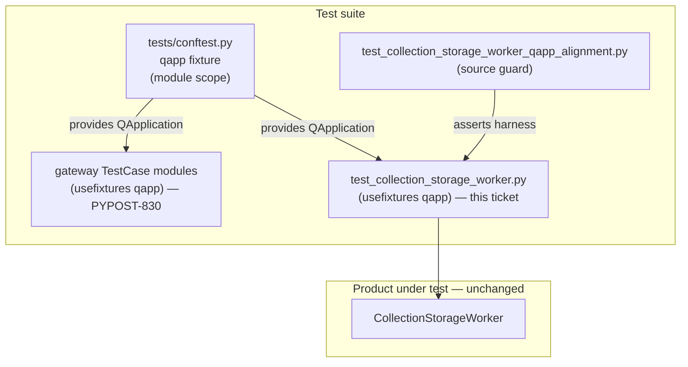

# PYPOST-884: Align collection storage worker tests on shared qapp

## Research

### Origin and requirements

- Jira: [PYPOST-884](https://pypost.atlassian.net/browse/PYPOST-884), Low Debt
  (2 SP), follow-up from [PYPOST-830](https://pypost.atlassian.net/browse/PYPOST-830)
  TD-2 (`ai-tasks/PYPOST-830/60-tech-debt.md`).
- Requirements: `ai-tasks/PYPOST-884/10-requirements.md`.
- PYPOST-830 aligned gateway units + H3 stress onto shared `qapp` via
  `@pytest.mark.usefixtures("qapp")`. This ticket closes the same pattern for
  the collection storage worker test module only.

### Shared fixture (established convention)

`tests/conftest.py` already defines:

```python
@pytest.fixture(scope="module")
def qapp():
    """Shared QApplication for Qt widget tests (module-scoped singleton)."""
    app = QApplication.instance() or QApplication([])
    yield app
```

Reference `unittest.TestCase` consumers (PYPOST-830):

- `tests/test_collection_storage_gateway.py`
- `tests/test_environment_storage_gateway.py`
- `tests/test_storage_gateway_h3_stress.py`

Each uses `@pytest.mark.usefixtures("qapp")` and no module-local `setUpClass`
`QApplication`.

### Target still using module-local lifecycle

| Module | Style today | Local lifecycle | Uses `cls.app` after create? |
| --- | --- | --- | --- |
| `tests/test_collection_storage_worker.py` | `unittest.TestCase` | `setUpClass` → `QApplication.instance() or QApplication([])` | No (side-effect only) |

Already shares `pytestmark = pytest.mark.timeout(120)` and hang-resistant
`process_until` (PYPOST-827). Product under test:
`CollectionStorageWorker` — unchanged.

### Why usefixtures (not fixture parameter)

pytest documents that `unittest.TestCase` methods cannot take fixture
arguments the way plain pytest functions do
([Using unittest-based tests with pytest](https://docs.pytest.org/en/stable/how-to/unittest.html)).
The supported side-effect pattern is `@pytest.mark.usefixtures("qapp")`
([usefixtures](https://docs.pytest.org/en/stable/how-to/fixtures.html#use-fixtures-in-classes-and-modules-with-usefixtures)).

### External Qt / pytest-qt guidance

- Prefer one shared application for the process; do not destroy/recreate
  `QApplication` per module
  ([pytest-qt qapp](https://pytest-qt.readthedocs.io/en/stable/reference.html)).
- Custom fixtures live in `conftest.py`
  ([pytest-qt QApplication](https://pytest-qt.readthedocs.io/en/stable/qapplication.html)).

Reuse the existing conftest fixture; do not re-scope or replace it.

### Scope discipline

Suite-wide remaining `setUpClass` / local `qapp` modules stay under PYPOST-886.
Only `tests/test_collection_storage_worker.py` is in scope for PYPOST-884.

## Implementation Plan

1. **Leave product code and `tests/conftest.py` `qapp` unchanged.**
2. **Align the worker TestCase module** onto the shared fixture:
   - Remove `setUpClass` `QApplication` creation and unused `cls.app`.
   - Drop `from PySide6.QtWidgets import QApplication` when unused.
   - Request shared `qapp` via `@pytest.mark.usefixtures("qapp")` on
     `TestCollectionStorageWorker`.
3. **Do not convert** the `TestCase` class to free functions; coverage intent
   stays the same.
4. **Verify** focused worker (+ optional sibling gateway) tests under
   `make test` with `PYTEST_ARGS`, then lint as needed.

**Mandatory — Failing Repro (next Step 3):** Write an automated source-level
guard under `tests/` that asserts the desired harness state for
`tests/test_collection_storage_worker.py`:

- Desired behavior: the worker TestCase class requests shared `qapp` via
  `@pytest.mark.usefixtures("qapp")`, and the module does **not** define a
  `setUpClass` that constructs or assigns a local `QApplication`.
- Location: new small module
  `tests/test_collection_storage_worker_qapp_alignment.py` (pure AST/source
  assertions; no live Qt / storage I/O).
- Force failure without live deps: read the worker test file from disk and
  assert decoration + absence of local lifecycle; on current code the
  `usefixtures` assertion fails (and/or `setUpClass` presence fails).
- Sequencing: research (this doc) → red guard fails on current module →
  Step 4 wire-up makes the guard green and keeps existing worker signal tests
  green.

## Architecture

### System modules (test-only change)



### Module responsibilities

| Module / component | Responsibility after alignment |
| --- | --- |
| `tests/conftest.py` `qapp` | Single shared Qt application factory for the suite |
| Worker unit test module | Assert load finished/failed; obtain app via shared fixture |
| Alignment guard | Regression check that worker module stays on shared `qapp` |
| Gateway units | Unchanged reference for `usefixtures` pattern |
| Product worker | No architectural change |

### Dependencies

- Worker tests **depend on** `qapp` for a live Qt event loop / `QObject`
  context (`QSignalSpy`, `process_until`).
- Worker tests **do not** own application lifecycle after alignment.
- No new packages, markers, or suite plugins.

### Selected patterns and justification

| Pattern | Choice | Why |
| --- | --- | --- |
| Shared fixture reuse | Keep module-scoped `qapp` in `conftest.py` | PYPOST-823/830 convention |
| Unittest integration | `@pytest.mark.usefixtures("qapp")` | TestCase cannot take fixture params |
| Minimal surface | Edit only the worker test module (+ small guard) | Scope discipline; 2 SP |
| No product DI change | Tests still construct worker with mocks | Harness only |

### Main interfaces (test harness)

| Interface | Contract |
| --- | --- |
| `qapp` fixture | Yields existing or new `QApplication`; module-scoped |
| Consumer request | Worker `TestCase`: `usefixtures("qapp")` |
| Removed interface | Module-local `setUpClass` / `cls.app` application ownership |

### Explicit non-goals (architecture)

- Do not migrate unrelated `setUpClass` `QApplication` modules.
- Do not change `qapp` fixture scope or replace with pytest-qt’s plugin fixture.
- Do not alter worker product teardown, `process_until`, or timeout diagnostics.

## Q&A

- Q: Is converting worker tests to free functions required for Done?
  A: No. `usefixtures("qapp")` on the `TestCase` satisfies the shared-convention
  outcome (same as PYPOST-830).
- Q: Why a source guard instead of only re-running worker signal tests?
  A: Worker signal tests can pass with either local or shared app creation; a
  source guard fails specifically for missing shared-`qapp` alignment.
- Q: Does this change product collection load behavior?
  A: No. Only how automated checks obtain `QApplication`.
- Q: Links used?
  A:
  - [pytest unittest + fixtures](https://docs.pytest.org/en/stable/how-to/unittest.html)
  - [pytest usefixtures](https://docs.pytest.org/en/stable/how-to/fixtures.html#use-fixtures-in-classes-and-modules-with-usefixtures)
  - [pytest-qt qapp reference](https://pytest-qt.readthedocs.io/en/stable/reference.html)
