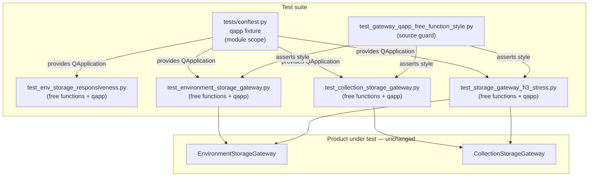

# PYPOST-885: Convert gateway TestCase modules to free functions with qapp

## Research

### Origin and requirements

- Jira: [PYPOST-885](https://pypost.atlassian.net/browse/PYPOST-885), Lowest
  Debt (2 SP), follow-up from [PYPOST-830](https://pypost.atlassian.net/browse/PYPOST-830)
  TD-3 (`ai-tasks/PYPOST-830/60-tech-debt.md`).
- Requirements: `ai-tasks/PYPOST-885/10-requirements.md`.
- PYPOST-830 aligned gateway units + H3 stress onto shared `qapp` via
  `@pytest.mark.usefixtures("qapp")` while keeping `unittest.TestCase`.
  This ticket optionally unifies style with responsiveness free functions.

### Shared fixture (established convention)

`tests/conftest.py` already defines module-scoped `qapp` (process singleton).
Responsiveness reference:

- `tests/test_env_storage_responsiveness.py` — `def test_...(qapp): ...`

### Targets still on TestCase + usefixtures

| Module | Style today | Risk notes |
| --- | --- | --- |
| `tests/test_environment_storage_gateway.py` | `TestCase` + `usefixtures` | Small (~9 methods); helpers easy to lift |
| `tests/test_collection_storage_gateway.py` | `TestCase` + `usefixtures` | Small (~4 methods) |
| `tests/test_storage_gateway_h3_stress.py` | `TestCase` + `usefixtures` | 2 long stress methods; helpers already module-level |

Conversion risk is low: mechanical `self.assert*` → `assert`, add `qapp`
parameter, drop `unittest` / `usefixtures`. Coverage intent and
`process_until` budgets stay identical. **Decision: convert** (not defer).

### Why free functions (not keep usefixtures)

pytest documents that `unittest.TestCase` methods cannot take fixture
arguments
([Using unittest-based tests with pytest](https://docs.pytest.org/en/stable/how-to/unittest.html)).
Free functions can take `qapp` directly, matching responsiveness and removing
the class/usefixtures indirection for this surface.

### External Qt / pytest-qt guidance

- Prefer one shared application for the process
  ([pytest-qt qapp](https://pytest-qt.readthedocs.io/en/stable/reference.html)).
- Custom fixtures live in `conftest.py`.
- Reuse existing conftest fixture; do not re-scope or replace it.

### Scope discipline

Collection worker `TestCase` (PYPOST-884) and suite-wide remaining TestCase
modules stay out of scope. Only the three gateway/stress modules above.

## Implementation Plan

1. **Leave product code and `tests/conftest.py` `qapp` unchanged.**
2. **Convert each target module** to free pytest functions:
   - Drop `unittest.TestCase` classes and `@pytest.mark.usefixtures("qapp")`.
   - Express each former method as `def test_...(qapp): ...` (plus other
     fixtures if any).
   - Replace `self.assert*` with plain `assert` / `pytest.fail` as needed.
   - Keep `pytestmark = pytest.mark.timeout(120)` and existing helpers.
3. **Add a source-level style guard** so modules do not regress to TestCase +
   usefixtures.
4. **Verify** focused gateway + stress + responsiveness + guard under
   `make test` with `PYTEST_ARGS`.

**Mandatory — Failing Repro (next Step 3):** Write an automated source-level
guard under `tests/` that asserts the desired harness state for the three
target modules:

- Desired behavior: each target module has **no** `unittest.TestCase`
  subclass, has **no** `@pytest.mark.usefixtures("qapp")`, and every
  `test_*` function accepts a `qapp` parameter.
- Location: new small module
  `tests/test_gateway_qapp_free_function_style.py` (pure AST/source
  assertions; no live Qt / storage I/O).
- Force failure without live deps: read the three files from disk and assert
  free-function style; on current code the assertions fail (TestCase /
  usefixtures still present; methods lack `qapp` params).
- Sequencing: research (this doc) → red guard fails on current modules →
  Step 4 conversion makes the guard green and keeps existing gateway/stress
  tests green.

## Architecture

### System modules (test-only change)

### Module responsibilities

| Module / component | Responsibility after conversion |
| --- | --- |
| `tests/conftest.py` `qapp` | Single shared Qt application factory |
| Gateway / H3 test modules | Assert load/save/queue/stress; take `qapp` |
| Style guard | Regression check for free-function style |
| Responsiveness | Unchanged reference for free-function pattern |
| Product gateways | No architectural change |

### Dependencies

- Gateway/stress tests **depend on** `qapp` for a live Qt event loop /
  `QObject` context (`QSignalSpy`, `process_until`).
- Tests **do not** own application lifecycle.
- No new packages, markers, or suite plugins.

### Selected patterns and justification

| Pattern | Choice | Why |
| --- | --- | --- |
| Shared fixture reuse | Keep module-scoped `qapp` in `conftest.py` | PYPOST-823/830 convention |
| Consumer style | Free functions with `qapp` param | Matches responsiveness; closes TD-3 |
| Minimal surface | Edit only three gateway/stress modules (+ guard) | Scope discipline; 2 SP |
| No product DI change | Tests still construct gateways with mocks | Harness only |

### Main interfaces (test harness)

| Interface | Contract |
| --- | --- |
| `qapp` fixture | Yields existing or new `QApplication`; module-scoped |
| Consumer request | `def test_...(qapp): ...` on target modules |
| Removed interface | `unittest.TestCase` + `usefixtures("qapp")` on this surface |

### Explicit non-goals (architecture)

- Do not convert collection worker or unrelated `TestCase` modules.
- Do not change `qapp` fixture scope or replace with pytest-qt’s plugin fixture.
- Do not alter gateway product teardown, `process_until`, or timeout diagnostics.

## Q&A

- Q: Convert or defer?
  A: **Convert.** Modules are small/mechanical; risk is low; DoD polish closes
  cleanly with a style guard.
- Q: Why a source guard instead of only re-running gateway tests?
  A: Signal tests can pass under either style; a source guard fails
  specifically for TestCase / usefixtures regression.
- Q: Does this change product persistence behavior?
  A: No. Only how automated checks obtain `QApplication`.
- Q: Links used?
  A:
  - [pytest unittest + fixtures](https://docs.pytest.org/en/stable/how-to/unittest.html)
  - [pytest fixtures](https://docs.pytest.org/en/stable/how-to/fixtures.html)
  - [pytest-qt qapp reference](https://pytest-qt.readthedocs.io/en/stable/reference.html)
