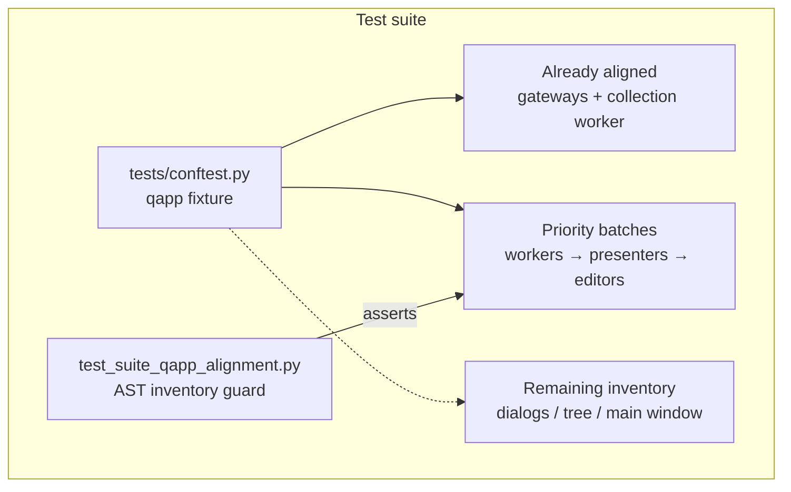

# PYPOST-886: Suite-wide migrate tests onto shared conftest qapp

## Research

### Origin and requirements

- Jira: [PYPOST-886](https://pypost.atlassian.net/browse/PYPOST-886), Low Debt
  (8 SP), follow-up from [PYPOST-830](https://pypost.atlassian.net/browse/PYPOST-830)
  TD-4 (`ai-tasks/PYPOST-830/60-tech-debt.md`).
- Requirements: `ai-tasks/PYPOST-886/10-requirements.md`.
- Already aligned reference surfaces:
  - Gateways + H3 stress: PYPOST-830 (`@pytest.mark.usefixtures("qapp")`)
  - Collection storage worker: PYPOST-884 (same pattern)

### Shared fixture (established convention)

`tests/conftest.py` already defines a module-scoped singleton:

```python
@pytest.fixture(scope="module")
def qapp():
    """Shared QApplication for Qt widget tests (module-scoped singleton)."""
    app = QApplication.instance() or QApplication([])
    yield app
```

Consumption styles (both valid):

| Style | When |
| --- | --- |
| `@pytest.mark.usefixtures("qapp")` | `unittest.TestCase` (cannot take fixture params) |
| `def test_...(qapp):` | Free-function pytest tests |

### Inventory at architecture time

Approximate remaining debt (excluding already-aligned gateway/worker modules):

| Pattern | Count (approx.) | Notes |
| --- | --- | --- |
| `setUpClass` + `QApplication` | ~29 modules | Side-effect only; `cls.app` rarely read |
| Local `def qapp()` | ~23 modules | Shadows conftest fixture |

Priority order from ticket / requirements: **workers → presenters → editors**.

| Batch | Modules (representative) |
| --- | --- |
| Workers | `test_request_save_orchestrator.py` |
| Presenters | `test_collections_presenter.py`, `test_env_presenter.py`, `test_tabs_presenter.py`, `test_presenter_font_inheritance.py` |
| Editors | `test_code_editor*.py`, `test_json_highlighter.py`, `test_tab_header.py`, `test_request_editor_*.py` |
| Remaining (fast-follow) | collection tree, main window, history, dialogs, settings, style managers, etc. |

### Why usefixtures (not fixture parameter) for TestCase

pytest documents that `unittest.TestCase` methods cannot take fixture
arguments the way plain pytest functions do
([Using unittest-based tests with pytest](https://docs.pytest.org/en/stable/how-to/unittest.html)).
The supported side-effect pattern is `@pytest.mark.usefixtures("qapp")`
([usefixtures](https://docs.pytest.org/en/stable/how-to/fixtures.html#use-fixtures-in-classes-and-modules-with-usefixtures)).

### External Qt / pytest-qt guidance

- Prefer one shared application for the process; do not destroy/recreate
  `QApplication` per module
  ([pytest-qt qapp](https://pytest-qt.readthedocs.io/en/stable/reference.html)).
- Custom fixtures live in `conftest.py`
  ([pytest-qt QApplication](https://pytest-qt.readthedocs.io/en/stable/qapplication.html)).

Reuse the existing conftest fixture; do not re-scope or replace it.

### Special cases

- **`_get_app()` helpers** in several `test_request_editor_body_*.py` / MCP /
  method-tab modules: module-global lazy `QApplication` — treat as local
  lifecycle; remove and use `usefixtures("qapp")`.
- **`test_env_presenter.py` subprocess string** that constructs `QApplication`
  inside a child process for hang canary: keep that child snippet; it is not
  suite fixture ownership.
- **`test_worker_race.py` / inline creates**: migrate if in scope of a batch;
  otherwise inventory as remaining debt.

## Implementation Plan

1. **Leave product code and `tests/conftest.py` `qapp` unchanged.**
2. **Step 3:** Add AST/source inventory guard covering priority batches
   (workers → presenters → editors). Guard asserts desired aligned state and
   therefore fails on current code (red).
3. **Step 4 batches (≤100 LOC edits when possible per iteration):**
   - Batch A — workers: `test_request_save_orchestrator.py`
   - Batch B — presenters: collections / env / tabs / font-inheritance
   - Batch C — editors: code editor family, tab header, request editor family
   - For each `TestCase`: remove `setUpClass` / `_get_app` local lifecycle;
     add `@pytest.mark.usefixtures("qapp")`; drop unused `QApplication` import
     when safe.
   - For each local `def qapp()`: delete the duplicate fixture so tests bind
     conftest `qapp`.
4. **Verify** each batch with `make test` + focused `PYTEST_ARGS` (hang-aware
   timeouts). Keep the Step 3 guard green after migrations.
5. **If remaining surfaces are large:** document inventory as NON-BLOCKER
   follow-ups in `60-tech-debt.md` rather than force an unsafe giant sweep.
   Prefer also clearing easy local-`qapp` dialog/settings modules if stable.

**Mandatory — Failing Repro (next Step 3):** Automated AST/source guard under
`tests/`:

- Desired behavior: every module listed in the priority inventory
  (workers → presenters → editors) requests shared `qapp` (via
  `usefixtures("qapp")` on Qt `TestCase` classes, or conftest fixture for
  free-function `qapp` params) and does **not** define local `setUpClass`
  `QApplication` creation, local `def qapp()`, or `_get_app()` lazy creators.
- Location: `tests/test_suite_qapp_alignment.py` (pure AST/source; no live Qt
  product I/O).
- Force failure without live deps: scan listed module sources; on current
  code assertions fail because local lifecycles remain.
- Sequencing: research (this doc) → red guard → Step 4 migrate batches until
  green + focused suite green.

## Architecture

### System modules (test-only change)



### Module responsibilities

| Module / component | Responsibility after migration |
| --- | --- |
| `tests/conftest.py` `qapp` | Single shared Qt application factory |
| Priority-batch test modules | Obtain app via shared fixture only |
| Alignment guard | Regression check for priority inventory |
| Remaining modules | Tracked follow-ups if not migrated |
| Product code | No architectural change |

### Selected patterns and justification

| Pattern | Choice | Why |
| --- | --- | --- |
| Shared fixture reuse | Keep module-scoped `qapp` | PYPOST-823/830/884 convention |
| Unittest integration | `usefixtures("qapp")` | TestCase cannot take fixture params |
| Free-function tests | Delete local `def qapp()` | Conftest fixture already matches signature |
| Incremental batches | workers → presenters → editors | Ticket guidance; hang risk control |
| No product DI change | Tests still construct SUT as today | Harness only |

### Main interfaces (test harness)

| Interface | Contract |
| --- | --- |
| `qapp` fixture | Yields existing or new `QApplication`; module-scoped |
| TestCase consumer | `@pytest.mark.usefixtures("qapp")` |
| Free-function consumer | `qapp` parameter from conftest |
| Removed interfaces | Module-local `setUpClass` / `def qapp()` / `_get_app()` ownership |

### Explicit non-goals (architecture)

- Do not change `qapp` fixture scope or replace with pytest-qt’s plugin fixture.
- Do not convert all `TestCase` modules to free functions (PYPOST-885 class).
- Do not fix unrelated suite flakes (e.g. PYPOST-883) unless required for a
  migrated batch to stay green.

## Q&A

- Q: Is full suite migration mandatory for Done?
  A: Prefer yes for priority batches; remaining non-priority inventory may be
  NON-BLOCKER follow-ups after workers → presenters → editors are green.
- Q: Why a source guard instead of only re-running UI tests?
  A: UI tests can pass with either local or shared app creation; a source
  guard fails specifically for missing shared-`qapp` alignment.
- Q: Does subprocess canary code in env presenter count as local lifecycle?
  A: No — child process needs its own app; suite ownership is the parent
  module’s `setUpClass` / fixtures.
- Q: Links used?
  A:
  - [pytest unittest + fixtures](https://docs.pytest.org/en/stable/how-to/unittest.html)
  - [pytest usefixtures](https://docs.pytest.org/en/stable/how-to/fixtures.html#use-fixtures-in-classes-and-modules-with-usefixtures)
  - [pytest-qt qapp reference](https://pytest-qt.readthedocs.io/en/stable/reference.html)
