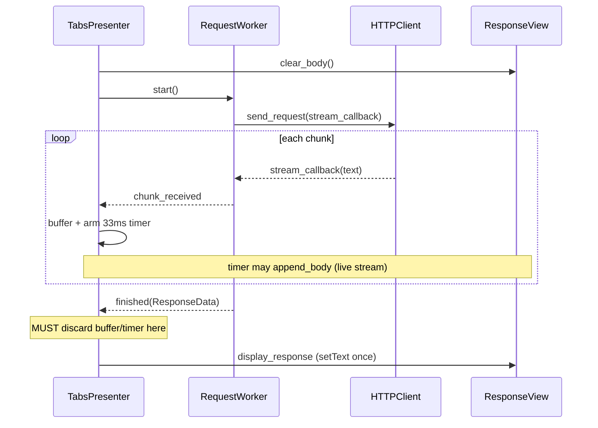

# PYPOST-887: Response body shown twice for PUT with nested/malformed JSON

## Research

### Bug report (source of truth)

[Jira PYPOST-887](https://pypost.atlassian.net/browse/PYPOST-887): PUT to
`https://portal.velvetel.net/v2/user_auth` with raw body `{ { "data": { } } }` shows the
HTTP response body twice. Expected: once. Notes ask whether the defect is specific to
malformed bodies / PUT or general response rendering.

Approved requirements: `ai-tasks/PYPOST-887/10-requirements.md`.

### Response display path (code evidence)

End-to-end flow after Send:

```text
RequestEditor.send_requested
  → TabsPresenter._handle_send_request
      clear_body(); start RequestWorker
  → RequestWorker.run → RequestService.execute → HTTPClient.send_request
      read_streamed_body(..., stream_callback=on_chunk)
        → chunk_received Signal(str) per iter_content chunk
  → TabsPresenter._on_chunk_received → buffer + 33 ms QTimer
      → _flush_chunk_buffer → ResponseView.append_body
  → RequestWorker.finished(ResponseData)
  → TabsPresenter._on_request_finished
      → ResponseView.display_response(response)  # setText(full body)
```

Key modules:

| Module | Role |
| --- | --- |
| `tabs_presenter.py` | Owns `_chunk_buffers`, `_chunk_flush_timers`, `_chunk_flush_ms=33` |
| `tabs_presenter_worker.py` | Chunk receive/flush; `_on_request_finished` |
| `response_view.py` | `append_body` (insert); `display_response` (`setText`) |
| `core/qt/worker.py` | Emits `chunk_received` then `finished` |
| `http_response_body_reader.py` | `stream_callback` per chunk; joins full body |
| `http_client.py` | Always `stream=True`; bad JSON → `data=` (request only) |

Paths above are under `pypost/ui/presenters/`, `pypost/ui/widgets/`, and
`pypost/core/` as appropriate.

### Likely root cause (primary hypothesis)

**Streaming chunk debounce + final `display_response` race.**

1. Worker emits all `chunk_received` events, then `finished`, with the full body also in
   `ResponseData`.
2. Main thread buffers chunks and starts a single-shot **33 ms** flush timer
   (`tabs_presenter_worker.py` `_on_chunk_received` / `_flush_chunk_buffer`).
3. `_on_request_finished` calls `display_response` → `body_view.setText(full_body)`.
4. **It does not stop the flush timer or discard `_chunk_buffers`.**
5. When the timer fires, `_flush_chunk_buffer` **appends** the same chunk text again →
   body appears twice.

Evidence (spot-checked in code):

- `_on_request_finished` (`tabs_presenter_worker.py`) calls `display_response` then
  re-sets status/time/size labels — **no** timer stop and **no** `_chunk_buffers` clear.
- `_flush_chunk_buffer` pops `_chunk_buffers` and calls `append_body`; it does **not**
  remove or stop the entry in `_chunk_flush_timers` (single-shot just expires). Finish
  never cancels that timer, so a pending flush still runs after `setText`.
- `_on_request_error` likewise leaves buffer/timer untouched (stale append risk).
- `_handle_send_request` calls `clear_body()` but does not clear chunk buffers/timers.
- `ResponseView.append_body` uses `insertPlainText`; `display_response` uses `setText`
  (replace). Together: replace-then-late-append duplicates content.
- No tests assert `append_body` / chunk-flush / `display_response` interaction
  (grep over `tests/` finds none).

Why the report mentions PUT + malformed JSON (correlation, not a separate display path):

- In `http_client._prepare_request_kwargs`, invalid JSON body falls back to
  `kwargs["data"] = body`; method is unchanged. There is **no PUT-specific or
  malformed-body-specific response UI path** — same `chunk_received` →
  `display_response` pipeline for all methods.
- Small/fast responses (typical auth/error payloads) often arrive as one chunk and
  finish before the 33 ms timer fires → **exact duplicate** after `setText` + later
  `append_body`.
- Larger/slower responses may flush mid-stream; `setText` then replaces streamed text,
  so duplication is subtler or only a trailing fragment — easier to miss.

Breadth expectation from requirements: minimum is the reported case; same race implies
**any method/body that streams at least one chunk** can double-display. Fix should be
general at the presenter finish/cancel path.

### Secondary hypotheses (lower priority)

| Hypothesis | Assessment |
| --- | --- |
| Pretty-print runs twice | Unlikely: `setText` replaces; no double-call evidence |
| Qt signal connected twice | Worker is one-shot; connect once per send — not this bug |
| `requests` body read twice | Reader joins once; duplicate is UI-side |
| History / MCP / logs | Out of default scope unless same send duplicates there |

Qt docs note: duplicate connections invoke slots multiple times
([Signals & Slots](https://doc.qt.io/qtforpython-6/overviews/qtcore-signalsandslots.html));
that is **not** the pattern here — the issue is an uncancelled flush timer.

### Existing tests to mirror

| Test / fixture | Useful pattern |
| --- | --- |
| `test_tabs_presenter_on_request_error.py` | Presenter + tab; call handlers directly |
| `test_response_view_search.py` | Asserts `display_response` / `toPlainText()` |
| `test_agent_e2e_http.py` + stub | Stub `HTTPClient.send_request` (no live net) |
| `ai-tasks/PYPOST-838/20-architecture.md` | Prefer stubbing HTTP, not whole worker |

Paths for the first three rows are under `tests/`.

### External notes

- Prefer `UniqueConnection` / disconnect when reconnecting Qt signals; relevant here is
  **timer not cancelled on finish**, not a double `finished` connect.
- Debounced UI updates after a final replace is a classic “append after set” bug class
  (same family as recursive `textChanged` when programmatic writes re-enter UI
  handlers — see [QTextEdit textChanged](https://runebook.dev/en/docs/qt/qtextedit/textChanged)).

### Process constraint (mandatory)

After architecture approval and **before** the corrective change in Development:

1. Research & design (this document).
2. Write an automated **failing** repro that demonstrates double display.
3. Implement the fix until that test passes.

Do not land the fix without the red→green gate.

## Implementation Plan

### Phase A — Design gate (this step)

- Agree root-cause hypothesis and change points below.
- Leave STEP 2 as `[/]` until user approval.

### Phase B — Failing repro **before** any fix (first Development action)

**Sequencing (required):**

1. Research & design — done in this artifact.
2. Write failing repro test — **before** changing production code.
3. Fix until the repro (and regression) tests pass.

**Where:** Prefer a focused presenter-level test, e.g.
`tests/test_tabs_presenter_response_display.py` (or extend
`tests/test_tabs_presenter_on_request_error.py` if keeping one module is cleaner).

**How to force the race without live HTTP:**

1. Build `TabsPresenter` + a `RequestTab` (same fixtures as existing tabs tests).
2. Simulate streaming: call `_on_chunk_received(tab, BODY)` (and optionally more chunks).
3. Do **not** process the flush timer yet (or keep `_chunk_flush_ms` and advance time only
   after finish).
4. Call `_on_request_finished(tab, ResponseData(..., body=BODY, ...))`.
5. Advance Qt event loop / single-shot timer so `_flush_chunk_buffer` runs (e.g.
   `QTest.qWait` beyond flush interval, or `QTimer` + `qapp.processEvents()`).
6. **Assert (buggy today):** body text contains the payload twice (exact `BODY + BODY`
   if BODY is **not** valid JSON — `display_response` pretty-prints JSON via `setText`,
   so a JSON BODY would yield pretty + raw append instead of `BODY + BODY`). Prefer a
   plain non-JSON BODY for a stable equality assert. Test must **fail on current code**.
7. Add a companion case (e.g. GET/POST and/or different body shape) to show the same
   race is not PUT-only (still failing before fix). Request-body malformation need not
   be part of the presenter-level race harness.
8. Optional second test: after fix, happy path still shows body once when chunks were
   flushed before finish (stream-then-replace).

**Do not** depend on `portal.velvetel.net`. Stub HTTP only if writing a fuller
Send→worker integration test; the minimal race repro can call presenter handlers
directly.

**Timeouts:** Follow `.cursor/lsr/do-testing.md` (`@pytest.mark.timeout` / module
`pytestmark`).

### Phase C — Fix (only after red test exists)

Primary change surface: `TabsPresenterWorkerHandlers` / `TabsPresenter` chunk lifecycle.

Recommended approach:

1. Add a helper e.g. `_discard_chunk_buffer(tab)` that:
   - stops and optionally deletes the tab’s `_chunk_flush_timers` entry;
   - pops/clears `_chunk_buffers[id(tab)]`.
2. Call it at the start of `_on_request_finished` (before or immediately after
   `display_response` — discard must happen before any pending timeout can append).
3. Call it on error/cancel paths and at send start alongside `clear_body()` so stale
   flushes cannot append into a cleared view.
4. Keep streaming UX: mid-request `append_body` via flush remains; final authority is
   `display_response`’s `setText`.

Avoid expanding scope into request-body validation or response viewer redesign.

### Phase D — Verify

- Repro test goes green.
- Existing `tests/test_response_view_search.py` display tests still pass.
- Run via `make test` (or targeted pytest under Makefile workflow).

## Architecture

### Responsibility split (unchanged layers)



### Modules / interfaces to change

| Component | Change |
| --- | --- |
| `_on_request_finished` | Discard pending chunk buffer/timer before `display_response` |
| `_on_request_error` (and cancel) | Same discard — no late append after error UI |
| `_handle_send_request` | Discard on new send with `clear_body` |
| New helper (e.g. `_discard_chunk_buffer`) | Stop timer; clear `_chunk_buffers` / timer map |
| `ResponseView` | **No API change**; keep `append_body` / `display_response` |
| Worker / `HTTPClient` / body reader | **No change** for the primary fix |

Handlers live on `TabsPresenterWorkerHandlers`; send start on `TabsPresenter`.

### Patterns

- **Single source of truth on completion:** final body comes from `ResponseData` via
  `display_response` (`setText`), not from a second append of streamed chunks.
- **Debounced streaming remains** for live feedback; debounce must be **cancelled** when
  the request completes or is abandoned (same idea as search debounce stopped in
  `clear_body` / `display_response` — PYPOST-363).
- **Fail-first test gate:** red automated repro before green fix (requirements DoD).

### Out of scope for this architecture

- New malformed-body validation UX.
- Redesign of response viewer / pretty-print policy.
- Requiring the third-party reproduction URL in CI.

## Q&A

- **Q:** Is the defect PUT- or malformed-body-specific?
  **A:** Unlikely. Code paths treat PUT like other HTTP methods; malformed JSON only
  changes how the *request* body is sent (`data` vs `json`). The double-display race is
  in chunk flush vs `display_response`. Confirm breadth with a companion method in the
  failing presenter harness (malformed request body is not required to trigger the race).

- **Q:** What surface is “printed twice”?
  **A:** Primary: `ResponseView.body_view` after Send (requirements default). Architecture
  does not expand to history/MCP unless investigation shows the same duplication there.

- **Q:** Must automated verification hit the live velvetel URL?
  **A:** No. Prefer deterministic presenter-level (or stubbed HTTP) repro of the race.

- **Q:** Why not remove streaming append entirely?
  **A:** Live partial body is intentional (performance audit / PYPOST-689 chunk coalesce).
  Prefer cancelling pending flush on finish over removing streaming.

- **Q:** What is the mandatory Development order after architecture approval?
  **A:** (1) Write failing repro → (2) Implement discard/fix → (3) Confirm green + no
  happy-path regression. Do not reverse (1) and (2).
