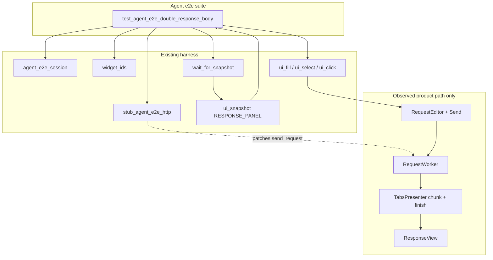

# PYPOST-889: Agent e2e lock for double response-body regression

## Research

### Approved requirements

Source: `ai-tasks/PYPOST-889/10-requirements.md`. Business goal: one agent UI
e2e scenario that drives the PYPOST-887 reported Send case (PUT + malformed
nested JSON-like body), stubs HTTP (no live host), and asserts the response
panel shows the response body **exactly once**. Product fix stays with
[PYPOST-887](https://pypost.atlassian.net/browse/PYPOST-887).

### Related defect and existing unit lock

| Artifact | Role |
| --- | --- |
| [PYPOST-887](https://pypost.atlassian.net/browse/PYPOST-887) | Product double-body bug (chunk flush vs `display_response`) |
| `ai-tasks/PYPOST-887/20-architecture.md` | Root cause: pending 33 ms flush after `setText` |
| `tests/test_tabs_presenter_response_display.py` | Presenter-level once-only unit lock (already green) |

Presenter handlers discard chunk buffers on finish/error
(`_discard_chunk_buffer` in `tabs_presenter_worker.py`). That unit coverage
does **not** prove the agent-driven Send → response panel path.

### Existing agent e2e harness (reuse, do not fork)

| Layer | Entry | Role for this lock |
| --- | --- | --- |
| Session | `agent_e2e_session` | Blank offscreen session |
| HTTP stub | `stub_agent_e2e_http` / `agent_e2e_http_stub` | Deterministic `send_request` |
| Catalog builder | `make_canned_http_result` | New canned OK for this lock |
| Identity | `pypost.ui.widget_ids` | URL, method, Send, response panel |
| Actions | `ui_fill` / `ui_select` / `ui_click` | Configure + Send |
| Wait / snapshot | `wait_for_snapshot` / `ui_snapshot` | Settle + observe panel |
| Suite entry | `make test-agent-e2e` / `agent_e2e` | CI + local gate |
| Composition model | `tests/test_agent_golden_e2e.py` | Pattern to mirror |

Docs: [agent_e2e.md](../../doc/dev/agent_e2e.md),
[agent_golden_e2e.md](../../doc/dev/agent_golden_e2e.md),
[agent_e2e_http.md](../../doc/dev/agent_e2e_http.md).

Golden asserts status + body **presence** (`in joined`). This lock must assert
**cardinality** (body token appears exactly once).

### Gap: request body has no stable widget id

`METHOD_COMBO`, `URL_INPUT`, `SEND_BUTTON`, and `RESPONSE_PANEL` are wired.
`RequestEditor.body_edit` (`CodeEditor`) has **no** `set_widget_id` today, so
agents cannot `ui_fill` the reported body via the identity contract.

Selecting PUT already auto-switches the detail tabs to Body
(`RequestEditor._on_method_changed`), so after `ui_select(..., "PUT")` the
body editor becomes visible — required because `ui_fill` rejects non-visible
targets.

`ui_fill` already supports `QPlainTextEdit` / `QTextEdit` via `setPlainText`
([ui_actions.md](../../doc/dev/ui_actions.md)); `CodeEditor` fits that path.
`setPlainText` does not auto-reformat invalid JSON, so
`{ { "data": { } } }` can be filled as raw text.

### Snapshot body observation

Status/body under `ResponseView` still lack dedicated ids; golden walks
`RESPONSE_PANEL` snapshot values. Same approach here. Prefer a **plain,
recognizable stub body** (non-JSON) so:

- `display_response` does not pretty-print (stable string equality / count).
- Snapshot `sanitize_text` does not compact-JSON-rewrite the token.
- Duplication is `token + token` (or count `== 2`) vs count `== 1`.

### External notes (offscreen Qt / e2e)

Prefer `QT_QPA_PLATFORM=offscreen` via `make test-agent-e2e` (project
Makefile already does this). Headless Qt guidance aligns with pytest-qt /
CI practice: set the platform before GUI init; do not depend on a live
display for this lock
([pytest-qt troubleshooting](https://pytest-qt.readthedocs.io/en/stable/troubleshooting.html)).

### Process constraint

Product display fix is **out of scope**. Step 3 delivers the agent e2e lock
that encodes desired once-only presentation. Current HEAD already includes
the PYPOST-887 discard fix, so the lock’s default run is expected **green**.
FR5 (fails while bug present) is proven by a local red protocol — temporarily
disable discard — not by reintroducing the product bug in-tree.

## Implementation Plan

### Phase A — Architecture (this step)

- Agree modules, harness reuse, body identity gap, and Step 3 red design.
- Mark STEP 2 `[x]` under sprint-task-runner autonomy (no user gate).

### Phase B — Failing repro / red-capable lock (Step 3)

**Sequencing:**

1. Research & design — this document.
2. Write the agent e2e lock (assert exactly-once) **before** any Step 4
   doc/catalog polish that assumes the scenario exists.
3. Prove red-on-bug locally (optional but recommended for FR5), then keep
   the lock green on current HEAD.
4. Step 4: wire body id if not done in Step 3, catalog entry, `doc/dev/`
   note + umbrella links — **no** product double-body fix.

**Where (planned):**

- New module: `tests/test_agent_e2e_double_response_body.py`
  (name may be shortened; keep `agent_e2e` in the name for discoverability).
- Do **not** overload `tests/test_agent_golden_e2e.py` (golden stays GET /
  presence-only).

**Module markers:**

```python
pytestmark = [
    pytest.mark.timeout(60),
    pytest.mark.agent_e2e,
]
```

**How to drive the reported case without live HTTP:**

1. `agent_e2e_session` — ready blank window.
2. Pre-flight `find_widget` for URL, method, Send (and body id once wired).
3. `ui_fill(URL_INPUT, LOCK_URL)` — `https://example.test/...` (not the
   original third-party host).
4. `ui_select(METHOD_COMBO, "PUT")` — also reveals Body tab.
5. `ui_fill(REQUEST_BODY_EDIT, '{ { "data": { } } }')` — reported shape.
6. `with stub_agent_e2e_http(CANNED_…):` → `ui_click(SEND_BUTTON)`.
7. `wait_for_snapshot` until status + lock body token appear under
   `RESPONSE_PANEL` (reuse golden-style panel walk helpers, test-local).
8. **Assert desired behavior:** joined panel values contain the stub body
   token **exactly once** (`joined.count(token) == 1`). Message must
   contrast single vs double (e.g. include count and a short excerpt).

**Stub body:** plain unique string, e.g. `pypost-887-lock-body-once`
(Content-Type text/plain via `make_canned_http_result(..., headers=...)`).
Status 200. Catalog constant + `CANNED_HTTP_CATALOG` row in
`pypost/fixtures/agent_e2e_http.py` (or Step 4 if Step 3 uses an inline
`make_canned_http_result` first — prefer catalog for FR6 consistency).

**Force red without live deps (FR5 proof):**

| Mode | Expectation |
| --- | --- |
| Current HEAD (discard present) | Lock **passes** |
| Temporarily no-op / comment out `_discard_chunk_buffer` call in `_on_request_finished` | Lock **fails** with clear double-body assert |
| Restore discard | Lock **passes** again |

Do not commit the no-op. Do not depend on `portal.velvetel.net`. Do not mock
`RequestWorker` wholesale.

**Settle budget:** mirror golden (~15 s `wait_for_snapshot`); module timeout
60 s per `.cursor/lsr/do-testing.md`.

**Prerequisite for Step 3 fill path:** add `REQUEST_BODY_EDIT` (or equivalent)
to `widget_ids.py`, `KEY_WIDGET_IDS`, `set_widget_id(self.body_edit, …)` in
`request_editor.py`, and a one-line identity doc / spot-check update. This is
**harness identity**, not the PYPOST-887 display fix. Without it, Step 3
cannot meet FR2 + FR6 via `ui_fill`.

### Phase C — Development (Step 4, after red-capable lock exists)

- Ensure catalog + scenario are polished and included under
  `make test-agent-e2e`.
- Brief `doc/dev/` note (new short page or section) describing the lock;
  link from [agent_e2e.md](../../doc/dev/agent_e2e.md) module table and
  golden/HTTP docs as appropriate.
- Keep Jira Relates to PYPOST-887.
- No product chunk-flush / response-view changes.

### Phase D — Later steps

Cleanup, observability, tech-debt, and Step 8 docs follow the roadmap; expect
minimal new metrics (reuse existing agent e2e stub logging).

## Architecture

### Module diagram



### Modules and responsibilities

| Module | Responsibility |
| --- | --- |
| `tests/test_agent_e2e_double_response_body.py` | One scenario; exactly-once assert; clear failure text |
| `pypost/fixtures/agent_e2e_http.py` | Canned lock result + catalog registration |
| `pypost/ui/widget_ids.py` | New `REQUEST_BODY_EDIT` constant |
| `pypost/ui/widgets/request_editor.py` | Apply `set_widget_id` on `body_edit` |
| `tests/test_ui_identity_spotcheck.py` / `doc/dev/ui_identity.md` | Register/document the new id |
| `doc/dev/agent_e2e.md` (+ sibling) | Discoverability of the lock |
| Presenter / ResponseView | **Unchanged** (owned by PYPOST-887) |

### Dependencies

```text
Lock scenario
  → agent_e2e_session (lifecycle)
  → widget_ids + find_widget / ui_* (identity + actions)
  → stub_agent_e2e_http(CANNED_LOCK_OK) (HTTP boundary)
  → wait_for_snapshot + RESPONSE_PANEL walk (observation)
  → pytest agent_e2e + timeout markers
  → make test-agent-e2e (suite entry)

Does NOT depend on:
  → live network
  → seeded_agent_e2e_session (blank session is enough)
  → changing _discard_chunk_buffer / display_response
  → golden module internals (copy helpers locally or share later if debt)
```

### Patterns

| Pattern | Justification |
| --- | --- |
| Composition over new runner | Same as golden: pytest scenario + `pypost.agent` APIs |
| Stub at RequestService use site | Shared HTTP fixture layer (PYPOST-859); keeps UI→worker→panel real |
| Snapshot cardinality assert | User-visible surface; no private presenter hooks in agent e2e |
| Focused single scenario | Epic PYPOST-888 siblings own matrices |
| Minimal identity extension | Enables FR2 without parallel non-id body injection |

### Interfaces / APIs

| Interface | Contract |
| --- | --- |
| `agent_e2e_session` | Yields ready `AgentAppSession` |
| `stub_agent_e2e_http(result)` | Context manager; patches `SEND_REQUEST_PATCH_TARGET` |
| `make_canned_http_result(...)` | Builds stub `HTTPRequestResult` |
| `REQUEST_BODY_EDIT` (new) | `objectName` on `body_edit`; fill via `ui_fill` |
| `session.wait_for_snapshot(pred, timeout=15.0)` | Settle after Send |
| Assert API (test-local) | `joined.count(LOCK_BODY) == 1` under `RESPONSE_PANEL` |

### Interaction scheme (scenario)

1. Obtain session; assert `is_ui_ready`.
2. Configure URL + PUT + reported raw body via stable ids.
3. Install canned stub; click Send.
4. Wait until panel shows status + lock body token.
5. Assert token count == 1; on wait timeout, rewrap with panel excerpt
   (golden style).

## Q&A

- Q: Why not extend the golden e2e test?
  A: Golden proves composition (GET, body presence). This story locks a
  specific regression with PUT + malformed body and an exactly-once count.
  Keeping modules separate preserves golden clarity.
- Q: Why add a body widget id instead of setting `request_data.body` in code?
  A: Requirements mandate harness composition including widget identity.
  Direct model mutation would bypass the agent UI path for body entry.
- Q: Will Step 3 fail on current main?
  A: Default run should **pass** (PYPOST-887 discard already landed). Red is
  demonstrated by temporarily disabling discard locally, then restoring it —
  not by shipping a broken presenter.
- Q: Is Step 3 “N/A — no behavioral change”?
  A: No. Runtime behavior under test is “response body once after this Send.”
  There is no product fix in this story, but there **is** a behavioral
  regression lock to author in Step 3.
- Q: Must the stub echo the malformed request body?
  A: No. Stub returns a distinctive response body so duplication is
  countable; request body shape is for scenario fidelity (FR2).
- Q: Relates to PYPOST-887?
  A: Keep existing Jira Relates; do not drop it (FR8).
