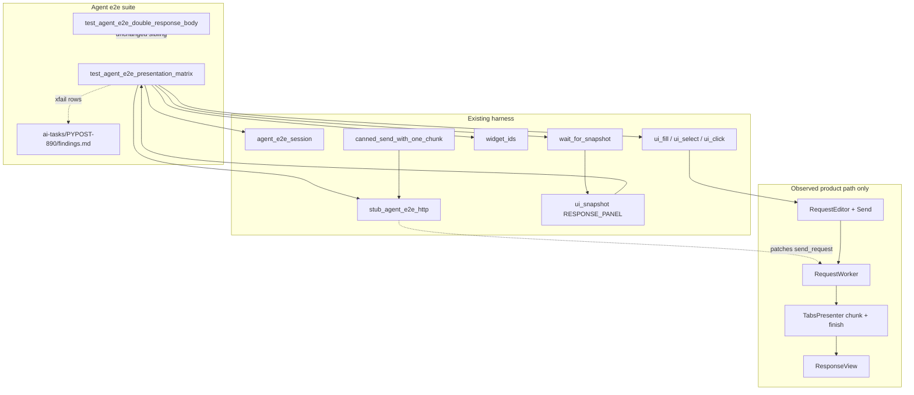

# PYPOST-890: Agent e2e matrix for Send/response presentation

## Research

### Approved requirements

Source: `ai-tasks/PYPOST-890/10-requirements.md`. Business goal: a
parametrized agent UI e2e matrix that probes HTTP methods × request body
shapes against response presentation invariants (body once; status once and
stub-consistent; no duplicate status+body blocks), records failing cells for
[PYPOST-891](https://pypost.atlassian.net/browse/PYPOST-891), and stays
runnable under `make test-agent-e2e` with a fast smoke slice. Product fixes
and the single [PYPOST-889](https://pypost.atlassian.net/browse/PYPOST-889)
lock remain out of scope.

### Step 1 review gaps (resolved here)

- **GET × body cells:** Include the **full cartesian**, including GET with
  non-empty bodies. Empty GET is the natural baseline; non-empty GET is a
  deliberate probe (UI allows Body; Send may still attach body). Do **not**
  skip those cells.
- **Stub response variation:** Request side varies per cell. Response side:
  unique plain-text body token per cell, Content-Type `text/plain`, default
  status **200**. One smoke/status probe uses a **non-200** (e.g. 201) so
  status consistency is not hard-coded. Do **not** echo the request body.
  Prefer `canned_send_with_one_chunk` so the chunk-flush race can appear.
- **Findings artifact path:** Concrete path
  **`ai-tasks/PYPOST-890/findings.md`** (owned by this story; consumed by
  PYPOST-891).

### Sibling lock and harness (reuse)

- [PYPOST-889](https://pypost.atlassian.net/browse/PYPOST-889) /
  `tests/test_agent_e2e_double_response_body.py` — focused PUT + malformed
  lock; **do not replace** (FR10).
- `stub_agent_e2e_http` / `canned_send_with_one_chunk` — deterministic Send
  boundary.
- `REQUEST_BODY_EDIT`, `METHOD_COMBO`, `URL_INPUT`, `SEND_BUTTON`,
  `RESPONSE_PANEL` — identity already wired by 889.
- Golden / lock snapshot walk helpers — cardinality via joined
  `RESPONSE_PANEL` values.
- Docs: [agent_e2e.md](../../doc/dev/agent_e2e.md),
  [agent_e2e_http.md](../../doc/dev/agent_e2e_http.md),
  [agent_e2e_double_response_body.md](../../doc/dev/agent_e2e_double_response_body.md).

Presenter unit lock (`tests/test_tabs_presenter_response_display.py`) and the
889 agent lock do **not** cover the method × body space.

### Matrix dimensions

**Methods (FR2):** `GET`, `POST`, `PUT`, `PATCH`, `DELETE`.

**Body shapes (FR3):**

- `empty` — leave editor empty (no fill).
- `json_ok` — compact valid JSON, e.g. `{"probe": true}`.
- `json_malformed` — extra-wrapped / malformed JSON-like, e.g.
  `{ { "data": { } } }` (same family as 887/889; matrix-owned URL/token).
- `text` — non-JSON plain text, e.g. `not-json-probe`.
- `large` — large-ish (~8–16 KiB) repeating ASCII; omit only if suite budget
  forces — then document in findings.

**Cartesian:** 5 × 5 = **25 cells**. All cells are in scope, including
`GET × {json_ok, json_malformed, text, large}`.

**Body tab visibility:** `RequestEditor` auto-switches to Body only for
`POST` / `PUT`. For `GET` / `PATCH` / `DELETE` with non-empty shapes, the
matrix must select the Body tab before `ui_fill(REQUEST_BODY_EDIT, …)`.
Prefer a small harness id on `detail_tabs` (or equivalent) if click/select
by identity is required; programmatic `setCurrentWidget(body_tab)` via
`find_widget` is acceptable only as a short-term Step 3 bridge, then harden
in Step 4 docs/identity.

### Stub response variation (pinned)

- **Status:** matrix default `200`. Smoke includes one cell with stub status
  `201` (or `404`) asserting `Status: {code}` once and matching the stub.
- **Response body:** unique token per cell, e.g.
  `pypost-890-{method}-{shape}-once`, `text/plain` — stable under snapshot
  sanitize / no pretty-print.
- **Streaming:** install via `canned_send_with_one_chunk(canned)` for
  once-only cells (same rationale as 889).
- **Catalog:** shared constants in `pypost/fixtures/agent_e2e_http.py` **or**
  a matrix-local builder that still uses `make_canned_http_result`; register
  shared entries in `CANNED_HTTP_CATALOG` when reused. Pass `name=` when
  identity auto-name misses factories
  ([PYPOST-893](https://pypost.atlassian.net/browse/PYPOST-893)).
- **URL:** distinct `https://example.test/pypost-890/...` per cell (or
  method×shape); never a live host.

Request body shape is for scenario fidelity; stub response stays independent
so duplication is countable (`joined.count(token) == 1`).

### Suite time and smoke vs full

Default `make test-agent-e2e` uses `-m "agent_e2e and not slow"`.

- **Smoke (default):** `agent_e2e` only. About five cells: `GET×empty`,
  `POST×json_ok`, `PUT×json_malformed`, `PATCH×text`, `DELETE×empty`; plus
  one non-200 status probe (may fold into one of these).
- **Full matrix:** `agent_e2e` + `slow` on non-smoke params — remaining
  cells of the 25.

Document how to run the full matrix (e.g.
`make test-agent-e2e PYTEST_ARGS='tests/test_agent_e2e_presentation_matrix.py -m agent_e2e -v'`
or drop `not slow` via documented `PYTEST_ARGS`). Prefer
`pytest.param(..., marks=pytest.mark.slow)` per
[pytest parametrize + marks](https://docs.pytest.org/en/stable/how-to/parametrize.html).

### Findings recording (pinned path)

**Artifact:** `ai-tasks/PYPOST-890/findings.md`

| Column / field | Purpose |
| --- | --- |
| method | HTTP method |
| body_shape | Shape id from table above |
| stub_status / stub_token | Expected presentation anchors |
| invariant | Which FR4 assert failed |
| pytest_nodeid | Selectable id |
| observed | Short excerpt / count |
| triage | Open / filed Bug key (PYPOST-891 fills) |

Recording strategy:

1. Matrix asserts desired invariants (strict).
2. Known product defects discovered on HEAD: mark that param with
   `pytest.mark.xfail(strict=False, reason="…")` **and** add a row to
   `findings.md` in the same change.
3. Unexpected failures (smoke green cells) fail the suite — do not silently
   skip.
4. Do not remove or weaken the 889 lock when a matrix cell overlaps the
   malformed PUT family.

### Observation / asserts (FR4)

Reuse lock-style helpers (copy test-local first; extract to
`tests/helpers/agent_e2e_response_panel.py` only if cheap — related debt
[PYPOST-869](https://pypost.atlassian.net/browse/PYPOST-869)):

- Body token appears **exactly once** under `RESPONSE_PANEL`.
- `Status: {stub_status}` appears **exactly once**.
- No duplicate status+body block pattern for that Send (token count and
  status count suffice as the primary signal).

Settle: `wait_for_snapshot` (~15 s) + short `QTest.qWait` past chunk flush
(~100 ms) when using streaming stubs. Module `pytest.mark.timeout(60)` (+
higher only if a slow cell needs it) per `.cursor/lsr/do-testing.md`.

### External notes

- [pytest skip/xfail + parametrize](https://docs.pytest.org/en/stable/how-to/skipping.html):
  per-cell `pytest.param(..., marks=pytest.mark.xfail(...))`.
- Offscreen Qt via Makefile (`QT_QPA_PLATFORM=offscreen`); no live display.
- Python guidelines: `.cursor/lsr/do-python.md` (pytest, type hints, stubs).

### Process constraint

This story **discovers and records**; it does not fix product presentation
bugs. Step 3 authors the matrix (desired behavior). Default HEAD is expected
mostly green where 887 discard already applies; red proof uses the same
local discard no-op protocol as 889 for at least one streaming cell.

## Implementation Plan

### Phase A — Architecture (this step)

- Pin GET×body inclusion, stub variation, findings path, smoke vs slow.
- Mark STEP 2 complete under sprint-task-runner autonomy.

### Phase B — Failing repro / red-capable matrix (Step 3)

**Sequencing:** research (done) → write matrix asserting desired presentation
**before** Step 4 docs/catalog polish → prove red locally → keep default
smoke green on HEAD (xfail + findings only for real product defects).

**Where:**

- New: `tests/test_agent_e2e_presentation_matrix.py`
- New (stub or filled): `ai-tasks/PYPOST-890/findings.md` (header + empty
  table if no failures yet)
- Do **not** edit `tests/test_agent_e2e_double_response_body.py` except if a
  shared helper extract is agreed (prefer copy-local in Step 3).

**Module markers:**

```python
pytestmark = [
    pytest.mark.timeout(60),
    pytest.mark.agent_e2e,
]
```

**Parametrize:** `@pytest.mark.parametrize("method,body_shape", [...])`
with explicit `id=` like `GET-empty`, `PUT-json_malformed`. Mark non-smoke
params with `pytest.mark.slow`.

**Drive one cell (no live HTTP):**

1. `agent_e2e_session` — ready blank window.
2. Pre-flight `find_widget` for URL, method, Send, body edit.
3. `ui_fill(URL_INPUT, cell_url)`.
4. `ui_select(METHOD_COMBO, method)`.
5. If body shape ≠ `empty`: ensure Body tab visible, then
   `ui_fill(REQUEST_BODY_EDIT, body_text)`.
6. Build canned result (unique token, status per policy);
   `with stub_agent_e2e_http(canned_send_with_one_chunk(canned), name=...):`
   `ui_click(SEND_BUTTON)`.
7. `wait_for_snapshot` until status label + body token appear; then
   `QTest.qWait(100)`.
8. Assert `joined.count(token) == 1` and
   `joined.count(f"Status: {code}") == 1` with cell id in the failure
   message.

**Force red without live deps:**

- **Current HEAD (discard present):** smoke cells **pass** (unless a real
  new defect → xfail + findings).
- **Temporarily no-op** `_discard_chunk_buffer` in `_on_request_finished`:
  at least one streaming matrix cell **fails** with count ≥ 2.
- **Restore discard:** passes again.

Do not commit the no-op. Do not hit live hosts. Do not mock
`RequestWorker` wholesale.

**Step 3 deliverable:** parametrized module with smoke + slow params,
invariant asserts, initial `findings.md` (possibly empty table), and a
documented red protocol in the test module docstring (mirror 889).

### Phase C — Development (Step 4)

- Catalog polish / shared canned helpers if not done in Step 3.
- Body-tab identity hardening if the Step 3 bridge is fragile.
- `doc/dev/agent_e2e_presentation_matrix.md` + umbrella links in
  `agent_e2e.md` / `agent_e2e_http.md`.
- Ensure smoke stays in default `make test-agent-e2e`; document full matrix.
- Update `findings.md` for any xfails discovered during implementation.
- No product ResponseView / presenter fixes.

### Phase D — Later steps

Cleanup, observability (reuse stub install logs), tech-debt, Step 8 docs
polish. PYPOST-891 consumes `findings.md`.

## Architecture

### Module diagram



### Modules and responsibilities

- `tests/test_agent_e2e_presentation_matrix.py` — parametrized matrix;
  smoke vs slow; invariant asserts; red protocol docstring.
- `ai-tasks/PYPOST-890/findings.md` — durable failing-cell list for
  PYPOST-891.
- `pypost/fixtures/agent_e2e_http.py` — optional shared canned tokens /
  catalog rows.
- `pypost/ui/widget_ids.py` (+ request editor) — optional Body/detail-tab
  id if fill visibility needs it.
- `doc/dev/agent_e2e_presentation_matrix.md` — matrix contract
  (Step 4 / 8).
- `doc/dev/agent_e2e.md` — umbrella discoverability.
- `tests/test_agent_e2e_double_response_body.py` — sibling lock;
  untouched as a product of this story.
- Presenter / ResponseView — **unchanged** (fixes → PYPOST-891 / Bugs).

### Dependencies

```text
Presentation matrix
  → agent_e2e_session
  → widget_ids + ui_* (+ Body tab select for GET/PATCH/DELETE + body)
  → stub_agent_e2e_http(canned_send_with_one_chunk(...))
  → wait_for_snapshot + RESPONSE_PANEL walk
  → pytest agent_e2e + timeout (+ slow on non-smoke)
  → make test-agent-e2e
  → ai-tasks/PYPOST-890/findings.md (xfail / triage handoff)

Does NOT depend on:
  → live network
  → seeded_agent_e2e_session
  → changing _discard_chunk_buffer / display_response
  → removing or rewriting the PYPOST-889 lock
```

### Patterns

| Pattern | Justification |
| --- | --- |
| Parametrized composition | One driver × method×shape; pytest ids for triage |
| Stub at RequestService use site | Shared HTTP layer; real UI→worker→panel |
| Unique plain response tokens | Stable cardinality; no pretty-print / sanitize drift |
| Streaming canned side effect | Once-only asserts can see flush races |
| Smoke vs `@pytest.mark.slow` | Keeps default `make test-agent-e2e` fast |
| xfail + findings.md | Discovers without owning product fixes |
| Sibling lock untouched | FR10 breadth complements focused 889 |

### Interfaces / APIs

| Interface | Contract |
| --- | --- |
| `agent_e2e_session` | Ready `AgentAppSession` |
| `stub_agent_e2e_http(result, name=...)` | Patches `SEND_REQUEST_PATCH_TARGET` |
| `canned_send_with_one_chunk(result)` | One `stream_callback` chunk then finish |
| `make_canned_http_result(...)` | Builds stub `HTTPRequestResult` |
| `REQUEST_BODY_EDIT` / method / URL / Send / panel | Drive + observe |
| Body tab select | Required for GET/PATCH/DELETE + non-empty |
| Assert API | `count(token)==1`, `count("Status: N")==1` |
| `findings.md` | Markdown table under `ai-tasks/PYPOST-890/` |

### Interaction scheme (one cell)

1. Obtain session; assert `is_ui_ready`.
2. Configure URL + method; for non-empty shapes, show Body and fill shape.
3. Install unique canned streaming stub; click Send.
4. Wait until panel shows status + token; settle past flush window.
5. Assert once-only body and once-only status; on failure, message includes
   method, shape, counts, excerpt.
6. If known defect: xfail that param and append `findings.md`.

## Q&A

- Q: Are GET × non-empty body cells skipped?
  A: No. Full cartesian includes them; select Body tab before fill.
- Q: Do stubs echo the request body or vary widely?
  A: No echo. Unique plain token per cell; status mostly 200 with one
  non-200 probe for status consistency.
- Q: Where is the findings artifact?
  A: `ai-tasks/PYPOST-890/findings.md` only (not under `doc/` for triage
  handoff; docs may link to it).
- Q: Does this replace PYPOST-889?
  A: No (FR10). Matrix may include a PUT×malformed cell with its own URL
  and token; the 889 lock stays.
- Q: Is Step 3 N/A (no behavioral change)?
  A: No. Step 3 authors the matrix that encodes desired presentation
  behavior; product fixes remain out of scope.
- Q: What if the large body cell is too slow?
  A: Mark `slow` or document omission in `findings.md` / architecture note;
  do not block the rest of the matrix.
- Q: Is Step 2 user approval required?
  A: Under sprint-task-runner autonomy, treat as pre-approved; no gate.
