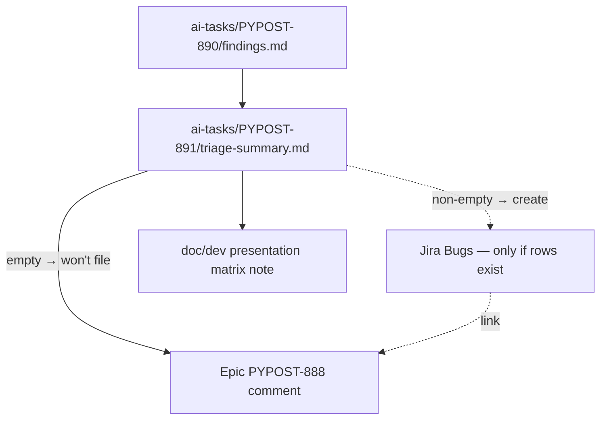

# PYPOST-891: Triage agent e2e audit findings and file fix Bugs

## Research

### Approved requirements

Source: `ai-tasks/PYPOST-891/10-requirements.md`. Business goal: triage
the PYPOST-890 presentation-matrix findings, file Bugs only for distinct
product failures linked to epic
[PYPOST-888](https://pypost.atlassian.net/browse/PYPOST-888), and comment
on the epic — or explicitly record **no product defects / won’t file**
when findings are empty. No product code changes.

### Findings input (pinned)

| Source | Path / note |
| --- | --- |
| Findings table | `ai-tasks/PYPOST-890/findings.md` |
| HEAD scan | 2026-07-21: full cartesian **25 passed** |
| Table state | Empty — *(empty — no product defects recorded yet)* |
| Matrix contract | [agent_e2e_presentation_matrix.md](../../doc/dev/agent_e2e_presentation_matrix.md) |

### Triage rules

1. **Read** findings rows end-to-end; do not invent failures from memory.
2. **Group** rows into distinct failure modes (same invariant + same root
   cause class → one Bug; different modes → separate Bugs).
3. **File** only when a row documents a real HEAD product defect (xfail +
   findings row per PYPOST-890 policy).
4. **Won’t file** when the table is empty and HEAD scan is green — write
   that outcome in the triage summary and epic comment.
5. **Never** change product Send / response presentation code in this
   story.

### External / process notes

- Jira Bugs belong under epic PYPOST-888 (link issue + epic comment).
- This execution subagent **cannot** call Jira MCP; orchestrator posts
  the epic comment and would create Bugs if findings were non-empty.
- Local red protocol in PYPOST-890 (temp discard no-op) is **not** a
  findings row and must not become a Bug.

## Implementation Plan

### Phase A — Architecture (this step)

- Pin findings path, empty-table outcome, triage-summary artifact path.
- Declare Step 3 **N/A — no behavioral change**.

### Phase B — Failing repro (Step 3)

**N/A — no behavioral change.** This story is ticketing / docs process
only. There is no runtime defect to prove with a red product test, and
no product behavior to change in Step 4. Document N/A on the roadmap;
do not author a failing test.

### Phase C — Development (Step 4)

1. Re-read `ai-tasks/PYPOST-890/findings.md`.
2. Confirm empty table + 25/25 HEAD context.
3. Write `ai-tasks/PYPOST-891/triage-summary.md` with:
   - input review
   - distinct-failure count = 0
   - **no product defects found / won’t file**
   - draft epic comment for orchestrator
   - Bug create list: none
4. Skip Bug creates (Phase D).

### Phase D — Later steps

Cleanup / observability N/A for docs-only; tech-debt explicit none;
Step 8 updates matrix doc with triage outcome pointer.

## Architecture

### Module diagram

### Modules and responsibilities

| Artifact | Responsibility |
| --- | --- |
| `findings.md` (890) | Input — durable failing cells (read-only here) |
| `triage-summary.md` (891) | Decision record + epic comment draft |
| Jira Bugs | Product fix backlog (skipped when empty) |
| Epic PYPOST-888 | Audit trail via comment |
| `agent_e2e_presentation_matrix.md` | Discoverability of triage outcome |

### Patterns

| Pattern | Justification |
| --- | --- |
| Empty-findings close-out | Explicit won’t-file beats silent skip |
| One Bug per distinct mode | Avoids Bug spam for related cells |
| Orchestrator Jira handoff | This run cannot call Jira MCP |
| Docs-only surface | No product path change |

### Interfaces

| Interface | Contract |
| --- | --- |
| Findings table | Rows = fileable defects; empty = won’t file |
| Triage summary | Must state Bug keys or won’t-file |
| Epic comment | Summarize counts + link to triage artifact |
| Product code | Unchanged |

## Q&A

- Q: Is Step 3 N/A?
  A: Yes — no runtime behavioral change; triage is process / docs.
- Q: What if findings gain rows later?
  A: Re-open triage under a new story or reopen this process; do not
  invent Bugs on empty input in this run.
- Q: Should the local discard no-op red proof become a Bug?
  A: No — not a product defect on HEAD; not a findings row.
