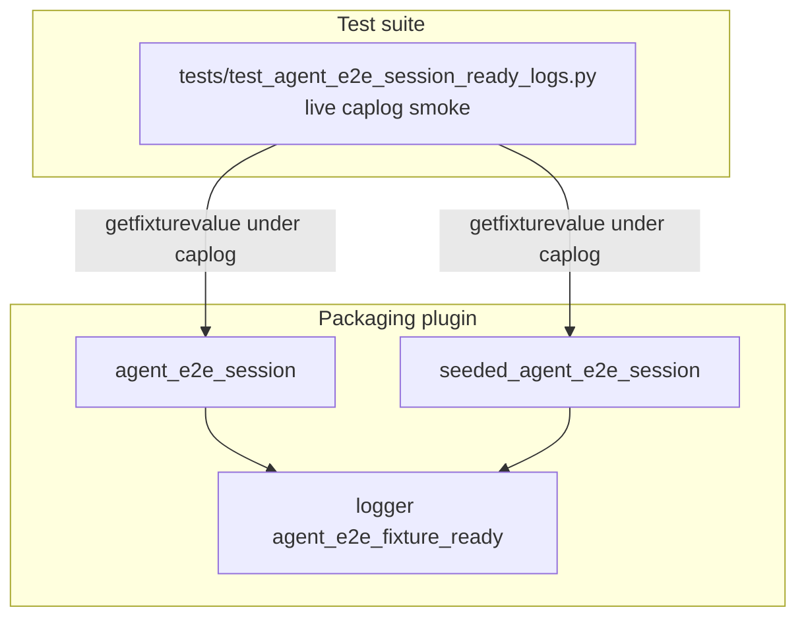

# PYPOST-899: Optional live-session ready-log smoke

## Research

### Origin

- Jira: [PYPOST-899](https://pypost.atlassian.net/browse/PYPOST-899), Lowest Debt,
  from [PYPOST-867](https://pypost.atlassian.net/browse/PYPOST-867) tech debt.
- Requirements: `ai-tasks/PYPOST-899/10-requirements.md`.
- Sibling pattern: [PYPOST-867](https://pypost.atlassian.net/browse/PYPOST-867)
  (`tests/test_agent_e2e_packaging_logs.py` — mocked packaging ready caplog).

### Current production contract (already landed)

`tests/_pytest_plugins/agent_e2e.py`:

1. `agent_e2e_session` — after live `AgentAppSession` ready:
   `logger.info("agent_e2e_fixture_ready mode=blank")`.
2. `seeded_agent_e2e_session` — after seeded dirs + live ready session:
   `logger.info("agent_e2e_fixture_ready mode=seeded")`.

PYPOST-867 verifies the same events via mocked generator drive (fast unit,
no `agent_e2e` marker). **Missing:** live offscreen re-assert without mocks.

### Caplog / live fixture pattern

Remediation:

```text
caplog.at_level(INFO, logger="tests._pytest_plugins.agent_e2e")
```

Drive fixtures inside the caplog block via `request.getfixturevalue(...)` so
ready logs emitted during fixture setup are captured. Do **not** patch
`AgentAppSession` or `seeded_agent_dirs`.

Mark module `@pytest.mark.agent_e2e` + `timeout(60)`; add harness table row.

### Decision

**Test-only change.** Add `tests/test_agent_e2e_session_ready_logs.py` with two
thin smokes (blank + seeded) that request live fixtures under caplog and assert
ready event prefixes. No production change expected.

## Implementation Plan

1. Keep `tests/_pytest_plugins/agent_e2e.py` unchanged unless tests reveal a
   real contract gap.
2. Add `tests/test_agent_e2e_session_ready_logs.py` with module
   `pytestmark = [timeout(60), agent_e2e]`.
3. Cover both modes on live path:
   - `test_live_agent_e2e_session_logs_fixture_ready_blank`
   - `test_live_seeded_agent_e2e_session_logs_fixture_ready_seeded`
4. Update `doc/dev/agent_e2e.md` harness table + packaging ready note.
5. Update `doc/dev/logging.md` cross-link to live smoke module.

**Mandatory — Failing Repro (Step 3):**

- **What:** Red placeholder failing with explicit PYPOST-899 message (missing
  live-session caplog coverage). Production already emits events; gap is test
  coverage only.
- **Where:** `tests/test_agent_e2e_session_ready_logs.py`.
- **Sequencing:** Step 3 red `pytest.fail` → Step 4 real live caplog asserts
  until green. No product edit unless green tests expose a logging bug.

## Architecture

### Modules



### Responsibilities

| Component | Responsibility |
| --- | --- |
| Live fixtures | Real offscreen session + ready log (existing) |
| New session-ready-logs tests | Assert ready events via caplog on live path |
| PYPOST-867 packaging_logs | Retained mocked fast unit proofs |
| `doc/dev/agent_e2e.md` | Harness table + live vs unit proof note |

### Patterns

- `request.getfixturevalue` inside `caplog.at_level` block (capture setup logs).
- Minimal sanity: `session.window.is_ui_ready is True`.
- GUI timeout tier (60s); marked `agent_e2e` for harness inclusion.

## Q&A

- Q: Duplicate PYPOST-867?
  A: Complementary — unit (mocked, fast) vs live (e2e confidence).
- Q: Extend lifecycle_smoke instead?
  A: Dedicated module keeps caplog smoke discoverable and thin.
- Q: Step 3 N/A?
  A: No — live caplog coverage was missing; red placeholder documents gap.
