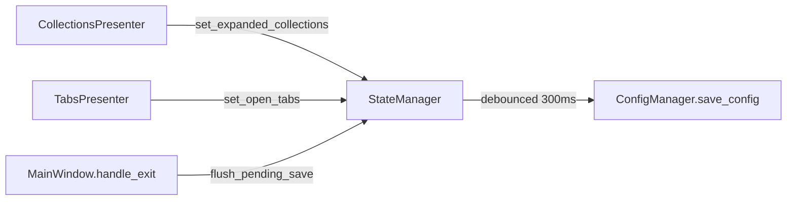

# PYPOST-90: Close debt — synchronous settings save on every click

## Research

Qt desktop apps commonly debounce high-frequency persistence with a single-shot `QTimer`
(300 ms is a typical interval). PyPost adopted this pattern in PYPOST-386 following the same
approach used elsewhere (e.g. response search debounce in PYPOST-363).

## Implementation Plan

Verification-only closure — no new modules:

1. Confirm `CollectionsPresenter` routes expand/collapse through `StateManager.set_expanded_collections`.
2. Confirm `StateManager` schedules debounced saves and `MainWindow.handle_exit()` flushes.
3. Run `tests/test_settings_persistence.py` debounce and coalescing tests.
4. Update PYPOST-10 tech-debt and `doc/dev/state_manager.md` cross-references.

## Architecture

| Component | Responsibility |
| --- | --- |
| `CollectionsPresenter` | Tree expand/collapse → `StateManager` |
| `StateManager` | Debounce timer, coalesce rapid `set_*` calls |
| `ConfigManager` | Serialize full `AppSettings` to disk |
| `MainWindow` | Flush pending UI state on exit |

Environment selection in `EnvPresenter` still calls `save_config` immediately — unchanged and
out of scope for this debt item.

## Q&A

- **Q:** Does debounce apply to all settings? **A:** Only UI session fields managed by
  `StateManager` (`expanded_collections`, `open_tabs`, `last_environment_id` via its API).
  User preferences from Settings dialog save immediately.
