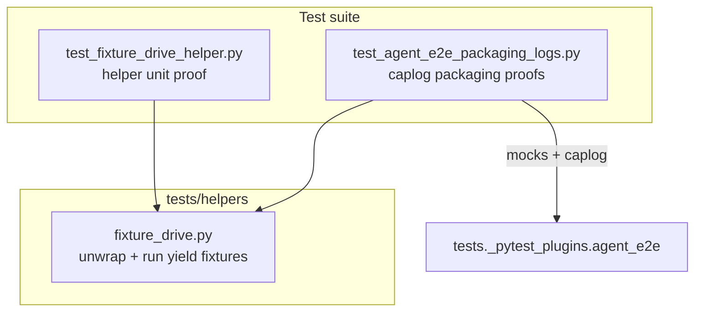

# PYPOST-900: Optional public fixture-drive helper

## Research

### Origin

- Jira: [PYPOST-900](https://pypost.atlassian.net/browse/PYPOST-900), Lowest Debt,
  from [PYPOST-867](https://pypost.atlassian.net/browse/PYPOST-867) tech debt.
- Requirements: `ai-tasks/PYPOST-900/10-requirements.md`.
- Current usage: `tests/test_agent_e2e_packaging_logs.py` — local `_fixture_fn`
  and `_run_fixture` call `fixture._get_wrapped_function()`.

### Existing pattern

PYPOST-867 mocked caplog proofs drive yield fixtures manually:

```python
def _fixture_fn(fixture):
    return fixture._get_wrapped_function()

def _run_fixture(gen):
    value = next(gen)
    with pytest.raises(StopIteration):
        next(gen)
    return value
```

**Gap:** private pytest API and drive logic duplicated inline; no shared helper.

### Decision

**Test-only change.** Add `tests/helpers/fixture_drive.py` with:

- `unwrap_yield_fixture(fixture)` — sole caller of `_get_wrapped_function`
- `run_yield_fixture(gen)` — setup/teardown drive
- `call_yield_fixture(fixture)` — convenience compose

Refactor packaging log tests to import from helper. Add thin unit test module
proving helper against a trivial yield fixture.

## Implementation Plan

1. Add `tests/helpers/fixture_drive.py` with documented public helpers.
2. Refactor `tests/test_agent_e2e_packaging_logs.py` to use helper imports.
3. Add `tests/test_fixture_drive_helper.py` with module `pytestmark = timeout(30)`.
4. Update `doc/dev/testing.md` with helper table row / cross-link.

**Mandatory — Failing Repro (Step 3):**

- **What:** Red test importing `tests.helpers.fixture_drive` — fails with
  `ModuleNotFoundError` until Step 4 adds the module.
- **Where:** `tests/test_fixture_drive_helper.py`.
- **Sequencing:** Step 3 red import → Step 4 implement helper + green tests.
  No product edit.

## Architecture

### Modules



### Responsibilities

| Component | Responsibility |
| --- | --- |
| `fixture_drive.py` | Isolate private pytest unwrap; drive yield generators |
| `test_fixture_drive_helper.py` | Unit proof of helper API |
| `test_agent_e2e_packaging_logs.py` | Packaging ready caplog (consumer) |
| `doc/dev/testing.md` | Document helper for reuse |

### Patterns

- Single module owns `_get_wrapped_function` — comment documents pytest version
  coupling.
- `call_yield_fixture` for one-liner consumer ergonomics in caplog tests.
- Pure unit timeout tier (30s).

## Q&A

- Q: Export from `tests/helpers/__init__.py`?
  A: No — follow sibling helpers (direct module import path).
- Q: Step 3 N/A?
  A: No — helper module missing until Step 4; red import documents gap.
