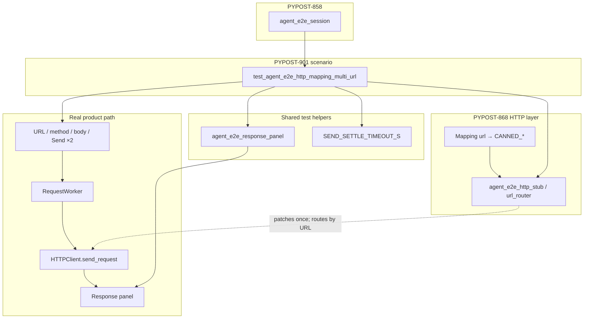

# PYPOST-901: Optional GUI multi-URL Send using Mapping router

## Research

### Jira / parent debt

- Issue: [PYPOST-901](https://pypost.atlassian.net/browse/PYPOST-901) —
  optional GUI multi-URL Send using the Mapping router.
- Parent: [PYPOST-868](https://pypost.atlassian.net/browse/PYPOST-868)
  shipped `stub_agent_e2e_http(Mapping[str, HTTPRequestResult])` with unit
  proofs; debt note in `ai-tasks/PYPOST-868/60-tech-debt.md` — *“No agent
  e2e GUI scenario yet drives two different URLs under one map.”*
- Acceptance: small marked `agent_e2e` scenario that Sends twice to distinct
  resolved URLs with a Mapping stub and asserts panel outcomes.

### Existing infrastructure (no product change)

| Layer | Location | Status |
| --- | --- | --- |
| Mapping router | `pypost/fixtures/agent_e2e_http.py` — `url_router_side_effect`, `stub_agent_e2e_http(Mapping)` | Shipped (868) |
| Unit proofs | `tests/test_agent_e2e_http.py` — `test_stub_agent_e2e_http_url_router_map`, miss case | Green |
| Catalog pair | `SEED_GET_RESOLVED_URL` → `CANNED_SEED_GET_OK`; `SEED_POST_RESOLVED_URL` → `CANNED_SEED_POST_OK` | Ready |
| Single-URL GUI Sends | `tests/test_agent_e2e_http_env.py` (GET), `tests/test_agent_e2e_http_seed_post.py` (POST + body) | Green |
| Panel helpers | `tests/helpers/agent_e2e_response_panel.py` — `joined_panel_values`, `subtree_by_name`, `response_panel_excerpt` | Shared (869) |
| Settle budget | `tests/helpers/agent_e2e_send.py` — `SEND_SETTLE_TIMEOUT_S` | Shared (895) |
| Docs (router API) | `doc/dev/agent_e2e_http.md` — URL→canned section with two-URL map example | Documented; **no GUI scenario named yet** |

Unit router tests call `send_request` directly with `RequestData` mocks. GUI
scenarios prove UI fill → Send → worker → patched boundary → response panel.
This task closes that gap for **two URLs under one Mapping install**.

### Session and fill strategy

| Option | Pros | Cons |
| --- | --- | --- |
| **Blank `agent_e2e_session` + explicit fill** | Mirrors seed POST; one tab; re-fill URL/method/body between Sends | Slightly more fill steps |
| Seeded session + tree navigation | Reuses seed inventory labels | Two requests / navigation adds noise for a “small” scenario |

**Decision: blank session + explicit fill.** Same boundary as
`test_agent_e2e_http_seed_post.py`: fill editor fields, Send, wait, assert.
Between Sends, re-fill URL (and method/body for POST). Keeps the scenario
self-contained and deterministic without collection-tree coupling.

### Stub scope

Both Sends must run inside **one** `with agent_e2e_http_stub(responses_map):`
(or equivalent `stub_agent_e2e_http(responses_map)`) so the router stays
installed and routes by `request_data.url` on each Send. Map keys must equal
the resolved URL strings filled in `URL_INPUT` (868 v1 contract).

Natural map (already used in unit test and docs):

```python
responses = {
    SEED_GET_RESOLVED_URL: CANNED_SEED_GET_OK,
    SEED_POST_RESOLVED_URL: CANNED_SEED_POST_OK,
}
```

Plain `return_value`-style canned results (no `canned_send_with_one_chunk`)
match env GET / seed POST GUI paths; streaming is out of scope.

### External guidance

No new libraries. Reuse established offscreen Qt + `pytest.mark.agent_e2e`
patterns. Per-test `@pytest.mark.timeout(60)` on the scenario module (sibling
Send scenarios).

## Implementation Plan

1. **Failing repro (Step 3)** — add inventory gate in
   `tests/test_agent_e2e_http.py` asserting
   `tests.test_agent_e2e_http_mapping_multi_url` exists and exposes
   `test_mapping_stub_two_distinct_urls_panel_outcomes`. Fails with
   `ModuleNotFoundError` until Step 4.
2. **Scenario module (Step 4)** — add
   `tests/test_agent_e2e_http_mapping_multi_url.py`:
   - marks: `pytestmark = [pytest.mark.timeout(60), pytest.mark.agent_e2e]`
   - blank `agent_e2e_session`; find `URL_INPUT`, `METHOD_COMBO`,
     `REQUEST_BODY_EDIT`, `SEND_BUTTON`, `RESPONSE_PANEL`
   - build two-URL map from catalog constants (above)
   - **inside one stub scope:**
     1. GET: fill URL + method → Send → `wait_for_snapshot` until status +
        GET canned body in panel → assert
     2. POST: fill URL + method + `SEED_POST_BODY` → Send → wait → assert
        POST canned body
   - reuse `SEND_SETTLE_TIMEOUT_S`, `joined_panel_values`,
     `response_panel_excerpt`, `subtree_by_name`; timeout re-raise attaches
     `response_excerpt` (same shape as env GET / seed POST)
3. **Cleanup / observability (Steps 5–6)** — flake8 on new module; reuse
   existing `agent_e2e_http_stub_installed name=url_router` log (no new
   events).
4. **Docs (Step 8)** — minimal discoverability:
   - `doc/dev/agent_e2e_http.md` — point URL-router section at the new GUI
     module + run command
   - `doc/dev/agent_e2e.md` — add harness table row (sync guard in
     `tests/test_agent_e2e_harness_table_doc.py` in same change)

**Mandatory — Failing Repro (next Step 3):**

Add to `tests/test_agent_e2e_http.py` (unit module; `pytestmark.timeout(10)`
already present):

```python
def test_mapping_multi_url_gui_send_scenario_module_exists() -> None:
    """PYPOST-901: GUI multi-URL Mapping Send scenario module must exist."""
    import importlib

    mod = importlib.import_module("tests.test_agent_e2e_http_mapping_multi_url")
    assert callable(
        getattr(mod, "test_mapping_stub_two_distinct_urls_panel_outcomes", None)
    )
```

Run:

```bash
make test PYTEST_ARGS='tests/test_agent_e2e_http.py::test_mapping_multi_url_gui_send_scenario_module_exists -q'
```

Expected: **red** (`ModuleNotFoundError` or failed assert) — honest “missing
scenario” gate. A fully written GUI scenario would pass immediately (Mapping
router, catalog, UI harness, and panel helpers already exist); inventory gate
matches [PYPOST-871](https://pypost.atlassian.net/browse/PYPOST-871) precedent.

After Step 4, green paths:

```bash
make test PYTEST_ARGS='tests/test_agent_e2e_http.py::test_mapping_multi_url_gui_send_scenario_module_exists -q'
make test-agent-e2e PYTEST_ARGS='tests/test_agent_e2e_http_mapping_multi_url.py -q'
```

Sequencing: research (done) → red inventory → Step 4 GUI module → inventory
green + scenario green under `make test-agent-e2e` → cleanup → observability
→ tech debt → docs.

## Architecture



### Modules and responsibilities

| Module | Change | Responsibility |
| --- | --- | --- |
| `tests/test_agent_e2e_http_mapping_multi_url.py` | **Add** | GUI Send ×2 under one Mapping stub; panel asserts |
| `tests/test_agent_e2e_http.py` | **Add** inventory test | Step 3 red gate; existing unit router tests unchanged |
| `pypost/fixtures/agent_e2e_http.py` | None | Mapping router + catalog (868) |
| `tests/helpers/agent_e2e_response_panel.py` | None | Shared panel snapshot helpers |
| `tests/helpers/agent_e2e_send.py` | None | Shared settle timeout |
| `doc/dev/agent_e2e_http.md` | Step 8 touch | Link GUI scenario to URL-router section |
| `doc/dev/agent_e2e.md` | Step 8 touch | Harness table row for discoverability |

### Interfaces (test-facing)

| Symbol | Use |
| --- | --- |
| `SEED_GET_RESOLVED_URL` / `CANNED_SEED_GET_OK` / `SEED_GET_OK_BODY` | First Send URL + expected panel body |
| `SEED_POST_RESOLVED_URL` / `CANNED_SEED_POST_OK` / `SEED_POST_OK_BODY` | Second Send URL + expected panel body |
| `SEED_POST_BODY` | POST request body fill |
| `stub_agent_e2e_http(responses_map)` or `agent_e2e_http_stub(responses_map)` | Single CM covering both Sends |
| `URL_INPUT`, `METHOD_COMBO`, `REQUEST_BODY_EDIT`, `SEND_BUTTON`, `RESPONSE_PANEL` | UI identities |
| `joined_panel_values`, `subtree_by_name`, `response_panel_excerpt` | Ready predicates + asserts + timeout diagnostics |
| `SEND_SETTLE_TIMEOUT_S` | Bounded wait after each Send |

### Patterns

- **Mirror single-URL Send scenarios** — same settle/wait/diagnostics shape as
  env GET and seed POST; only delta is Mapping stub + second Send in same scope.
- **Inventory red gate** — missing module is the honest Step 3 failure (871).
- **Deterministic boundary stub** — no live HTTP; no RequestWorker mock.
- **Fail-loud router** — unknown URL still raises at stub boundary (unit-covered;
  scenario uses only mapped keys).

### Out of scope (unchanged)

- Mapping match rules / router implementation (868).
- method+URL compound keys ([PYPOST-902](https://pypost.atlassian.net/browse/PYPOST-902)).
- Migrating existing single-canned scenarios to Mapping stubs.
- Product UX or `doc/user/` changes.

## Q&A

| Q | A |
| --- | --- |
| Why a new file instead of extending env or seed POST? | Keeps single-URL scenarios unchanged (FR7); multi-URL Mapping flow is a distinct author pattern. |
| Why blank session? | Two different URL/method/body fills on one tab; simpler than seeded tree navigation. |
| Why inventory red test, not a red GUI test? | Infrastructure is complete; a correct GUI scenario would pass on first write. Inventory proves the gap until the module lands (871 precedent). |
| Must both URLs be seed GET/POST? | Not mandated in FR1, but natural — constants and unit map already use this pair. |
| Streaming stub for panel body? | Not required; env GET / seed POST use plain canned results; same path via Mapping lookup. |
| Product code changes? | None — harness / test / dev-docs only. |
