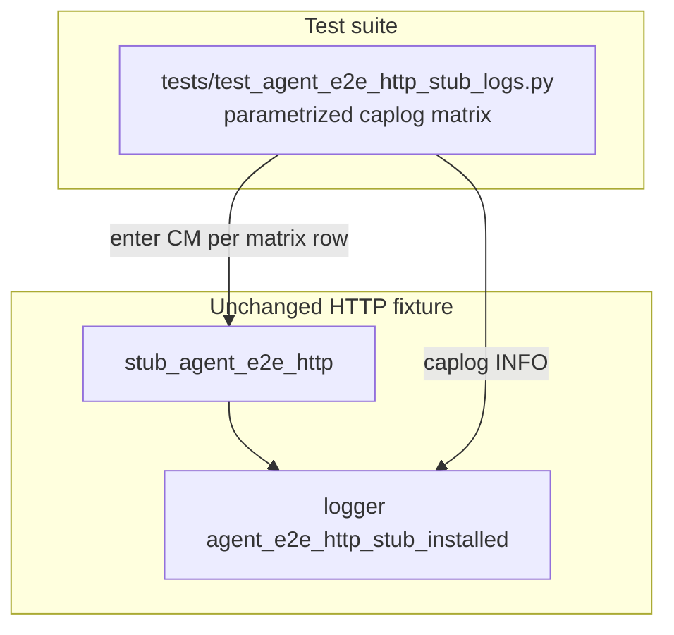

# PYPOST-903: Optional caplog matrix for stub install name tokens

## Research

### Origin

- Jira: [PYPOST-903](https://pypost.atlassian.net/browse/PYPOST-903), Lowest Debt,
  from [PYPOST-870](https://pypost.atlassian.net/browse/PYPOST-870)
  (`ai-tasks/PYPOST-870/60-tech-debt.md` — Optional caplog matrix).
- Requirements: `ai-tasks/PYPOST-903/10-requirements.md`.
- Existing proof: `tests/test_agent_e2e_http_stub_logs.py` — single `golden_ok` test.

### Production contract (unchanged)

`pypost/fixtures/agent_e2e_http.py` — `stub_agent_e2e_http`:

- Catalog identity (`is`) → `golden_ok`, `seed_get_ok`, `seed_post_ok`,
  `double_body_lock_ok`.
- Mapping + default `name="custom"` → `url_router`.
- Explicit `name=` override → caller value (when not overridden by catalog `is`).
- Logger: `pypost.fixtures.agent_e2e_http`, event `agent_e2e_http_stub_installed`.

### Caplog pattern (PYPOST-870)

```text
caplog.at_level(INFO, logger="pypost.fixtures.agent_e2e_http")
assert "agent_e2e_http_stub_installed name=<token>" in caplog.text
```

Pure unit: enter CM under caplog; no GUI, no live network.

### Decision

**Test-only change.** Replace the single golden test with a parametrized matrix
(or add siblings sharing one helper). No production edits expected.

## Implementation Plan

1. Keep `pypost/fixtures/agent_e2e_http.py` unchanged unless tests expose a gap.
2. Extend `tests/test_agent_e2e_http_stub_logs.py`:
   - Define install-case table: stub arg, expected `name=`, optional CM kwargs.
   - Parametrize `test_stub_agent_e2e_http_logs_installed_event`.
3. Run focused:
   `make test PYTEST_ARGS="tests/test_agent_e2e_http_stub_logs.py -v"`.
4. Step 8: note expanded caplog matrix in `doc/dev/agent_e2e_http.md`.

**Mandatory — Failing Repro (next Step 3):**

- **What:** Parametrized matrix where rows beyond `golden_ok` call
  `pytest.fail("PYPOST-903: caplog matrix not implemented for name=…")` so
  `make test` is red with multiple failures until Step 4 implements asserts.
- **Where:** `tests/test_agent_e2e_http_stub_logs.py`.
- **Force without live deps:** placeholder rows need no external deps; green
  path uses existing `stub_agent_e2e_http` mock patch only.
- **Sequencing:** Step 3 red placeholders → Step 4 real caplog asserts until
  all matrix rows green. No product edit unless green tests expose a bug.

## Architecture

### Modules



### Install-case table

| Expected `name=` | Stub argument | CM kwargs |
| --- | --- | --- |
| `golden_ok` | `CANNED_GOLDEN_OK` | — |
| `seed_get_ok` | `CANNED_SEED_GET_OK` | — |
| `seed_post_ok` | `CANNED_SEED_POST_OK` | — |
| `double_body_lock_ok` | `CANNED_DOUBLE_BODY_LOCK_OK` | — |
| `url_router` | `{GOLDEN_URL: CANNED_GOLDEN_OK}` | — |
| `scenario_alpha` | `make_canned_http_result(url=…)` | `name="scenario_alpha"` |

### Patterns

- Parametrize over `(stub_arg, expected_name, stub_kwargs)` tuples.
- Caplog scoped to `_HTTP_LOGGER` at INFO.
- Module `pytestmark = timeout(10)`; no `agent_e2e` marker.

## Q&A

- Q: Change production logger message?
  A: No — assert existing prefixes from PYPOST-859.
- Q: Is Step 3 N/A?
  A: No — matrix rows beyond golden_ok are missing; red placeholders first.
- Q: Merge into `test_agent_e2e_http.py`?
  A: No — keep dedicated stub-logs module (PYPOST-870 / FR7).
