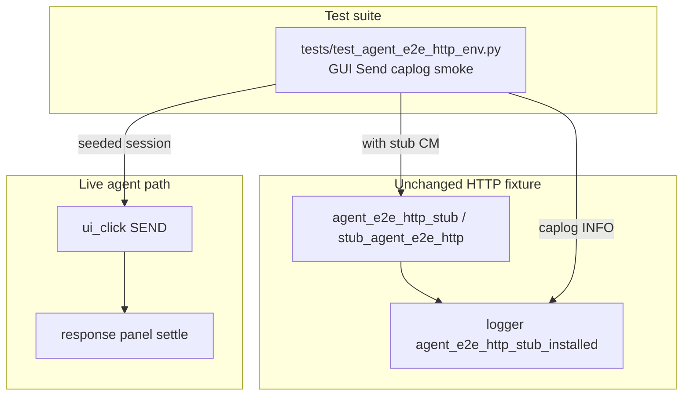

# PYPOST-904: Optional GUI-path install-log smoke

## Research

### Origin

- Jira: [PYPOST-904](https://pypost.atlassian.net/browse/PYPOST-904), Lowest Debt,
  from [PYPOST-870](https://pypost.atlassian.net/browse/PYPOST-870)
  (`ai-tasks/PYPOST-870/60-tech-debt.md` — Optional live GUI path re-assert).
- Requirements: `ai-tasks/PYPOST-904/10-requirements.md`.
- Unit proofs: `tests/test_agent_e2e_http_stub_logs.py` (PYPOST-870 / 903).
- Sibling live pattern: [PYPOST-899](https://pypost.atlassian.net/browse/PYPOST-899)
  (`tests/test_agent_e2e_session_ready_logs.py` — live ready caplog).

### Target scenario

`tests/test_agent_e2e_http_env.py::test_seeded_env_send_uses_shared_http_stub`
already exercises seeded env GET Send under `CANNED_SEED_GET_OK` with
`agent_e2e` marker. **Missing:** caplog assert on install event during GUI flow.

### Caplog pattern

```text
caplog.at_level(INFO, logger="pypost.fixtures.agent_e2e_http")
with agent_e2e_http_stub(CANNED_SEED_GET_OK):
    session.ui_click(SEND_BUTTON)
    session.wait_for_snapshot(...)
assert "agent_e2e_http_stub_installed name=seed_get_ok" in caplog.text
```

Install log fires on stub CM enter (before Send completes). Wrapping the stub
block in caplog captures it on the live GUI path.

### Decision

**Test-only change.** Add sibling smoke
`test_seeded_env_send_logs_http_stub_installed` in the existing env Send module
rather than a new harness-table row. No production change expected.

## Implementation Plan

1. Keep `pypost/fixtures/agent_e2e_http.py` unchanged unless tests expose a gap.
2. Extend `tests/test_agent_e2e_http_env.py`:
   - Add `_HTTP_LOGGER` constant.
   - Add thin Send smoke with caplog around stub + click + settle.
3. Run focused:
   `make test-agent-e2e PYTEST_ARGS="tests/test_agent_e2e_http_env.py -v"`.
4. Step 8: note GUI-path install-log smoke in `doc/dev/agent_e2e_http.md`.

**Mandatory — Failing Repro (Step 3):**

- **What:** Red placeholder
  `pytest.fail("PYPOST-904: GUI Send install-log caplog not implemented")`.
- **Where:** new test in `tests/test_agent_e2e_http_env.py`.
- **Sequencing:** Step 3 red → Step 4 real caplog assert until green. No product
  edit unless green tests expose a logging bug.

## Architecture

### Modules



### Patterns

- Reuse `_response_ready`, `SEND_SETTLE_TIMEOUT_S`, seeded session fixture.
- Caplog scoped to `_HTTP_LOGGER` at INFO inside stub context.
- Module `pytestmark = [timeout(60), agent_e2e]` unchanged.

## Q&A

- Q: New module vs extend env Send?
  A: Extend env Send — already marked, harness table row exists (user preference).
- Q: Which `name=` token?
  A: `seed_get_ok` — matches `CANNED_SEED_GET_OK` on this scenario.
- Q: Is Step 3 N/A?
  A: No — GUI caplog assert missing; red placeholder first.
