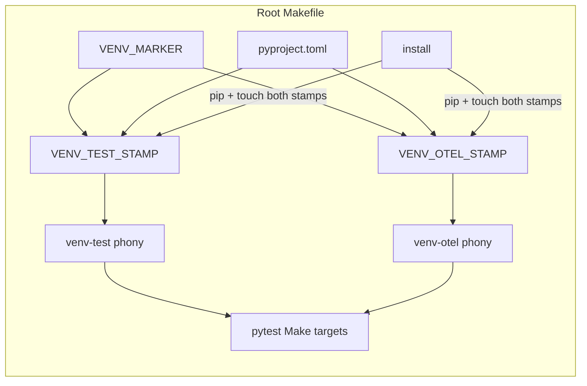

# PYPOST-905: Stamp/cache venv-test and venv-otel

## Research

### Jira / parent debt

- Issue: [PYPOST-905](https://pypost.atlassian.net/browse/PYPOST-905) —
  stamp / cache `venv-test` and `venv-otel` so pip is skipped when
  extras are already current.
- Acceptance: idempotent Make prerequisites avoid redundant pip when the
  venv is up to date.
- Parent: [PYPOST-872](https://pypost.atlassian.net/browse/PYPOST-872)
  `60-tech-debt.md` item 1 (ENABLE of `venv-test` on pytest targets left
  non-stamped dual editable installs on every visit).

### Current Makefile (root) — how venv works today

| Piece | Behavior today |
| --- | --- |
| `VENV_MARKER` | Real file `.venv/.initialized-$(PYTHON_VERSION)`; recipe creates venv + upgrades pip, then `touch`es the marker |
| `venv` | `.PHONY` alias depending on `$(VENV_MARKER)` — idempotent (second visit: nothing to do) |
| `venv-test` | `.PHONY` recipe: always `pip install -e ".[dev]"` when visited |
| `venv-otel` | `.PHONY` recipe: always `pip install -e ".[otel]"` when visited |
| `install` | `.PHONY` recipe: `pip install -e ".[dev,otel]"`; does **not** record stamps for the split extras |
| Pytest targets | `test` / `test-slow` / `test-cov` / `test-agent-e2e` depend on marker + `venv-test` + `venv-otel` |
| `typecheck` | marker + `venv-test` |
| `clean` | `rm -rf $(VENV)` — removes marker and any future stamps with the venv |

**Stamp pattern already in-tree:** only the base venv uses a version-aware
marker file. Extras installs are ordinary phony recipes with no “already
done” file, so Make re-runs them on every prerequisite visit.

### Docs today

`doc/dev/testing.md` § Install-first vs auto `venv-test` explicitly warns
that neither extra target is stamp-gated and that each Make visit re-runs
pip. That wording becomes wrong after this change and must be updated
(Step 8).

### Contract tests today (`tests/test_makefile.py`)

- Dependency-chain asserts require `venv-test` / `venv-otel` on pytest
  targets (PYPOST-872) — keep those.
- `test_venv_is_idempotent` only checks return codes for `venv`, not that
  the recipe was skipped.
- No assert today that a second `venv-test` / `venv-otel` visit skips pip.
- Workspace fixtures copy the root `Makefile` + `pyproject.toml` into a
  temp tree and invoke `make` with `PYTHON={sys.executable}`.

### External guidance (stamp / sentinel files)

Industry Makefile practice for Python installs:

- Prefer a **real stamp/sentinel file** as the Make target (or as the
  sole prerequisite of a thin `.PHONY` alias), then `touch` after the
  install recipe.
- Make compares stamp mtime to declared prerequisites (typically
  `pyproject.toml` / lock files) and skips the recipe when up to date.
- Same idea as this repo’s `VENV_MARKER`; also documented in community
  write-ups (stamp under `.venv` or `.stamps/`, keep install commands
  behind the stamp, keep user-facing names as phony aliases).

References:

- [Makefile tricks for Python projects](https://ricardoanderegg.com/posts/makefile-python-project-tricks/)
  — touch after install so Make skips rebuilds.
- [Best Practices To Write A Makefile](https://ipwnponies.github.io/programming/2022/07/24/how-to-write-makefile.html)
  — sentinel files for “venv with deps installed”.
- [Advanced Makefile Patterns for Python Projects](https://mcginniscommawill.com/posts/2026-04-15-advanced-makefile-patterns/)
  — `.stamps/installed: pyproject.toml …` then `touch $@`.

### Architectural decision: stamp files for each extra

| Option | Pros | Cons |
| --- | --- | --- |
| **A. Stamp files under `.venv/` (chosen)** | Mirrors `VENV_MARKER`; Make native skip; no pip short-circuit needed; `clean` clears stamps | Must remove/keep phony aliases carefully; `install` must refresh stamps |
| B. Keep phony + shell “already installed?” guard | No new files | Recipe still always starts; fragile import checks; weaker Make semantics |
| C. Depend on `install` only | One combined install | Changes dependency graph intent (out of FR4 / PYPOST-872 shape) |

**Choice A (stamps):** Introduce version-aware stamp paths (same style as
`VENV_MARKER`):

- `VENV_TEST_STAMP := $(VENV)/.venv-test-$(PYTHON_VERSION)`
- `VENV_OTEL_STAMP := $(VENV)/.venv-otel-$(PYTHON_VERSION)`

### Exact Make graph: thin alias + stamp prereqs (Option B)

Two ways to keep `MARKER_REL` reachable after stamps; this task picks
**B** (mirrors `venv` → `$(VENV_MARKER)`):

| Option | Phony line | Effect on `test_venv_test_depends_on_marker` |
| --- | --- | --- |
| A | `venv-test: $(VENV_MARKER) $(VENV_TEST_STAMP)` | **Preserve** — `MARKER_REL` stays a direct `make -p` prereq of `venv-test` |
| **B (chosen)** | `venv-test: $(VENV_TEST_STAMP)` only | **Update** the assert — marker moves to the stamp target’s prereqs |

**Exact prerequisite / recipe lines (Step 4):**

```makefile
VENV_TEST_STAMP := $(VENV)/.venv-test-$(PYTHON_VERSION)
VENV_OTEL_STAMP := $(VENV)/.venv-otel-$(PYTHON_VERSION)

venv-test: $(VENV_TEST_STAMP) ## Install dev optional extra from pyproject.toml (pytest, flake8, etc.)
venv-otel: $(VENV_OTEL_STAMP) ## Install OpenTelemetry optional extra from pyproject.toml

$(VENV_TEST_STAMP): $(VENV_MARKER) pyproject.toml
	$(BIN)/python -m pip install -e ".[dev]"
	touch "$@"

$(VENV_OTEL_STAMP): $(VENV_MARKER) pyproject.toml
	$(BIN)/python -m pip install -e ".[otel]"
	touch "$@"

install: $(VENV_MARKER) ## Install editable package with dev and OTel extras
	$(BIN)/python -m pip install -e ".[dev,otel]"
	touch "$(VENV_TEST_STAMP)" "$(VENV_OTEL_STAMP)"
```

`.PHONY` continues to list `venv-test` / `venv-otel` (aliases), **not** the
stamp paths. Pytest targets keep listing `venv-test` / `venv-otel` (FR4;
PYPOST-906 owns `lint`).

**Contract test update (Option B — mandatory in Step 4):**

Today `test_venv_test_depends_on_marker` asserts `MARKER_REL` is a direct
prereq of `venv-test`. Under Option B that becomes false. **Update** (do
not leave as-is):

1. Rename or retarget: `venv-test` prereqs include the test-stamp relative
   path (e.g. `.venv/.venv-test-<pyver>`).
2. Assert stamp-target prereqs include `MARKER_REL` **and** `pyproject.toml`
   (`_prerequisites(..., stamp_rel)`).
3. Mirror the same pair of asserts for `venv-otel` / `VENV_OTEL_STAMP`.

Intent of the old test (marker remains on the install chain) is preserved;
only the Make edge that is inspected changes.

**Currency / invalidation (FR “current”):**

- Stamp recipe depends on `$(VENV_MARKER)` and `pyproject.toml`.
- Missing stamp → install extra → `touch` stamp.
- Newer `pyproject.toml` than stamp → reinstall extra → refresh stamp.
- `make clean` removes `.venv` → stamps gone → next visit reinstalls.
- After `make install` (`.[dev,otel]`), **touch both stamps** so split
  prerequisites do not immediately re-pip.

## Implementation Plan

1. **Failing repro (Step 3)** — see mandatory section below; no Makefile
   production change in Step 3.
2. **Makefile (Step 4)** — implement Option B exact lines above; wire
   `install` to touch both stamps; `.PHONY` lists aliases only.
3. **Contract tests (Step 4)** — green Step 3 behavioral cases; **update**
   `test_venv_test_depends_on_marker` per Option B (stamp on alias;
   marker + `pyproject.toml` on stamp); mirror for `venv-otel`; keep
   PYPOST-872 pytest-target dependency-chain asserts.
4. **Docs (Step 8)** — rewrite `doc/dev/testing.md` (and setup notes if
   they echo “non-stamped”) to describe stamp-gated skip + still-valid
   `make install` preference.

**Mandatory — Failing Repro (next Step 3):**

In `tests/test_makefile.py` (same Make workspace fixtures; module already
has `pytestmark = pytest.mark.timeout(120)`):

1. **Skip when current (primary red proof — FR1/FR2/FR5)** — after a
   successful first `make venv-test` in the temp workspace, run
   `make venv-test` again and assert the second invocation’s combined
   stdout/stderr does **not** contain a pip install invocation (e.g. no
   `pip install` / no `-m pip install`). Today the second visit always
   re-runs the recipe → **red**. After stamps → no pip → **green**.
2. Same skip pattern for `venv-otel`.
3. **Install when needed (FR3/FR5 lock)** — cover missing and/or stale
   stamp so pip still runs (locks “install when needed”; may stay
   **green** today because phony recipes always pip):
   - **Missing stamp:** ensure base venv/marker exists (`make venv`),
     ensure the test-stamp file is absent (delete if present), run
     `make venv-test`, assert combined stdout/stderr **does** contain a
     pip install of `".[dev]"`. Mirror for `venv-otel` / `".[otel]"`.
   - **Stale stamp (preferred companion once stamps exist; write in
     Step 3 against the planned paths):** after a successful stamped
     install, `touch` `pyproject.toml` so it is newer than the stamp,
     run `make venv-test` again, assert pip runs. Today (no stamp file)
     this case is N/A or folds into “every visit runs pip”; after Step 4
     it is the regression lock for FR3 invalidation.
4. **Static companion (Step 3 or 4)** — assert `make -p` prereqs for
   `venv-test` / `venv-otel` include the stamp relative paths
   (`.venv/.venv-test-$(PYTHON_VERSION)` /
   `.venv/.venv-otel-$(PYTHON_VERSION)`). Updating
   `test_venv_test_depends_on_marker` for Option B may land in Step 4
   with the Makefile change (today it would go red if rewritten early).

Do **not** edit the root `Makefile` in Step 3.

Run:

```bash
make test PYTEST_ARGS='tests/test_makefile.py -q -k "venv_test_skips or venv_otel_skips or stamp or install_when"'
```

(Exact test names chosen in Step 3; filter must hit skip **and**
install-when-needed cases.)

Expected Step 3: **red** on skip-when-current (second visit still runs
pip). Install-when-needed asserts may already **pass** (always-pip
today) and stay green after stamps.

Sequencing: research → red skip asserts + install-when-needed lock →
Option B Makefile + `install` touch + update marker/stamp contract
tests → green → docs.

## Architecture



| Module | Responsibility |
| --- | --- |
| Root `Makefile` | Option B stamp rules + thin phony aliases; `install` refreshes stamps; pytest edges unchanged |
| `tests/test_makefile.py` | Skip-when-current + install-when-needed; update marker→stamp asserts (Option B); keep PYPOST-872 edges |
| `doc/dev/testing.md` (+ setup if needed) | Document stamp-gated extras; keep install-once recommendation |

### Module interfaces

- **User / CI / agents:** unchanged target names (`venv-test`, `venv-otel`,
  `test`, …).
- **Make → pip:** stamp recipes still call
  `$(BIN)/python -m pip install -e ".[dev]"` / `".[otel]"` only when the
  stamp is missing or older than `pyproject.toml` (or marker rebuilt).
- **`install` → stamps:** after successful combined install, `touch` both
  stamp paths so subsequent alias visits are no-ops until invalidation.
- **Tests → Make:** subprocess `make` in isolated workspace; inspect
  stdout and/or `make -p` prerequisites (existing helpers).

### Patterns

- **Sentinel / stamp file** (same family as `VENV_MARKER`).
- **Thin phony alias over real file target** (`venv` pattern) — Option B.
- **Prerequisite safety net unchanged** (PYPOST-872 ENABLE retained).

## Q&A

| Q | A |
| --- | --- |
| Why Option B over keeping marker on the phony? | Matches `venv` → marker; stamp owns install currency; marker stays on the stamp recipe. |
| Why update `test_venv_test_depends_on_marker`? | Option B moves `MARKER_REL` off `venv-test` direct prereqs; assert stamp + stamp→marker instead. |
| Why not hash the extras list into the stamp name? | `pyproject.toml` as prerequisite invalidates on extras edits; version in stamp path matches existing marker style. |
| Why touch stamps from `install`? | Combined `[dev,otel]` already satisfies both extras; without touch, next `make test` would still run both stamped recipes once. |
| Does this change `lint` deps? | No — PYPOST-906. |
| Why behavioral “no pip on second visit” over timing? | Stable under load; matches Make’s “Nothing to be done” semantics. |
| Why add install-when-needed in Step 3 if green today? | FR5 needs both sides; missing/stale cases lock FR3 after stamps land. |
