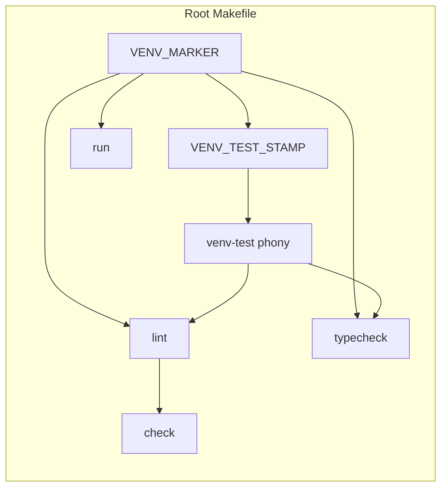

# PYPOST-906: Optional lint depend on venv-test

## Research

### Jira / parent debt

- Issue: [PYPOST-906](https://pypost.atlassian.net/browse/PYPOST-906) —
  optional: make `lint` depend on `venv-test` (out of PYPOST-872 title
  scope).
- Acceptance: `make lint` ensures test/dev tooling present **or** docs
  state why not. Product preference for this run: ensure tooling.
- Parents:
  - [PYPOST-872](https://pypost.atlassian.net/browse/PYPOST-872) ENABLE of
    `venv-test` on pytest targets; deferred lint ensure as out of title
    scope.
  - [PYPOST-905](https://pypost.atlassian.net/browse/PYPOST-905) stamp /
    cache for `venv-test` / `venv-otel` — made ensure cheap when current;
    left lint → `venv-test` to this ticket.

### Current Makefile (root) — lint vs peers

| Piece | Behavior today |
| --- | --- |
| `lint` | `lint: $(VENV_MARKER)` then `$(BIN)/python -m flake8 …` |
| `typecheck` | `typecheck: $(VENV_MARKER) venv-test` — peer pattern to copy |
| `run` | `run: $(VENV_MARKER)` — stays marker-only (out of scope) |
| `check` | `check: lint test verify-ai-tasks` — inherits lint’s prereqs |
| `venv-test` | Thin phony over `$(VENV_TEST_STAMP)` (PYPOST-905); cheap when current |
| Flake8 location | Dev optional extra (`[dev]`); not in base venv |

Verified: `lint` has no `venv-test` edge. A bare marker-only venv fails
`make lint` with a missing flake8 / module-not-found style failure
(`test_lint_fails_without_flake8_in_bare_venv` locks that today).

### Docs today

- `doc/dev/testing.md` § Install-first vs auto `venv-test`: “`run` and
  `lint` stay marker-only — run `make install` (or `make venv-test`)
  before `make lint`.”
- `doc/dev/setup.md`: same asymmetry — `run` and `lint` depend on
  `$(VENV_MARKER)` only.

Both become wrong for `lint` after the preferred change; `run` wording
must stay marker-only.

### Contract tests today (`tests/test_makefile.py`)

- `TestDependencyChain.test_runtime_targets_depend_on_marker_only`
  parametrizes `["run", "lint"]` and asserts `MARKER_REL` present,
  `install` / `venv-test` **absent**.
- That parametrization is the lock that must flip for `lint` under
  preferred acceptance; `run` must keep the marker-only assert.
- Behavioral: `test_lint_fails_without_flake8_in_bare_venv` expects lint
  failure on bare venv — becomes obsolete / inverted after Step 4
  (ensure path). Update in Step 4 with Makefile; do **not** require it
  as the Step 3 red proof (static prereq flip is clearer and matches FR4).
- Peer already green: `typecheck` / pytest targets assert `venv-test` in
  prereqs (PYPOST-872) — reuse that assert shape for `lint`.

### External guidance (lint depends on install sentinel)

Industry Make practice for Python quality targets:

- Phony quality targets (`lint`, `test`) should declare the install /
  sentinel prerequisite so tooling exists before the recipe runs.
- Prefer depending on the same “dev env ready” target used by tests /
  typecheck rather than inventing a lint-only install path.
- Sentinel / stamp files keep repeated visits cheap (already landed as
  `VENV_TEST_STAMP` via PYPOST-905).

References:

- [Tips for your Makefile with Python](https://blog.mathieu-leplatre.info/tips-for-your-makefile-with-python.html)
  — `lint: $(INSTALL_STAMP)` then run flake8 from the venv.
- [Writing Makefiles for Python Projects](https://venthur.de/2021-03-31-python-makefiles.html)
  — `lint: $(VENV)` then `$(BIN)/flake8`.
- [Best Practices To Write A Makefile](https://ipwnponies.github.io/programming/2022/07/24/how-to-write-makefile.html)
  — sentinel file as the abstract “env with deps” dependency.

### Architectural decision: preferred ensure path

| Option | Pros | Cons |
| --- | --- | --- |
| **A. `lint: $(VENV_MARKER) venv-test` (chosen)** | Matches `typecheck`; reuses stamped ensure; FR2/FR3; `check` inherits | Contract + docs + bare-venv lint smoke must update |
| B. Docs-only “why not” (Jira fallback) | No Make change | Leaves install-first footgun; rejects preferred acceptance |
| C. Depend on stamp path directly | Same ensure semantics | Bypasses phony alias; diverges from `typecheck` / pytest edges |

**Choice A:** One-line prerequisite add — mirror `typecheck`:

```makefile
lint: $(VENV_MARKER) venv-test ## Run flake8 static analysis on pypost/
	$(BIN)/python -m flake8 --jobs=1 pypost/
```

`run` unchanged:

```makefile
run: $(VENV_MARKER) ## Run the PyPost desktop application
```

No new stamp mechanics, extras packaging, or install redesign (owned by
872 / 905). PYPOST-905 stamps keep second+ `make lint` visits cheap when
`[dev]` is current (NFR2).

## Implementation Plan

1. **Failing repro (Step 3)** — see mandatory section below; no Makefile
   production change in Step 3.
2. **Makefile (Step 4)** — add `venv-test` to `lint` prerequisites
   (exact line above); leave `run` marker-only; leave recipe body
   unchanged.
3. **Contract / smoke tests (Step 4)** — green the Step 3 desired
   asserts; update or replace `test_lint_fails_without_flake8_in_bare_venv`
   so bare-venv lint either succeeds after ensure or no longer expects
   fail-without-flake8; keep `run` marker-only; keep PYPOST-872 /
   PYPOST-905 edges.
4. **Docs (Step 8)** — rewrite testing/setup wording so `lint` ensures
   `[dev]` via `venv-test` (like `typecheck`); `run` remains
   marker-only / install-first.

**Mandatory — Failing Repro (next Step 3):**

In `tests/test_makefile.py` (`TestDependencyChain`; module already has
`pytestmark = pytest.mark.timeout(120)`), **update / split** the
current combined contract so desired behavior is asserted **before**
any Makefile fix:

1. **Primary red proof (FR2 / FR4)** — assert `lint` prerequisites
   **do** include `venv-test` (and keep `MARKER_REL`; still exclude
   `install` unless product later says otherwise). Today
   `test_runtime_targets_depend_on_marker_only` with `target="lint"`
   asserts `venv-test` **not** in prereqs → after rewriting to the
   desired contract, Step 3 is **red** on current Makefile.
2. **Separate green-today lock (out of scope)** — assert `run`
   stays marker-only: `MARKER_REL` present; `venv-test` and `install`
   absent. Split out of the shared `["run", "lint"]` parametrization so
   lint’s new contract cannot drag `run` into ensure-tooling.
3. **Suggested shape (exact names chosen in Step 3):**
   - Retarget / rename the lint half, e.g.
     `test_lint_depends_on_marker_and_venv_test`, asserting
     `MARKER_REL` and `"venv-test"` in `_prerequisites(..., "lint")`.
   - Keep a dedicated `test_run_depends_on_marker_only` (or narrow the
     old parametrize to `["run"]` only) for the runtime path.
4. Do **not** edit the root `Makefile` in Step 3. Behavioral smoke
   (`test_lint_fails_without_flake8_in_bare_venv`) may stay as-is until
   Step 4; the static prereq flip is the mandatory red gate.

Run:

```bash
make test PYTEST_ARGS='tests/test_makefile.py -q -k "lint_depends or run_depends_on_marker"'
```

(Exact test names chosen in Step 3; filter must hit lint-ensure **and**
run-marker-only cases.)

Expected Step 3: **red** on lint → `venv-test` desired assert; **green**
on run marker-only.

Sequencing: research → red lint contract (+ split run assert) →
Makefile one-line prereq → green + update bare-venv lint smoke → docs.

## Architecture



| Module | Responsibility |
| --- | --- |
| Root `Makefile` | Add `venv-test` to `lint` prereqs; leave `run` marker-only; no stamp redesign |
| `tests/test_makefile.py` | Split run vs lint contract; lint asserts `venv-test`; update bare-venv lint smoke in Step 4 |
| `doc/dev/testing.md`, `doc/dev/setup.md` | Document lint ensure; keep run marker-only |

### Module interfaces

- **User / CI / agents:** same target names (`lint`, `check`, `run`).
  First bare-venv `make lint` may install `[dev]` once; subsequent visits
  skip pip when the test stamp is current.
- **Make → ensure:** `lint` → `venv-test` → stamp recipe (existing
  PYPOST-905 path); no new extras API.
- **`check` → lint:** unchanged edge; inherits ensure via `lint`.
- **Tests → Make:** existing `_prerequisites` / `make -p` helpers in
  isolated workspace fixtures.

### Patterns

- **Prerequisite safety net** — same ENABLE pattern as `typecheck` /
  pytest targets (PYPOST-872).
- **Reuse stamped ensure** — no new sentinel; depend on `venv-test`
  alias (PYPOST-905).
- **Asymmetric runtime path** — `run` stays marker-only by design
  (out of scope).

## Q&A

| Q | A |
| --- | --- |
| Why ensure instead of docs-why-not? | Preferred acceptance; stamps removed the cost argument for leaving lint marker-only. |
| Why mirror `typecheck` not stamp path? | Same business promise and Make edge style as existing peers; avoids dual conventions. |
| Why split the parametrized test? | `run` must stay marker-only; sharing `["run", "lint"]` cannot encode both contracts after the change. |
| Why red on static prereqs, not bare-venv lint smoke? | FR4 is the dependency contract; prereq flip fails cleanly today without needing a successful flake8 run. |
| Does `check` need its own prereq? | No — `check` already depends on `lint`; ensure flows through. |
| Does this change stamps / `install`? | No — owned by PYPOST-905 / 872; this ticket only adds the lint → `venv-test` edge. |
| Why not change `run`? | Out of scope; runtime app path stays install-first unless a later ticket. |
