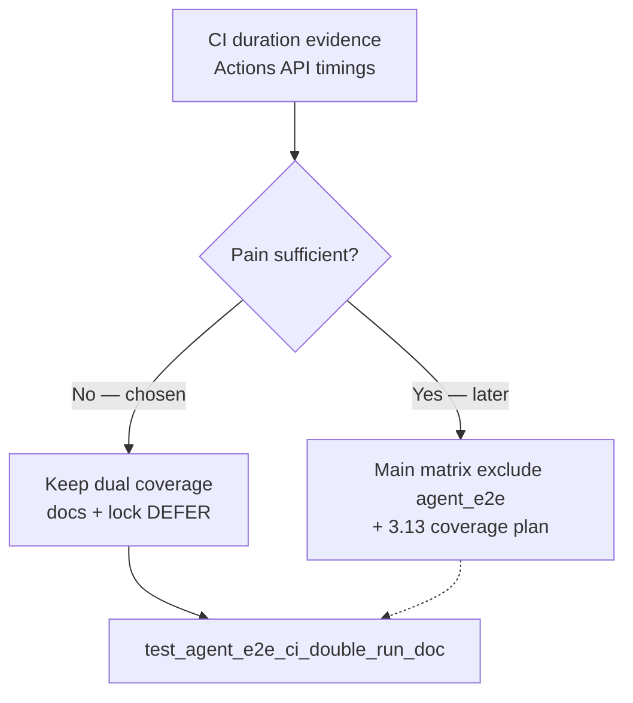

# PYPOST-907: ENABLE CI cost trim when pain evidenced

## Research

### Jira / parent

- Issue: [PYPOST-907](https://pypost.atlassian.net/browse/PYPOST-907) —
  ENABLE trim when pain evidenced; update lock/docs; keep 3.13 coverage.
- Parent DEFER: [PYPOST-873](https://pypost.atlassian.net/browse/PYPOST-873)
  — intentional 3.11 double-run; revisit when minutes hurt.
- Related: [PYPOST-908](https://pypost.atlassian.net/browse/PYPOST-908) —
  optional duration evidence (To Do); this task captures a first evidence
  set so ENABLE/DEFER is not gut feel.

### Current CI (`.github/workflows/test.yml`)

| Job | Python | Agent e2e |
| --- | --- | --- |
| `test` (matrix) | 3.11, 3.13 | Yes — `-m "not slow"` includes `agent_e2e` |
| `agent-e2e` | 3.11 only | Yes — `make test-agent-e2e` |

Local collect (this workspace): **64** tests under
`-m "agent_e2e and not slow"` (was ~48 at PYPOST-873).

### CI duration evidence (GitHub Actions API, 2026-08-01)

Source: `koctep/pypost` workflow `Tests` (`test.yml`). Job/step timings from
completed runs that include job `agent-e2e` (only **two** such runs in the
fetched window of 15 completed workflow runs):

| Run | Main `test` 3.11 | Main `test` 3.13 | Job `agent-e2e` |
| --- | --- | --- | --- |
| #21 (`29912105656`) | ~11.8m total; **Run tests** ~670s | ~11.6m; **Run tests** ~656s | ~3.6m total; **make test-agent-e2e** ~172s; `make install` ~24s |
| #20 | ~7.4m | ~7.0m | ~1.6m |

Interpretation (honest, not invented):

- Critical-path **wall clock** for a push is dominated by the main matrix
  (~7–12m). Job `agent-e2e` finishes in ~1.6–3.6m **in parallel**, so
  excluding pack tests from the matrix would **not** shorten PR feedback
  latency in these samples.
- **Billable** overlap on 3.11 is real: the dedicated job spends ~172s on
  `make test-agent-e2e` while the same marker set also runs inside the warm
  main 3.11 pytest process. That is measurable redundancy, but on the order
  of a few minutes per push — not a multi-tens-of-minutes tax.
- Sample size is thin (n=2 with `agent-e2e`). Older successful runs in the
  same fetch window had no `agent-e2e` job yet (~0.7–1.1m main jobs).
- Local `make test-agent-e2e` with `PYTEST_ARGS` override accidentally ran a
  near-full suite (~352s wall) and is **not** used as pack-duration proof.

### ENABLE sketch (if pain later justifies)

1. Main matrix: `-m "not slow and not agent_e2e"`.
2. Expand `agent-e2e` to a Python matrix **3.11 + 3.13** (or keep 3.13 only
   in the main matrix and exclude `agent_e2e` on 3.11 only — weaker but
   preserves 3.13).
3. Update `tests/test_agent_e2e_ci_double_run_doc.py` + `doc/dev` for ENABLE.

Net billable savings vs expanding the dedicated job may be modest; wall
clock likely unchanged unless main pytest shrinks enough to beat the new
job.

### Decision: **DEFER** (evidence reviewed; pain not sufficient)

| Option | Pros | Cons |
| --- | --- | --- |
| **ENABLE** | Removes ~few minutes 3.11 double-run | Needs 3.13 plan; thin n=2; no wall-clock win; premature |
| **DEFER** (chosen) | Keeps dual + 3.13 matrix coverage; matches parent bar | Continues intentional overlap |

**Rationale:** Documented evidence shows **measurable** overlap (~172s
dedicated pack step) but **not** maintainer-grade pain: wall clock
unaffected, billable savings small, sample thin. Continue DEFER; publish
evidence + ENABLE threshold; leave workflow selection unchanged.

**ENABLE when (threshold):** any of (1) dedicated `make test-agent-e2e` step
sustained ≥ **6 minutes** across ≥3 recent green runs, (2) maintainers
report painful double failures / queue cost, or (3) pack collect size
sustained ≥ **120** `agent_e2e and not slow` tests **and** main-job pytest
clearly dominated by the pack. Then apply the ENABLE sketch above and flip
the lock.

### Architectural decisions

| Decision | Choice | Rationale |
| --- | --- | --- |
| ENABLE vs DEFER | **DEFER** | Evidence insufficient for trim |
| Workflow change | None | Keep dual coverage |
| Evidence | Docs + task research | Satisfies FR2; helps PYPOST-908 |
| Lock | Extend PYPOST-873 lock | Require PYPOST-907 + evidence anchors |

## Implementation Plan

1. **Failing repro (Step 3)** — extend
   `tests/test_agent_e2e_ci_double_run_doc.py` so docs must also name
   `PYPOST-907`, record **CI duration evidence**, and state the continued
   **DEFER** after evidence review (stable phrases). Workflow asserts stay
   dual-coverage (`agent-e2e` job; `-m "not slow"`; no `not agent_e2e`).
   Expect **red** until docs updated.
2. **Docs (Step 4 / 8)** — update `doc/dev/testing.md` and
   `doc/dev/agent_e2e.md` with evidence summary, DEFER decision, ENABLE
   threshold; no YAML selection change.
3. **Green** — re-run the lock until green.

**Mandatory — Failing Repro (next Step 3):**

- **Where:** `tests/test_agent_e2e_ci_double_run_doc.py`
- **Asserts (desired):** existing PYPOST-873 dual-run anchors **plus**
  `PYPOST-907`, phrase `CI duration evidence`, and continued-DEFER wording
  after evidence review; workflow still dual-covers.
- **Force red:** do not edit docs/workflow in Step 3.
- **Run:**

```bash
make test PYTEST_ARGS='tests/test_agent_e2e_ci_double_run_doc.py -v'
```

Sequencing: evidence research → red lock → docs DEFER+evidence → green.

## Architecture



| Module | Responsibility |
| --- | --- |
| `.github/workflows/test.yml` | Unchanged dual coverage (locked) |
| `doc/dev/testing.md` | Evidence + DEFER + ENABLE threshold |
| `doc/dev/agent_e2e.md` | Agent-facing note + link to testing |
| `tests/test_agent_e2e_ci_double_run_doc.py` | Lock docs + workflow contract |

## Q&A

| Q | A |
| --- | --- |
| Why not ENABLE with n=2 and ~172s? | Parent bar is pain, not mere measurability; wall clock unchanged. |
| Does this close PYPOST-908? | Partially: evidence is published; orchestrator may still close or narrow 908. |
| Why keep locking against `not agent_e2e`? | DEFER contract until a future ENABLE story updates YAML + lock together. |
