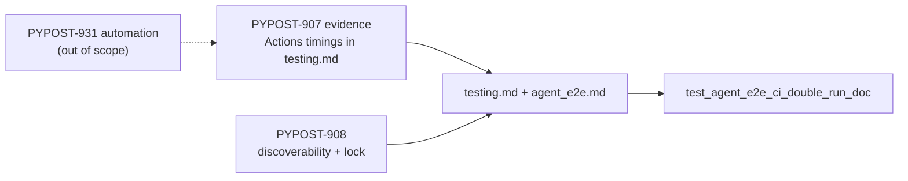

# PYPOST-908: Optional CI duration evidence for double-run

## Research

### Jira / lineage

- Issue: [PYPOST-908](https://pypost.atlassian.net/browse/PYPOST-908) —
  optional CI duration evidence; acceptance = timing notes linked from docs
  or the ENABLE ticket.
- Evidence publisher: [PYPOST-907](https://pypost.atlassian.net/browse/PYPOST-907)
  — Actions timings + **DEFER after evidence** + ENABLE threshold in
  `doc/dev/testing.md`.
- Parent DEFER: [PYPOST-873](https://pypost.atlassian.net/browse/PYPOST-873).
- Automation follow-up: [PYPOST-931](https://pypost.atlassian.net/browse/PYPOST-931)
  — may absorb refresh scripting (out of scope here).
- ENABLE trim: [PYPOST-930](https://pypost.atlassian.net/browse/PYPOST-930).

### Published CI duration evidence (cite only — do not invent)

Source of truth: `doc/dev/testing.md` § Agent e2e CI double-run, and
`ai-tasks/PYPOST-907/20-architecture.md` Research. Captured from GitHub
Actions API on **2026-08-01** for `koctep/pypost` workflow `Tests`
(`test.yml`). Runs that include job `agent-e2e` (n=2 in a 15-run window):

| Run | Main `test` 3.11 | Job `agent-e2e` |
| --- | --- | --- |
| #21 | ~11.8m total; pytest step ~670s | ~3.6m total; `make test-agent-e2e` ~172s |
| #20 | ~7.4m | ~1.6m |

Overlap cost (honest interpretation from PYPOST-907):

- **Wall clock:** dominated by main matrix; `agent-e2e` finishes in parallel
  (~1.6–3.6m) — trim would not shorten PR feedback in these samples.
- **Billable 3.11 redundancy:** dedicated pack step ~172s in run #21 while
  the same marker set also runs inside main 3.11 pytest — measurable but
  small; not multi-tens-of-minutes pain.
- **Sample thin:** n=2 with `agent-e2e` job present.
- Pack collect size (local, cited in docs): 64 tests
  (`agent_e2e and not slow`).

### Gap vs acceptance

| Need | Status before this task |
| --- | --- |
| Timing notes in docs | Present (`testing.md`) |
| Link from evidence → PYPOST-908 | Present (“Related: PYPOST-908”) |
| PYPOST-908 in `agent_e2e.md` | Missing |
| Harness / Makefile table row for 908 | Missing |
| Task artifacts `ai-tasks/PYPOST-908/*` | Missing |
| Lock requiring PYPOST-908 discoverability | Missing (only 873/907 locked) |

### Decision

**Document and lock** existing evidence; strengthen discoverability. No new
timings. No Actions scrape automation. No workflow selection change.

## Implementation Plan

1. **Failing repro (Step 3)** — extend
   `tests/test_agent_e2e_ci_double_run_doc.py` so developer docs must name
   `PYPOST-908` in **both** `testing.md` and `agent_e2e.md` (discoverability
   of the evidence ticket). Keep existing 873/907/evidence/DEFER anchors.
   Expect **red** until `agent_e2e.md` (and any missing table links) updated.
2. **Docs (Step 4 / 8)** — link PYPOST-908 from `agent_e2e.md` CI note;
   add harness-table row + footnote in `testing.md`; keep evidence table as
   the single timing source (no invented numbers).
3. **Green** — re-run the lock until green.
4. **Automation** — leave to PYPOST-931; note in tech-debt only.

**Mandatory — Failing Repro (next Step 3):**

- **Where:** `tests/test_agent_e2e_ci_double_run_doc.py`
- **Asserts (desired):** existing dual-run / evidence anchors **plus**
  `PYPOST-908` present in `doc/dev/testing.md` **and**
  `doc/dev/agent_e2e.md`.
- **Force red:** do not edit docs in Step 3 (`agent_e2e.md` currently omits
  908).
- **Run:**

```bash
make test PYTEST_ARGS='tests/test_agent_e2e_ci_double_run_doc.py -v'
```

Sequencing: research (cite 907) → red lock → docs cross-links → green.

## Architecture



| Module | Responsibility |
| --- | --- |
| `doc/dev/testing.md` | Evidence table + Related PYPOST-908 + harness row |
| `doc/dev/agent_e2e.md` | Agent-facing link to evidence ticket / testing § |
| `tests/test_agent_e2e_ci_double_run_doc.py` | Lock 873/907/908 + evidence phrases |
| `ai-tasks/PYPOST-908/*` | Cite evidence; no duplicate invented numbers |
| `.github/workflows/test.yml` | Unchanged (DEFER) |

## Q&A

| Q | A |
| --- | --- |
| Why require 908 in both docs? | Acceptance is “linked from docs”; agent entry must surface the evidence ticket. |
| Why not N/A Step 3? | Discoverability is enforceable via the existing lock pattern. |
| Does this ENABLE trim? | No — threshold remains in testing.md; PYPOST-930 owns ENABLE. |
