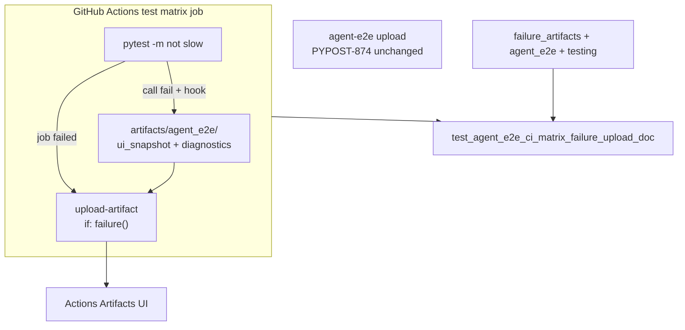

# PYPOST-909: Optional upload from main test matrix on failure

## Research

### Jira / parent debt

- Issue: [PYPOST-909](https://pypost.atlassian.net/browse/PYPOST-909) —
  optional upload of `artifacts/agent_e2e/` from the main `test` matrix
  on failure when dumps exist.
- Parent: [PYPOST-874](https://pypost.atlassian.net/browse/PYPOST-874)
  `60-tech-debt.md` item 1 — matrix upload left as follow-up after
  ENABLE on dedicated job `agent-e2e`.
- Related dump producer: [PYPOST-860](https://pypost.atlassian.net/browse/PYPOST-860)
  (masked `ui_snapshot.json` + `diagnostics.json`).

### Current CI (`.github/workflows/test.yml`)

| Job | Agent e2e dumps upload |
| --- | --- |
| `test` (matrix 3.11 / 3.13) | **None** — dumps may exist after `-m "not slow"` fails |
| `agent-e2e` | ENABLE’d (PYPOST-874): `agent-e2e-failure-artifacts` |

Main `test` already uses pinned upload for junit/coverage:

```text
actions/upload-artifact@ea165f8d65b6e75b540449e92b4886f43607fa02 # v4.6.2
```

with names `test-results-${{ matrix.python-version }}` and
`coverage-report-${{ matrix.python-version }}` under `if: always()`.

### Docs today

- `doc/dev/agent_e2e_failure_artifacts.md` § CI upload (PYPOST-874) —
  documents `agent-e2e` only.
- `doc/dev/agent_e2e.md` / `testing.md` — same scope; no matrix upload.

### External guidance

GitHub Actions `upload-artifact`: use `if: failure()` for debug uploads;
`if-no-files-found: ignore` when the path may be absent (non-dump
failures). Matrix artifact names must include `${{ matrix.* }}` to avoid
collision across parallel jobs (upload-artifact v4 uniqueness).

### Decision: **ENABLE** matrix failure upload

| Option | Pros | Cons |
| --- | --- | --- |
| **ENABLE** (chosen) | 3.13 / matrix-only reds downloadable; matches ticket | Small YAML + docs + lock |
| **DEFER** | Zero change | Leaves PYPOST-874 follow-up open; triage gap remains |

**Rationale:** Parent scoped 874 to `agent-e2e` only; this ticket’s
acceptance is explicit matrix upload. Cost/risk matches 874
(`if: failure()`, ignore missing path, masked dumps, same pin).

### Architectural decisions

| Decision | Choice | Rationale |
| --- | --- | --- |
| ENABLE vs DEFER | **ENABLE** | Ticket acceptance |
| Job scope | Main `test` matrix | Matches issue description |
| Condition | `if: failure()` | NFR1 — no green-run storage |
| Path | `artifacts/agent_e2e/` | PYPOST-860 default root |
| Missing files | `if-no-files-found: ignore` | Failures without dumps |
| Action pin | Same SHA as existing uploads | Consistency |
| Artifact name | `agent-e2e-failure-artifacts-${{ matrix.python-version }}` | Unique per matrix cell |
| Keep 874 upload | Unchanged | NFR4 |

## Implementation Plan

1. **Failing repro (Step 3)** — add
   `tests/test_agent_e2e_ci_matrix_failure_upload_doc.py` (pure unit,
   timeout 10, **no** `agent_e2e` mark) asserting:
   - Docs contain PYPOST-909 + matrix failure-upload anchors.
   - `.github/workflows/test.yml` job `test` includes
     `upload-artifact` with path `artifacts/agent_e2e/`,
     `if: failure()`, and matrix-versioned artifact name.
   - Run targeted; expect **red** until YAML + docs land.
2. **Workflow (Step 4)** — add upload step on job `test` after existing
   uploads / summary as appropriate.
3. **Docs** — extend CI upload sections for matrix download instructions.
4. **Green** — re-run lock until green; keep PYPOST-874 lock green.

**Mandatory — Failing Repro (next Step 3):**

- **Where:** `tests/test_agent_e2e_ci_matrix_failure_upload_doc.py`
- **Asserts (desired):** documented PYPOST-909 matrix ENABLE wording and
  workflow uploads `artifacts/agent_e2e/` under job `test` with
  `if: failure()` and per-version artifact name.
- **Force red:** do not edit workflow or docs in Step 3; asserts fail.
- **Run:**

```bash
make test PYTEST_ARGS='tests/test_agent_e2e_ci_matrix_failure_upload_doc.py -v'
```

Sequencing: research → red lock → ENABLE YAML + docs → green.

## Architecture



| Module | Responsibility |
| --- | --- |
| `.github/workflows/test.yml` | Failure upload step on job `test` |
| `doc/dev/agent_e2e_failure_artifacts.md` | Matrix ENABLE download instructions |
| `doc/dev/agent_e2e.md` / `testing.md` | Cross-links |
| `tests/test_agent_e2e_ci_matrix_failure_upload_doc.py` | Lock docs + workflow |

### Upload step sketch

```yaml
- name: Upload agent e2e failure artifacts
  if: failure()
  uses: actions/upload-artifact@ea165f8d65b6e75b540449e92b4886f43607fa02 # v4.6.2
  with:
    name: agent-e2e-failure-artifacts-${{ matrix.python-version }}
    path: artifacts/agent_e2e/
    if-no-files-found: ignore
```

## Q&A

| Q | A |
| --- | --- |
| Why not `if: always()`? | Green runs have no dumps; NFR1. |
| Why ignore missing files? | Non-agent failures leave an empty root. |
| Why version in the name? | Matrix cells run in parallel; v4 names must be unique. |
| Secrets? | Upload only already-masked PYPOST-860 dumps. |
