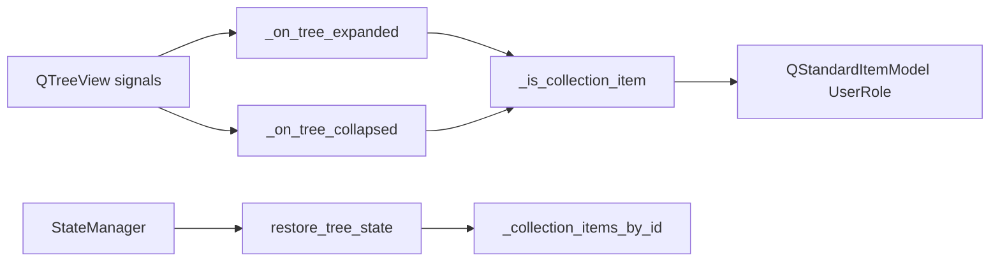

# PYPOST-91: Collection item type check helper

## Research

- Collection rows store collection id (`str`) in `Qt.UserRole`.
- Request rows store `RequestData` in `Qt.UserRole`.
- `_on_tree_expanded` / `_on_tree_collapsed` receive `QModelIndex` from `QTreeView` signals.
- `restore_tree_state` re-expands saved collection ids after model rebuild.

## Implementation Plan

1. Add `_is_collection_item(self, index) -> bool` on `CollectionsPresenter`:
   - Resolve item via `self._model.itemFromIndex(index)`.
   - Return `False` when item is missing.
   - Return `isinstance(item.data(Qt.UserRole), str)`.
2. Update `_on_tree_expanded` / `_on_tree_collapsed` to early-return when not a collection.
3. `restore_tree_state` uses `_collection_items_by_id` for O(1) lookup (PYPOST-390); no inline
   type check needed.
4. Unit tests for collection vs request indices.

## Architecture

| Component | Change |
|-----------|--------|
| `CollectionsPresenter` | `_is_collection_item`; expand/collapse use helper |
| `restore_tree_state` | Dict lookup by saved id (no duplicated isinstance) |
| `StateManager` | Unchanged |
| Tests | Helper tests; existing expand/collapse/restore tests |

## Q&A

- **Q:** Why does restore not call `_is_collection_item`? **A:** Restore iterates saved ids and
  looks up `QStandardItem` in `_collection_items_by_id`; only collection rows are indexed there,
  eliminating the need for per-row type discrimination.
