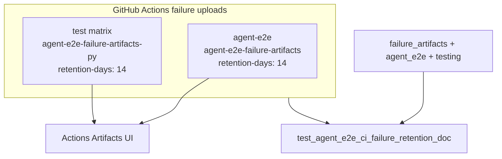

# PYPOST-910: Optional retention-days on failure artifact

## Research

### Jira / parent debt

- Issue: [PYPOST-910](https://pypost.atlassian.net/browse/PYPOST-910) —
  optional explicit `retention-days` on agent-e2e-failure-artifacts.
- Parent: [PYPOST-874](https://pypost.atlassian.net/browse/PYPOST-874)
  `60-tech-debt.md` item 2; also noted in PYPOST-909 shortcuts.
- Related uploads: PYPOST-874 (`agent-e2e`), PYPOST-909 (`test` matrix).

### Current CI (`.github/workflows/test.yml`)

Both failure uploads use pinned
`actions/upload-artifact@ea165f8d65b6e75b540449e92b4886f43607fa02`
(`if: failure()`, `if-no-files-found: ignore`) **without**
`retention-days`:

| Job | Artifact name |
| --- | --- |
| `agent-e2e` | `agent-e2e-failure-artifacts` |
| `test` matrix | `agent-e2e-failure-artifacts-${{ matrix.python-version }}` |

### External guidance

`actions/upload-artifact` accepts optional `retention-days` (minimum 1;
maximum typically 90 unless repo settings raise the ceiling). Omitting
it uses the repository/organization default (often 90 days). Failure
debug dumps rarely need the full default; shorter retention caps
storage while preserving a triage window.

Sources: [upload-artifact README](https://github.com/actions/upload-artifact),
[GitHub docs — custom retention](https://docs.github.com/en/actions/tutorials/store-and-share-data).

### Decision: **ENABLE** `retention-days: 14`

| Option | Pros | Cons |
| --- | --- | --- |
| **ENABLE 14** (chosen) | Explicit; ~2 weeks for PR triage; below default | Slightly less archival than 90d |
| ENABLE 7 | Tighter storage | May expire before slow triage |
| DEFER | Zero change | Leaves 874/909 follow-up open |

**Rationale:** Ticket acceptance requires workflow + docs. Fourteen days
matches typical sprint/PR feedback without keeping dumps for a full
default window. Apply to **both** failure upload steps so policy is
consistent.

### Architectural decisions

| Decision | Choice | Rationale |
| --- | --- | --- |
| ENABLE vs DEFER | **ENABLE** | Ticket acceptance |
| Days | **14** | Triage window; under typical max |
| Jobs | `agent-e2e` + `test` matrix | Same dump class; 909 related |
| Leave junit/coverage | Unchanged | Out of scope |
| Action pin | Same SHA | Consistency |

## Implementation Plan

1. **Failing repro (Step 3)** — add
   `tests/test_agent_e2e_ci_failure_retention_doc.py` (pure unit,
   timeout 10, **no** `agent_e2e` mark) asserting:
   - Docs contain PYPOST-910 + retention-days / `14` anchors.
   - Both job blocks include `retention-days: 14` near failure
     artifact uploads.
   - Run targeted; expect **red** until YAML + docs land.
2. **Workflow (Step 4)** — add `retention-days: 14` to both failure
   upload steps.
3. **Docs** — note retention in CI upload sections.
4. **Green** — re-run lock; keep 874/909 locks green.

**Mandatory — Failing Repro (next Step 3):**

- **Where:** `tests/test_agent_e2e_ci_failure_retention_doc.py`
- **Asserts (desired):** documented PYPOST-910 retention wording and
  workflow sets `retention-days: 14` on agent e2e failure uploads
  (`agent-e2e` and `test` matrix).
- **Force red:** do not edit workflow or docs in Step 3; asserts fail.
- **Run:**

```bash
make test PYTEST_ARGS='tests/test_agent_e2e_ci_failure_retention_doc.py -v'
```

Sequencing: research → red lock → YAML + docs → green.

## Architecture



| Module | Responsibility |
| --- | --- |
| `.github/workflows/test.yml` | `retention-days: 14` on both failure uploads |
| `doc/dev/agent_e2e_failure_artifacts.md` | Document retention value |
| `doc/dev/agent_e2e.md` / `testing.md` | Cross-links |
| `tests/test_agent_e2e_ci_failure_retention_doc.py` | Lock docs + workflow |

### Upload step sketch

```yaml
- name: Upload agent e2e failure artifacts
  if: failure()
  uses: actions/upload-artifact@ea165f8d65b6e75b540449e92b4886f43607fa02 # v4.6.2
  with:
    name: agent-e2e-failure-artifacts  # or matrix-versioned name
    path: artifacts/agent_e2e/
    if-no-files-found: ignore
    retention-days: 14
```

## Q&A

| Q | A |
| --- | --- |
| Why 14 not 7? | Gives a full sprint buffer for deferred triage. |
| Why both jobs? | Ticket relates to 874 uploads and 909 matrix twin. |
| Secrets? | Retention does not change dump contents (still masked). |
