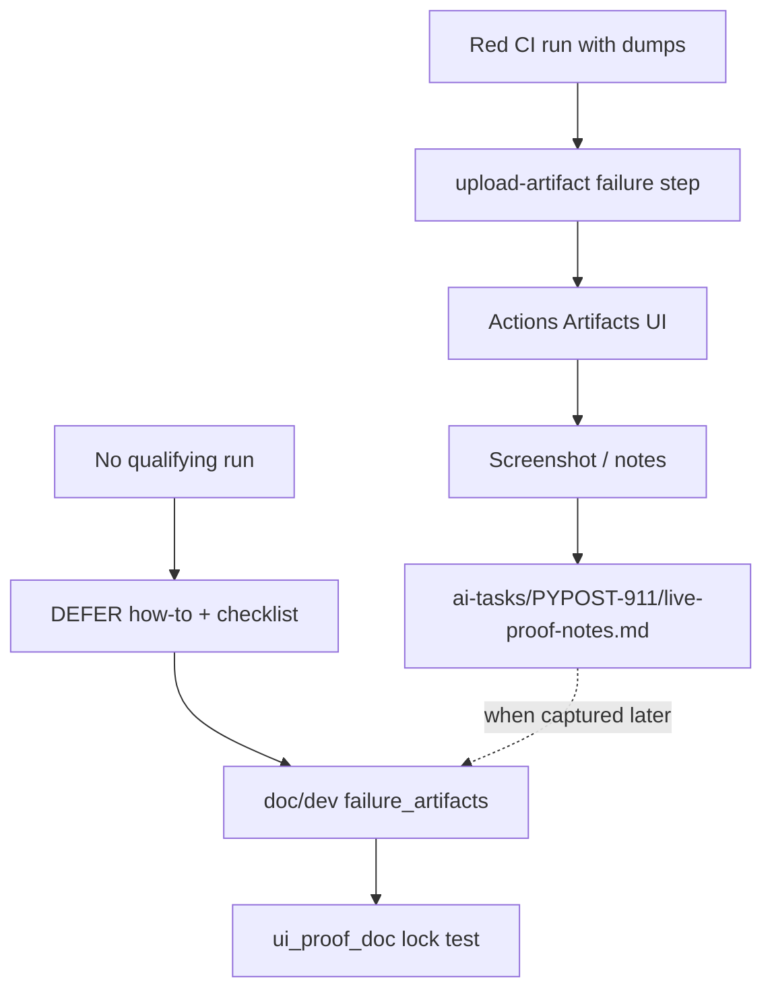

# PYPOST-911: Optional live CI proof of Artifacts UI download

## Research

### Jira / parent debt

- Issue: [PYPOST-911](https://pypost.atlassian.net/browse/PYPOST-911) —
  optional one-time live CI proof of Artifacts UI download for
  `agent-e2e-failure-artifacts`.
- Parent: [PYPOST-874](https://pypost.atlassian.net/browse/PYPOST-874)
  `60-tech-debt.md` item 3.
- Related: PYPOST-909 (matrix twin name), PYPOST-910 (`retention-days: 14`).

### Current CI (`.github/workflows/test.yml`)

Both failure uploads use pinned
`actions/upload-artifact@ea165f8d65b6e75b540449e92b4886f43607fa02`
(`if: failure()`, `if-no-files-found: ignore`, `retention-days: 14`):

| Job | Artifact name |
| --- | --- |
| `agent-e2e` | `agent-e2e-failure-artifacts` |
| `test` matrix | `agent-e2e-failure-artifacts-${{ matrix.python-version }}` |

### Public Actions evidence (2026-08-01)

Queried `https://api.github.com/repos/koctep/pypost/actions/runs`
(30 recent runs). All **failure** conclusions were scanned for artifacts
whose names contain `agent-e2e` or `failure`:

| Result | Detail |
| --- | --- |
| Qualifying artifact present? | **No** |
| Recent failures had | `test-results-*`, `coverage-report-*` only (or none) |
| `gh` CLI | Not installed in this environment; used GitHub REST API |

Conclusion: **no honest screenshot/notes from a real downloadable
agent-e2e failure zip are available today.** Do not invent one.

### External guidance

GitHub Actions run summary lists Artifacts when `upload-artifact`
succeeded. Download requires auth for private repos; public repos still
need a run where the upload step actually produced files (path exists).
`if-no-files-found: ignore` means a red job with no dumps uploads
nothing — UI will not list the artifact.

Sources: [upload-artifact README](https://github.com/actions/upload-artifact),
[GitHub docs — store workflow data](https://docs.github.com/en/actions/tutorials/store-and-share-data).

### Decision: **DEFER** live proof; **ENABLE** documented procedure

| Option | Pros | Cons |
| --- | --- | --- |
| CAPTURE now | Closes with hard evidence | Impossible without inventing or forcing fail |
| **DEFER + procedure** (chosen) | Honest; checklist locked; SAFE TO CLOSE | Proof still pending |
| Leave undocumented | Zero work | Ticket acceptance fails |

**Rationale:** Ticket explicitly allows DEFER/how-to when no live run
exists, with SAFE TO CLOSE for optional deferred proof. Lock the
procedure so the next maintainer can fill
`ai-tasks/PYPOST-911/live-proof-notes.md` without rediscovering steps.

### Architectural decisions

| Decision | Choice | Rationale |
| --- | --- | --- |
| Live screenshot | **DEFER** | No qualifying public artifact |
| Procedure docs | **ENABLE** | Acceptance alternative |
| Notes location | `ai-tasks/PYPOST-911/live-proof-notes.md` | Task-scoped; not invented image |
| Force CI fail | **No** | Out of scope |
| Workflow / upload | Unchanged | Proof-only ticket |
| Lock | Doc anchors only | No YAML change required |

## Implementation Plan

1. **Failing repro (Step 3)** — add
   `tests/test_agent_e2e_ci_failure_artifacts_ui_proof_doc.py` (pure unit,
   timeout 10, **no** `agent_e2e` mark) asserting docs contain:
   - `PYPOST-911`
   - Honest **DEFER** of live Artifacts UI proof
   - Checklist anchors (what to capture / where to put notes)
   - Artifact name `agent-e2e-failure-artifacts`
   - Run targeted; expect **red** until docs + notes stub land.
2. **Docs (Step 4)** — add DEFER / how-to / checklist to
   `agent_e2e_failure_artifacts.md` (+ cross-links in `agent_e2e.md`,
   `testing.md`); create `live-proof-notes.md` stub.
3. **Green** — re-run lock; keep 874/909/910 locks green.

**Mandatory — Failing Repro (next Step 3):**

- **Where:** `tests/test_agent_e2e_ci_failure_artifacts_ui_proof_doc.py`
- **Asserts (desired):** documented PYPOST-911 DEFER procedure with
  capture checklist and notes path; artifact name present.
- **Force red:** do not edit docs in Step 3; asserts fail.
- **Run:**

```bash
make test PYTEST_ARGS='tests/test_agent_e2e_ci_failure_artifacts_ui_proof_doc.py -v'
```

Sequencing: research → red lock → docs + notes stub → green.

## Architecture



| Module | Responsibility |
| --- | --- |
| `doc/dev/agent_e2e_failure_artifacts.md` | DEFER + how-to + checklist |
| `doc/dev/agent_e2e.md` / `testing.md` | Cross-links |
| `ai-tasks/PYPOST-911/live-proof-notes.md` | Stub / future proof notes |
| `tests/test_agent_e2e_ci_failure_artifacts_ui_proof_doc.py` | Lock docs |

## Q&A

| Q | A |
| --- | --- |
| Why not force a red agent-e2e job? | Out of scope; optional ticket. |
| Why notes under ai-tasks? | Task-scoped evidence; avoid fake binary in doc/. |
| Secrets in screenshot? | Capture only Artifacts list UI, not dump contents. |
