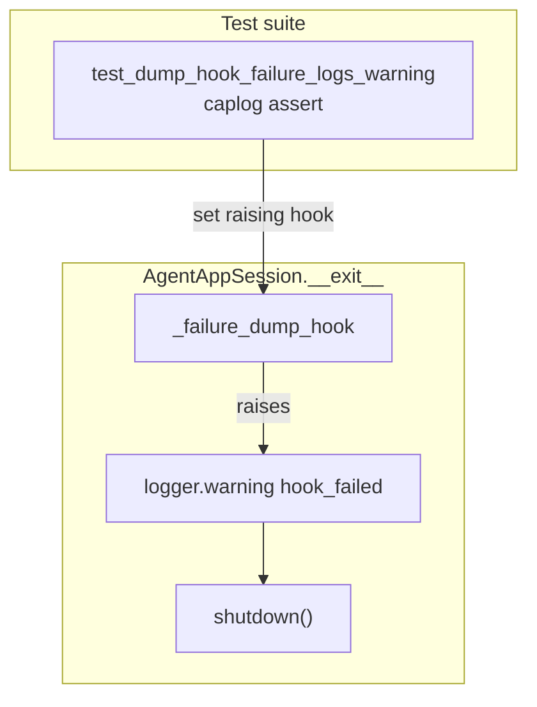

# PYPOST-912: Caplog proof for dump hook failed event

## Research

### Origin

- Jira: [PYPOST-912](https://pypost.atlassian.net/browse/PYPOST-912), Lowest Debt,
  from [PYPOST-875](https://pypost.atlassian.net/browse/PYPOST-875) tech debt.
- Requirements: `ai-tasks/PYPOST-912/10-requirements.md`.

### Current production contract (already landed)

`pypost/agent/lifecycle.py` — `AgentAppSession.__exit__`:

1. When `_failure_dump_hook` is set and the context exits with an `Exception`
   subclass, call the hook.
2. If the hook raises, log WARNING
   `agent_session_failure_dump_hook_failed error=<ExcType>`.
3. Always call `shutdown()`; original exception propagates.

Catalog: `doc/dev/logging.md` (`agent_session_failure_dump_hook_failed`).

**Missing:** caplog unit assert for step 2.

### Caplog pattern

Remediation:

```text
set_agent_session_failure_dump_hook(raising_hook)
caplog.at_level(WARNING, logger="pypost.agent.lifecycle")
with AgentAppSession(...) as session:
    assert False  # triggers __exit__ + hook
assert "agent_session_failure_dump_hook_failed error=RuntimeError" in caplog.text
finally: restore plugin hook via make_direct_session_failure_dump_hook()
```

Use `pytest.raises(AssertionError)` around the session block to assert FR2.

### Decision

**Test-only change.** Extend `tests/test_agent_e2e_failure_artifacts.py` with
`test_dump_hook_failure_logs_warning`. No production change expected.

## Implementation Plan

1. Keep `pypost/agent/lifecycle.py` unchanged unless tests reveal a contract gap.
2. Add `test_dump_hook_failure_logs_warning` to existing failure-artifacts module
   (shared `pytestmark`, imports, and hook context).
3. Restore hook in `finally` with `make_direct_session_failure_dump_hook()`.
4. Update `doc/dev/agent_e2e_failure_artifacts.md` Tests section.
5. Update `doc/dev/logging.md` cross-link to caplog proof.

**Mandatory — Failing Repro (Step 3):**

- **What:** Red gap — no caplog assert for hook-failed WARNING (production
  already logs). Step 3 documents missing coverage; Step 4 adds real assert.
- **Where:** `tests/test_agent_e2e_failure_artifacts.py`.
- **Sequencing:** No product edit unless green tests expose a logging bug.

## Architecture

### Modules



### Responsibilities

| Component | Responsibility |
| --- | --- |
| `lifecycle.py` | Hook wrapper + WARNING (existing) |
| New caplog test | Assert WARNING when hook raises |
| Subprocess dump proofs | Retained for on-disk artifact contract |

### Patterns

- In-process offscreen session (same as lifecycle smokes).
- Restore global hook after test to match plugin default.
- GUI timeout tier (60s); marked `agent_e2e`.

## Q&A

- Q: Duplicate subprocess direct-fail proof?
  A: Complementary — subprocess verifies files; caplog verifies hook-failed log.
- Q: Step 3 N/A?
  A: No — caplog coverage was missing; red = absent assert until Step 4.
