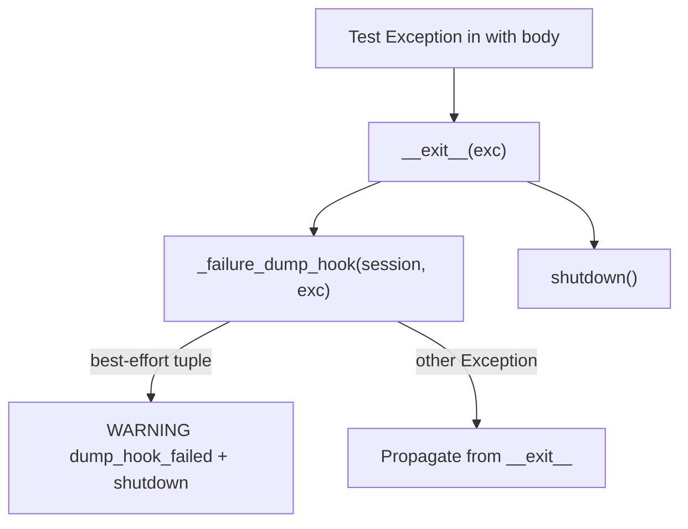

# PYPOST-914: Narrow lifecycle dump-hook exception types

## Research

### Current code

`pypost/agent/lifecycle.py` `AgentAppSession.__exit__` wraps
`_failure_dump_hook` in broad `except Exception` (`# noqa: BLE001`).
Any hook failure logs `agent_session_failure_dump_hook_failed` and shutdown
continues — the original test failure still propagates, but unexpected hook
bugs (e.g. `LookupError`) are swallowed.

PYPOST-876 narrowed `dump_agent_e2e_failure_artifacts` to
`_DUMP_BEST_EFFORT_ERRORS`:
`(OSError, RuntimeError, TypeError, ValueError, AttributeError)`.

Circular import blocks importing that constant from
`pypost.fixtures.agent_e2e_failure` (fixtures import `AgentAppSession` from
lifecycle). Duplicate the same tuple in lifecycle with a cross-reference
comment.

### Hook failure modes

The installed hook (`make_direct_session_failure_dump_hook`) delegates to
`dump_agent_e2e_failure_artifacts`, which already narrows its own catches.
Lifecycle wrapper covers **any** installed hook — including test doubles —
so the tuple matches dump-helper best-effort kinds.

## Implementation Plan

1. Add `_DUMP_HOOK_BEST_EFFORT_ERRORS` in `lifecycle.py` (same members as
   `_DUMP_BEST_EFFORT_ERRORS`).
2. Replace `except Exception` with that tuple; remove `# noqa: BLE001`.
3. Keep WARNING + continue shutdown for caught kinds.

**Failing Repro (Step 3):**

- **File:** `tests/test_agent_e2e_failure_artifacts.py`
- **Test:** `test_dump_hook_propagates_unexpected_exception`
- **Setup:** install hook raising `LookupError`; fail inside
  `with AgentAppSession(...)`.
- **Assert:** `pytest.raises(LookupError)`; no
  `agent_session_failure_dump_hook_failed` in caplog.
- **Why red today:** broad `except Exception` swallows `LookupError`; original
  `AssertionError` propagates instead.

## Architecture

### Modules

| Module | Change |
| --- | --- |
| `pypost/agent/lifecycle.py` | Named catch tuple; narrow hook wrapper |
| `tests/test_agent_e2e_failure_artifacts.py` | Propagation test + keep PYPOST-912 |
| `doc/dev/agent_e2e_failure_artifacts.md` | Document hook catch set |

### Patterns

- Same best-effort boundary as PYPOST-876 dump helper.
- Duplicate tuple to avoid fixtures ↔ lifecycle circular import.

### Interfaces

No public API change. Behavior change: unexpected hook exceptions propagate
from `__exit__` instead of being logged-only.
