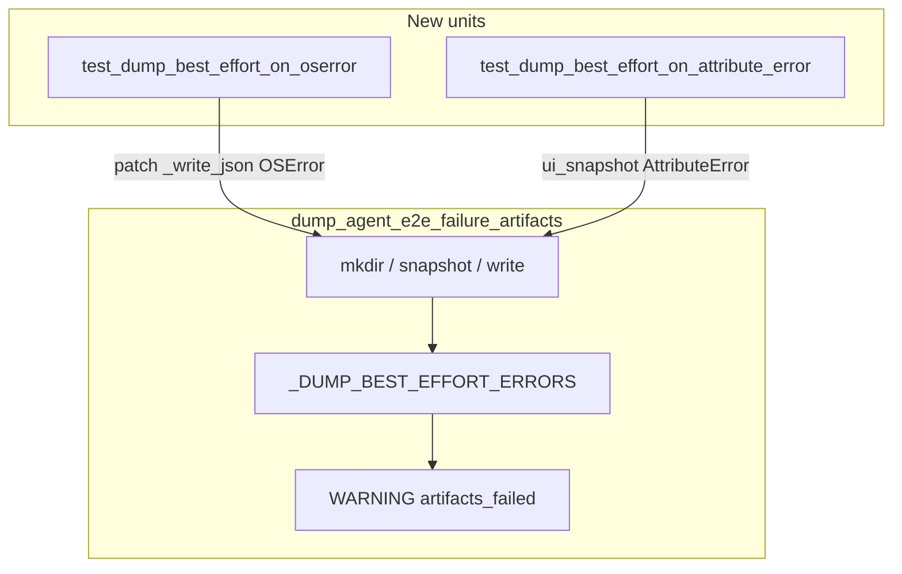

# PYPOST-915: Dedicated OSError / AttributeError dump best-effort units

## Research

### Origin

- Jira: [PYPOST-915](https://pypost.atlassian.net/browse/PYPOST-915), Lowest Debt,
  from [PYPOST-876](https://pypost.atlassian.net/browse/PYPOST-876) tech debt.
- Requirements: `ai-tasks/PYPOST-915/10-requirements.md`.

### Current production contract (already landed — PYPOST-876)

`pypost/fixtures/agent_e2e_failure.py`:

```python
_DUMP_BEST_EFFORT_ERRORS = (
    OSError,
    RuntimeError,
    TypeError,
    ValueError,
    AttributeError,
)
```

`dump_agent_e2e_failure_artifacts` catches that tuple, logs WARNING
`agent_e2e_failure_artifacts_failed nodeid=… error=<ExcType>`, returns
`None`.

**Missing:** dedicated units for `OSError` and `AttributeError` (only
`RuntimeError` has `test_dump_best_effort_on_capture_error` today).

### Existing test patterns

| Test | Proves |
| --- | --- |
| `test_dump_best_effort_on_capture_error` | RuntimeError → WARNING + None |
| `test_dump_propagates_unexpected_exception` | LookupError propagates |
| `test_dump_writes_snapshot_and_diagnostics` | Happy path |

Caplog pattern: `caplog.at_level(logging.WARNING,
logger="pypost.fixtures.agent_e2e_failure")`.

Mock pattern: `MagicMock(spec=AgentAppSession)` + `side_effect` or patch
internal `_write_json`.

### Decision

**Test-only change.** Extend `tests/test_agent_e2e_failure_artifacts.py`.
No production edit expected unless tests reveal a contract gap.

## Implementation Plan

1. Keep `pypost/fixtures/agent_e2e_failure.py` unchanged.
2. **Step 3:** Document red gap (missing OSError / AttributeError units).
3. **Step 4:** Add:
   - `test_dump_best_effort_on_oserror` — patch `_write_json` → `OSError`
   - `test_dump_best_effort_on_attribute_error` — `ui_snapshot` →
     `AttributeError`
4. Caplog assert event + `error=OSError` / `error=AttributeError`.
5. Update `doc/dev/agent_e2e_failure_artifacts.md` Tests section (Step 8).

**Mandatory — Failing Repro (Step 3):**

- **What:** Red gap — no dedicated units for OSError / AttributeError on
  dump helper (tuple membership implicit only).
- **Where:** `tests/test_agent_e2e_failure_artifacts.py`.
- **Force without live deps:** `unittest.mock.patch` on `_write_json`;
  `MagicMock` + `ui_snapshot.side_effect`.
- **Sequencing:** No product edit; tests green on first run once asserts
  land (prod already correct). Step 3 documents gap; Step 4 adds tests.

## Architecture



### Modules

| Module | Change |
| --- | --- |
| `pypost/fixtures/agent_e2e_failure.py` | None |
| `tests/test_agent_e2e_failure_artifacts.py` | Two new caplog units |
| `doc/dev/agent_e2e_failure_artifacts.md` | Tests section (Step 8) |

### Patterns

- Mirror `test_dump_best_effort_on_capture_error` structure.
- Pure unit (mocked); module `pytestmark` timeout(60) retained.
- No subprocess / Qt for these two tests.

## Q&A

- Q: AttributeError on `is_ui_ready` inner probe?
  A: Out of minimal scope; outer capture path is the primary catch-path
  lock. Inner probe already uses same tuple.
- Q: Step 3 N/A?
  A: No — coverage gap is the repro target; tests added Step 4.
- Q: Hook units?
  A: PYPOST-961 — out of scope.
