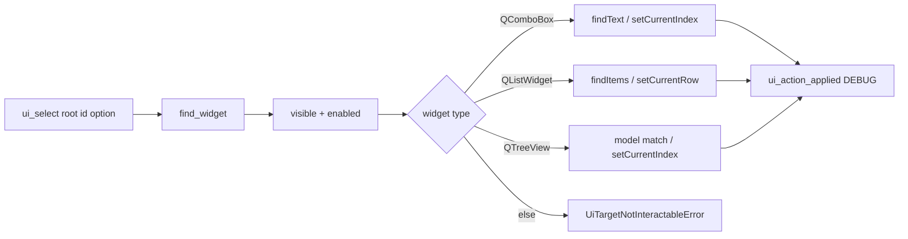

# PYPOST-916: Extend ui_select beyond QComboBox

## Research

### Jira / parent debt

- Issue: [PYPOST-916](https://pypost.atlassian.net/browse/PYPOST-916) —
  extend `ui_select` (or sibling) for list/tree by display text or index.
- Parent: [PYPOST-851](https://pypost.atlassian.net/browse/PYPOST-851)
  TD-1; originally [PYPOST-836](https://pypost.atlassian.net/browse/PYPOST-836)
  “Select is combo-box only”.

### Current code

| Piece | Behavior |
| --- | --- |
| `pypost/agent/ui_actions.py` `ui_select` | `QComboBox` only; `option: str` via `findText` |
| `AgentAppSession.ui_select` | Thin wrapper; same combo semantics |
| `tests/test_ui_actions.py` | Fixture combo + main-window method combo |
| `tests/helpers/agent_e2e_tree.py` | Viewport *click* by text on `QTreeView` (open/activate), not agent select |
| Product lists | History `QListWidget`; env list `QListWidget`; collections `QTreeView` |

### External / Qt guidance

- `QListWidget.findItems(text, MatchExactly)` + `setCurrentItem` /
  `setCurrentRow(int)` ([Qt QListWidget](https://doc.qt.io/qt-6/qlistwidget.html)).
- Model views: `QAbstractItemView.setCurrentIndex` /
  selection model ([QItemSelectionModel](https://doc.qt.io/qtforpython-6/PySide6/QtCore/QItemSelectionModel.html)).
- In-repo tree text walk already exists in `agent_e2e_tree` (depth-1
  `QStandardItemModel` walk); agent select should use a similar walk but
  raise `UiTargetNotInteractableError`, not `AssertionError`.

### Decision: **ENABLE** — extend `ui_select` (not a sibling)

| Option | Pros | Cons |
| --- | --- | --- |
| **Extend `ui_select`** (chosen) | One documented API; session helper stays; call sites unchanged for combo str | Slightly richer type dispatch |
| New sibling (`ui_select_list`) | Narrower function | Two APIs; docs/session duplication |
| Move tree helper into agent only | Reuses click | Click ≠ select; AssertionError vs agent errors |

**Rationale:** Acceptance asks for a documented select API for list/tree;
extending the existing primitive matches PYPOST-836 debt wording and
keeps golden/seed combo calls intact.

### Architectural decisions

| Decision | Choice | Rationale |
| --- | --- | --- |
| API shape | `option: str \| int` | Text = display; int = index |
| Combo | Keep str path; add int → `setCurrentIndex` | Symmetric with list/tree |
| List | `QListWidget` | History / env product types |
| Tree | `QTreeView` (model DisplayRole walk) | Collections tree; golden need |
| Index on tree | Top-level row only | Clear contract; nested → use text |
| Text on tree | Depth-first first match on DisplayRole | Mirrors e2e helper |
| Activate/open | Out of scope | Existing `click_tree_row_by_text` remains |
| Logging | Same `ui_action_applied` scalars | No option text in logs (NFR3) |

## Implementation Plan

1. **Failing repro (Step 3)** — extend `tests/test_ui_actions.py` fixture
   with a `QListWidget` (and optionally a small `QTreeView`) and assert
   `ui_select` by text and by index on the list (non-combo). Expect
   **red** (`not a combo box`) until Step 4.
2. **Step 4** — dispatch in `ui_select`: combo / list / tree; support
   `str | int`; update `AgentAppSession.ui_select` types/docstring;
   export unchanged.
3. **Docs** — update `doc/dev/ui_actions.md` (Step 8 primarily; may
   sketch in Step 4 if needed for green doc locks — none expected).
4. **Green** — re-run `tests/test_ui_actions.py`.

**Mandatory — Failing Repro (next Step 3):**

- **Where:** `tests/test_ui_actions.py`
- **Asserts (desired):**
  - `ui_select(root, list_id, "Beta")` selects that `QListWidget` row
  - `ui_select(root, list_id, 0)` selects row 0 by index
- **Force red:** do not change `ui_actions.py` in Step 3; raises
  `UiTargetNotInteractableError` with `not a combo box`.
- **Run:**

```bash
make test PYTEST_ARGS='tests/test_ui_actions.py::test_ui_select_list_by_text -v'
make test PYTEST_ARGS='tests/test_ui_actions.py::test_ui_select_list_by_index -v'
```

Sequencing: research → red tests → implement dispatch → green → docs.

## Architecture



| Module | Responsibility |
| --- | --- |
| `pypost/agent/ui_actions.py` | Type dispatch + select helpers |
| `pypost/agent/lifecycle.py` | Session `ui_select` signature/docs |
| `tests/test_ui_actions.py` | Combo + list (+ optional tree) fixture proofs |
| `doc/dev/ui_actions.md` | Documented API (Step 8) |

### Interface sketch

```python
def ui_select(root: QWidget, widget_id: str, option: str | int) -> None:
    """Select by display text (str) or index (int).

    Supports QComboBox, QListWidget, and QTreeView.
    """
```

## Q&A

| Q | A |
| --- | --- |
| Sibling vs extend? | Extend — one agent primitive. |
| Replace `click_tree_row_by_text`? | No — click opens; select sets current. |
| Nested tree by index? | Top-level only; nested by text. |
| Log option text? | No — keep existing scalar-only DEBUG. |
