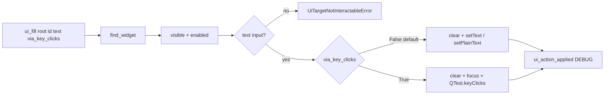

# PYPOST-917: Optional fill-via-keyClicks mode

## Research

### Jira / parent debt

- Issue: [PYPOST-917](https://pypost.atlassian.net/browse/PYPOST-917) —
  optional fill-via-keyClicks mode on agent fill.
- Parent: [PYPOST-851](https://pypost.atlassian.net/browse/PYPOST-851)
  TD-2; originally [PYPOST-836](https://pypost.atlassian.net/browse/PYPOST-836)
  “Optional fill-via-keyClicks mode”.

### Current code

| Piece | Behavior |
| --- | --- |
| `pypost/agent/ui_actions.py` `ui_fill` | Clear + `setText` / `setPlainText`; no keystroke mode |
| `ui_send_key` | Focus + `QTest.keyClick` for one key / hotkey |
| `AgentAppSession.ui_fill` | Thin wrapper; `in_current_tab` only |
| `tests/test_ui_actions.py` | Fixture line-edit fill; secret-log absence |
| In-repo `QTest.keyClicks` | e.g. response search typing in integration tests |
| `doc/dev/ui_actions.md` | Documents clear+set fill only |

### External / Qt guidance

- `QTest.keyClicks(widget, sequence, modifier=NoModifier, delay=-1)` simulates
  a character sequence as key clicks
  ([Qt QTest::keyClicks](https://doc.qt.io/qt-6/qtest.html#keyClicks)).
- Qt Test sends internal Qt events (no native OS side effects)
  ([Simulating GUI Events](https://doc.qt.io/qt-6/qttestlib-tutorial3-example.html)).
- `QLineEdit.setText` replaces in one shot and does not run per-key
  validation the same way typed input does
  ([QLineEdit](https://doc.qt.io/qtforpython-6/PySide6/QtWidgets/QLineEdit.html)).
- Existing agent pattern: `ui_send_key` focuses before `keyClick`; keystroke
  fill should focus before `keyClicks` the same way.

### Decision: **ENABLE** — opt-in keyword on `ui_fill` (not a sibling)

| Option | Pros | Cons |
| --- | --- | --- |
| **`via_key_clicks: bool = False` on `ui_fill`** (chosen) | One primitive; default unchanged; mirrors debt wording | Slightly richer fill body |
| New sibling (`ui_type` / `ui_fill_keys`) | Narrower function | Two fill APIs; session/docs duplication |
| Always keyClicks | Realism everywhere | Breaks NFR5 / golden speed & stability |

**Rationale:** Acceptance requires opt-in only; extending `ui_fill` with a
keyword-only flag keeps every existing call site on the setter path.

### Architectural decisions

| Decision | Choice | Rationale |
| --- | --- | --- |
| API flag | `*, via_key_clicks: bool = False` | Keyword-only; no positional breakage |
| Default (`False`) | clear + `setText` / `setPlainText` | Unchanged FR1 / golden / seed |
| Opt-in (`True`) | clear → focus → `QTest.keyClicks(widget, text)` | Whole-string keystroke realism |
| Widget types | Same trio as today | Line / plain / rich text only |
| Focus | `setFocus` + `_pump` before keyClicks | Match `ui_send_key` |
| Delay | Qt default (`-1`) | No mandatory per-key sleep (NFR5) |
| Errors | Same find / interactable / type errors | FR4 |
| Session mirror | Pass through `via_key_clicks` | FR5 |
| Logging | Add `via_key_clicks=%s` scalar; never log `text` | NFR3 / existing contract |
| Relation to send_key | Unchanged single-key / hotkey API | Out of scope |

## Implementation Plan

1. **Failing repro (Step 3)** — add red tests in `tests/test_ui_actions.py`
   that call `ui_fill(..., via_key_clicks=True)` (and session mirror). Expect
   **red** (`TypeError: unexpected keyword argument 'via_key_clicks'`) until
   Step 4.
2. **Step 4** — branch in `ui_fill` on `via_key_clicks`; mirror on
   `AgentAppSession.ui_fill`; keep default setter path byte-identical in
   behaviour.
3. **Observability** — extend `ui_action_applied` DEBUG line with
   `via_key_clicks=%s` (no fill text).
4. **Docs** — update `doc/dev/ui_actions.md` (Step 8 primarily) for default vs
   keystroke fill vs `ui_send_key`.
5. **Green** — re-run `tests/test_ui_actions.py` (both modes).

**Mandatory — Failing Repro (next Step 3):**

- **Where:** `tests/test_ui_actions.py`
- **Asserts (desired):**
  - `ui_fill(root, _INPUT, "typed-via-keys", via_key_clicks=True)` leaves
    the fixture `QLineEdit` text equal to `"typed-via-keys"`.
  - `AgentAppSession.ui_fill(URL_INPUT, "...", via_key_clicks=True)` accepts
    the same keyword (smoke on main-window URL field).
  - Optional companion (same Step 3 or with green suite): default call
    without the flag still replaces via setters (existing
    `test_ui_fill_on_fixture` remains the default-mode proof).
- **Force red:** do not change `ui_actions.py` / `lifecycle.py` in Step 3;
  calls raise `TypeError` because `via_key_clicks` is not a parameter today —
  that proves the opt-in keyClicks mode is missing.
- **Why not spy on keyClicks alone for red?** Signature rejection is the
  clearest missing-API signal; Step 4 green tests can additionally assert
  final text (and optionally `textChanged` count > 1) once the path exists.
- **Run:**

```bash
make test PYTEST_ARGS='tests/test_ui_actions.py::test_ui_fill_via_key_clicks_on_fixture -v'
make test PYTEST_ARGS='tests/test_ui_actions.py::test_ui_fill_via_key_clicks_session -v'
```

Sequencing: research → red tests → implement opt-in branch → green → docs.

## Architecture



| Module | Responsibility |
| --- | --- |
| `pypost/agent/ui_actions.py` | Dual-mode fill; DEBUG scalar for mode |
| `pypost/agent/lifecycle.py` | Session `ui_fill` passes `via_key_clicks` |
| `tests/test_ui_actions.py` | Default + opt-in proofs (fixture / session) |
| `doc/dev/ui_actions.md` | Document modes vs `ui_send_key` (Step 8) |

### Interface sketch

```python
def ui_fill(
    root: QWidget,
    widget_id: str,
    text: str,
    *,
    via_key_clicks: bool = False,
) -> None:
    """Replace editable text; opt into QTest.keyClicks when requested."""


# AgentAppSession
def ui_fill(
    self,
    widget_id: str,
    text: str,
    *,
    in_current_tab: bool = False,
    via_key_clicks: bool = False,
) -> None:
    ...
```

Log shape (DEBUG, no text payload):

```text
ui_action_applied primitive=fill widget_id=... outcome=ok
  duration_ms=... via_key_clicks=false|true
```

## Q&A

| Q | A |
| --- | --- |
| Sibling `ui_type` vs extend fill? | Extend — one agent fill primitive; opt-in flag. |
| Why keyword-only? | Preserve positional `(root, id, text)` and session callers. |
| Replace `ui_send_key`? | No — single key / hotkeys stay separate. |
| Switch golden/seed to keyClicks? | No — default remains setters (NFR5). |
| Log fill text? | No — mode scalar only (NFR3). |
| Per-key delay? | Not exposed; use Qt default for CI speed. |
