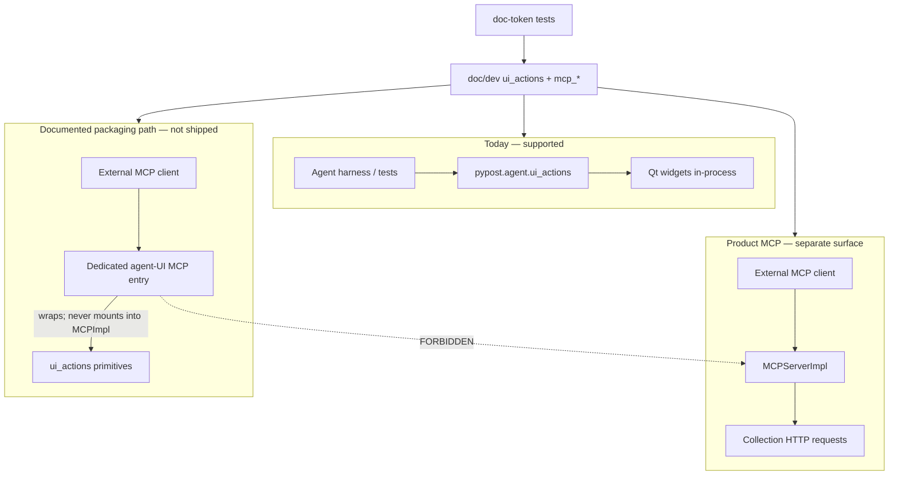

# PYPOST-918: Out-of-process MCP packaging for UI actions

## Research

### Jira / debt context

- Story: [PYPOST-918](https://pypost.atlassian.net/browse/PYPOST-918) —
  Debt from [PYPOST-851](https://pypost.atlassian.net/browse/PYPOST-851) TD-3
  (originally [PYPOST-836](https://pypost.atlassian.net/browse/PYPOST-836)
  follow-up item 5: “Out-of-process MCP wrapper — keep `MCPServerImpl` HTTP
  tools separate”).
- Acceptance (Jira): **Documented packaging path or deferred epic link; no
  mixing with product MCP HTTP tools.**
- Priority: Lowest. Type: Debt.
- Sibling packaging-clarity pattern:
  [PYPOST-922](https://pypost.atlassian.net/browse/PYPOST-922) (docs +
  doc-token contract tests; no live bridge for that debt either).
- Requirements: `ai-tasks/PYPOST-918/10-requirements.md` (PASS).

### What already exists (gap analysis)

| Piece | Today | Gap for 918 |
| --- | --- | --- |
| `pypost/agent/ui_actions.py` | In-process click/fill/select/send key | No out-of-process entry |
| `doc/dev/ui_actions.md` | States “not a network MCP tool on `MCPServerImpl`” | No closed packaging path / deferral answer |
| `MCPServerImpl` | Collection HTTP request tools only | Must stay free of UI-drive tools |
| `doc/dev/mcp_integration.md` | Product MCP + “not the same as agent UI e2e” | No UI-action out-of-process packaging answer |
| `doc/dev/mcp_trust_model.md` | Two inbound surfaces: request tools + metrics | No future agent-UI MCP surface note |
| Sibling agent docs | Snapshot / lifecycle / e2e cross-link actions | Open “maybe later MCP” still unowned |
| Live agent UI MCP server | **Does not exist** in the repo | Building it is out of scope for Lowest debt |

**Verdict:** Separation wording already exists; the debt is **closing the
packaging answer** (path vs deferral) so maintainers do not invent ad-hoc
bridges or register UI actions on product MCP.

### Epic search (deferred-epic option)

Jira epic search for MCP / agent / UI-action packaging found no owner epic
for out-of-process UI-action MCP:

| Epic | Relevance | Fit as deferral target? |
| --- | --- | --- |
| [PYPOST-832](https://pypost.atlassian.net/browse/PYPOST-832) E2E Agent UI Testing | In-process agent UI stack; **Done** | No — wrong scope; closed |
| [PYPOST-549](https://pypost.atlassian.net/browse/PYPOST-549) MCP Tools (HTTP) | Product collection-as-tools; **Done** | No — mixing risk |
| [PYPOST-855](https://pypost.atlassian.net/browse/PYPOST-855) Agent E2E Environment | Env pack; out of scope includes “Network MCP packaging beyond what the env pack needs” | No — explicitly excludes this |
| [PYPOST-888](https://pypost.atlassian.net/browse/PYPOST-888) Agent e2e audit | Presentation correctness | No |

Creating a **new** deferred epic solely to link from Lowest docs is heavier
than documenting a packaging path maintainers can follow when prioritized.
Acceptance allows either; prefer the path.

### External patterns (web)

- MCP guidance favors **multiple focused servers** (≈5–10 tools each) over
  one monolithic catalog — UI drive and collection HTTP tools are different
  domains and should stay separate servers
  ([MCP Developer Guide 2026](https://particula.tech/blog/mcp-developer-guide);
  [AWS MCP strategies](https://docs.aws.amazon.com/pdfs/prescriptive-guidance/latest/mcp-strategies/mcp-strategies.pdf)).
- Clients already **compose** multiple MCP servers (stdio local + Streamable
  HTTP remote) rather than merging unrelated tools into one process
  ([CallSphere multi-server orchestration](https://callsphere.ai/blog/orchestrating-multiple-mcp-servers-tool-ecosystem-complex-agents)).
- Product MCP today is Streamable HTTP (loopback); a future agent-UI bridge
  would typically be a **sidecar / agent-local** server (stdio or separate
  loopback HTTP), not an extension of `MCPServerImpl`
  ([MCP architecture patterns](https://mcp.institute/research/mcp-architecture-patterns)).
- Security posture: treat each MCP server as its own trust boundary; do not
  expand product request-tool blast radius with UI automation
  ([MCP server hardening](https://www.exploreagentic.ai/insights/mcp-server-security-hardening/)).

### Architectural decision: path vs deferred epic

| Option | Pros | Cons |
| --- | --- | --- |
| A. Documented packaging path (docs-only; no live bridge) | Closes acceptance; actionable; no epic invent; mirrors 922 | Bridge still not shipped (explicit) |
| B. Deferred epic link only | Minimal prose | No suitable epic; need create+link; weak “how” |
| C. Live out-of-process bridge in this debt | Fully packaged | Out of scope for Lowest; large surface |
| D. Register UI actions on `MCPServerImpl` | — | **Forbidden** by acceptance |

**Decision: Option A — documented packaging path.**

Document how out-of-process UI-action MCP **must** be packaged when/if built:
a **dedicated** agent-UI MCP process/entry that wraps in-process primitives
(or an equivalent Qt-owning sidecar), **never** mounted into the product
`MCPServerImpl` tool catalog. Live bridge delivery remains future work
outside this debt; this ticket owns the discoverable packaging contract and
no-mixing locks.

### Architectural decision: contract locks

| Option | Pros | Cons |
| --- | --- | --- |
| A. Docs-only (no new tests) | Cheapest | Wording drifts; TD-3 reopens |
| B. Doc-token test (922-style) | Locks FR1–FR5; fast; no GUI/MCP | Slightly more surface |
| C. Runtime assert that `MCPServerImpl` tool list excludes UI names | Strong runtime | Needs MCP harness; overkill for Lowest docs debt |

**Decision: Option B.** Fast doc-token unit locks (read Markdown from disk;
`@pytest.mark.timeout(10)`; no Qt, no live MCP). Optional hardening that
product MCP docs still forbid mixing can share the same module.

## Implementation Plan

1. **Step 3 (red):** Add failing doc-token contract tests (see Failing Repro)
   before any `doc/dev/` edit.
2. **Step 4 (green):** Add a packaging section to `doc/dev/ui_actions.md`
   (primary answer + `PYPOST-918` attribution); light cross-links from
   `mcp_integration.md`, `mcp_trust_model.md`, and sibling agent docs that
   still leave packaging as an open footnote.
3. **Steps 5–7:** Cleanup / observability (likely N/A or pointer-only) /
   tech-debt (unticketed only in `60-tech-debt.md`).
4. **Step 8:** Finish remaining `doc/dev/` discoverability polish if any.

**No** production code changes to `ui_actions.py` or `MCPServerImpl` in this
debt. **No** new make target required (unlike 922): packaging answer is
documentation + contract, not a runnable pack entry.

**Mandatory — Failing Repro (next Step 3):**

- **What it asserts (desired behavior):**
  1. `doc/dev/ui_actions.md` contains a stable packaging answer for
     **out-of-process** MCP of UI actions (tokens such as
     `out-of-process` and `packaging path`, case-insensitive) and
     attributes the close to `PYPOST-918`.
  2. The same (or sibling MCP) docs state the hard constraint: UI-action
     packaging must **not** mix with product MCP / must **not** register
     on `MCPServerImpl` (stable substrings, e.g. `MCPServerImpl` +
     `not` / `never` / `separate` framing — exact tokens fixed in the red
     test).
  3. At least one of `doc/dev/mcp_integration.md` or
     `doc/dev/mcp_trust_model.md` points readers at the UI-actions
     packaging answer (link or explicit cross-reference tokens), so
     product-MCP readers do not assume UI drive belongs in the request
     catalog.
- **Where it lives:**
  `tests/test_ui_actions_mcp_packaging_doc.py` (name may vary slightly) —
  pure unit, module `pytestmark = pytest.mark.timeout(10)`, **no**
  `agent_e2e` mark, same placement style as
  `tests/test_agent_e2e_broader_packaging_doc.py`.
- **How to force failure without live external deps:** Read docs from
  disk under repo root. Today’s `ui_actions.md` already says “not a
  network MCP tool on `MCPServerImpl`” but lacks `PYPOST-918`,
  `out-of-process` packaging-path closure, and MCP-doc cross-pointers —
  so new asserts are **red** before Step 4.
- **Sequencing:** research (this file) → write red tests only (Step 3) →
  Step 4 doc edits until green. Do **not** change docs in Step 3.

## Architecture

### Modules and responsibilities

| Module | Responsibility |
| --- | --- |
| `pypost/agent/ui_actions.py` | Unchanged in-process primitives (source of truth for drive) |
| `pypost/core/mcp_server_impl.py` | Product collection HTTP tools only — **no UI-action tools** |
| `doc/dev/ui_actions.md` | Primary packaging path + in-process API + PYPOST-918 |
| `doc/dev/mcp_integration.md` | Product MCP guide; cross-link packaging separation |
| `doc/dev/mcp_trust_model.md` | Trust surfaces; note agent-UI MCP is not a product surface |
| Sibling agent docs | Point at closed packaging answer (not open footnotes) |
| `tests/test_ui_actions_mcp_packaging_doc.py` | Doc-token locks for path + no-mixing + attribution |

### Documented packaging path (contract for future implementers)

When out-of-process UI-action MCP is prioritized, implementers **must**:

1. Ship a **dedicated** MCP server/entry (stdio sidecar and/or separate
   loopback Streamable HTTP), not a new tool family on `MCPServerImpl`.
2. Expose only agent UI-drive tools (click / fill / select / send key and
   related agent surfaces as needed) — never collection HTTP request tools.
3. Keep product MCP clients unchanged: collection tools remain solely on
   `MCPServerImpl`; clients that want both connect to **two** servers.
4. Prefer wrapping existing `pypost.agent.ui_actions` (or a thin façade)
   over duplicating QTest logic; the bridge owns process/lifecycle, not a
   second primitive set.
5. Document bind/trust separately from product MCP (agent-UI automation is
   a different privilege boundary than “run my saved request”).

This debt **documents** that path; it does **not** implement the bridge.

### Interfaces

- **Docs (primary):** Packaging section in `ui_actions.md` answering
  “in-process today; out-of-process = dedicated agent-UI MCP per path
  above; never product MCP.”
- **Docs (product MCP):** Explicit “UI actions are not tools here; see
  ui_actions packaging” pointer.
- **Tests:** Disk-read token asserts; no production → `tests/` imports.
- **Runtime:** No new public Python/MCP API in this ticket.

### Patterns

- **Documented packaging path over deferred epic** — no suitable epic;
  path is more actionable for Lowest debt.
- **Separate focused MCP servers** — industry default; hard no-mixing.
- **Docs + fast contract locks** — same shape as PYPOST-922 / 873-style
  token guards.
- **Extend docs, don’t fork product MCP** — zero change to
  `MCPServerImpl` registration.
- **Minimalism** — docs-only bridge description; live server is follow-up
  work when prioritized (record only in `60-tech-debt.md` if needed).

## Q&A

- Q: Path or deferred epic?
  A: **Documented packaging path** (Option A). No existing epic owns
  out-of-process UI-action MCP; inventing one is worse than documenting
  the packaging contract.

- Q: Does this ship a live MCP bridge?
  A: No. Acceptance is satisfied by the documented path + no mixing.
  Live delivery is future work following this path.

- Q: Can UI actions be added to `MCPServerImpl` “temporarily”?
  A: No. Forbidden by Jira acceptance and by this architecture.

- Q: Why not only update `60-tech-debt.md` / consolidated debt?
  A: Maintainers need a discoverable answer in `doc/dev/`, not a debt-table
  footnote (FR1 / discoverability NFR).

- Q: Must Step 3 be N/A?
  A: No. Prefer a red doc-token test (like PYPOST-922). Runtime product
  behaviour is unchanged; automated asserts change until docs land.

- Q: Relation to PYPOST-922 / agent e2e make packaging?
  A: Orthogonal. 922 packages in-process agent UI e2e. This debt packages
  (documentarily) out-of-process MCP for UI actions — or would have
  deferred it; we chose the path instead.
