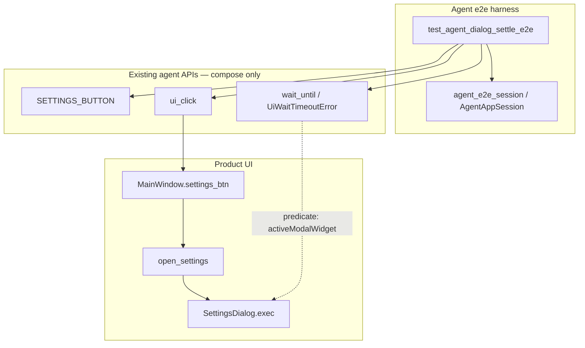

# PYPOST-919: Product dialog settle coverage in golden flow

## Research

### Jira / debt lineage

- Story: [PYPOST-919](https://pypost.atlassian.net/browse/PYPOST-919) —
  product dialog settle coverage (acceptance: golden or `agent_e2e` waits for a
  product dialog after an action).
- Source debt: [PYPOST-852](https://pypost.atlassian.net/browse/PYPOST-852) TD-1
  (from [PYPOST-837](https://pypost.atlassian.net/browse/PYPOST-837) TD-3 /
  [PYPOST-838](https://pypost.atlassian.net/browse/PYPOST-838) missing product
  dialog settle).
- Compose, do not redefine:
  - Lifecycle — `AgentAppSession` / `agent_e2e_session` (833 / 858)
  - Identity — `SETTINGS_BUTTON` (`pypost_settings_button`) already in
    `pypost.ui.widget_ids` (834)
  - Actions — `session.ui_click` (836)
  - Wait — `wait_until` / `UiWaitTimeoutError` (+ session mirrors) (837)
  - Snapshot — optional diagnostics only; not required for dialog presence (835)
  - Golden Send → response — remains separate proof in
    `tests/test_agent_golden_e2e.py` (838 / 859)

### Existing settle coverage (what is already proven)

| Path | What it waits for | Product dialog? |
| --- | --- | --- |
| `tests/test_ui_wait.py` | Delayed fixture widgets / text / enable | No (synthetic) |
| `tests/test_agent_golden_e2e.py` | Response panel after Send via
  `wait_for_snapshot` | No |
| Settings unit / e2e suites | Construct or patch `SettingsDialog.exec` | Yes, but
  **not** agent settle-after-action |

`doc/dev/ui_wait.md` already names “dialog open” as a settle use case; the
automated product proof for that sentence is what this story adds.

### Product Settings open path

```text
SETTINGS_BUTTON (pypost_settings_button)
  → MainWindow.open_settings()
  → SettingsDialog(parent=MainWindow, …)
  → dialog.exec()   # application-modal nested event loop
  → on accept: save / apply; on reject: return
```

Facts that drive architecture:

1. Settings is a real product dialog (`QDialog`, window title `"Settings"`).
2. Open is driven by a stable agent identity (`SETTINGS_BUTTON`) — no new id is
   required for the open action.
3. `SettingsDialog` does **not** currently set an `objectName`; presence is best
   observed via `QApplication.activeModalWidget()` (type and/or
   `windowTitle() == "Settings"`), not `wait_for_widget` under the main window
   alone.
4. `dialog.exec()` blocks inside the click slot. `QTest.mouseClick` (used by
   `ui_click`) therefore does **not** return until the dialog closes. A naïve
   “click then wait” sequence never reaches the wait under a live modal.
5. Existing settings e2e often **patches** `SettingsDialog.exec` to avoid the
   nested loop. That pattern proves save/apply wiring, not “wait until dialog
   appears.” This story must keep a **real** modal open long enough to settle.

### Modal / offscreen guidance (external + in-repo)

- Qt discourages blocking `exec()` for new code; `open()` + async finish is
  preferred ([QDialog docs](https://doc.qt.io/qt-6/qdialog.html)). PyPost
  production still uses `exec()` for Settings — out of scope to change here.
- pytest-qt / community guidance for live modals: schedule interaction with
  `QTimer.singleShot` **before** the blocking call so the nested loop can run
  the callback; prefer bounded waits over bare sleeps
  ([pytest-qt modal note](https://pytest-qt.readthedocs.io/en/stable/note_dialogs.html);
  Ert / pytest-qt hang reports under headless CI).
- In-repo precedent: PYPOST-548 documents that an undismissed modal under
  `offscreen` can hang the harness; dismiss (or patch) is mandatory for CI
  boundedness.

### Shared wait surface to reuse

Prefer **`wait_until`** (module or `session.wait_until`) with a predicate on
`QApplication.activeModalWidget()`, not a new wait helper and not an ad-hoc
`time.sleep`.

Why not `wait_for_snapshot` for the primary settle?

- Snapshot walks the **main window** visible tree; modal detection via
  `activeModalWidget` is the direct product signal.
- `ui_wait.md` already prefers typed / simple waits over full-tree snapshot
  polls on hot paths (PYPOST-852).

Optional: capture a short diagnostic string (dialog title / type name) into
`UiWaitTimeoutError.diagnostics` the same way golden Send wraps
`step` + `response_excerpt`.

### Placement decision (golden vs sibling module)

Jira accepts **golden or agent_e2e**. Trade-offs:

| Option | Pros | Cons |
| --- | --- | --- |
| Add test to `tests/test_agent_golden_e2e.py` | Ticket title “golden flow”;
  discoverable next to Send settle | Dilutes “one Send → response” golden
  narrative in `agent_golden_e2e.md` |
| New `tests/test_agent_dialog_settle_e2e.py` +
  `@pytest.mark.agent_e2e` | Clear separation; mirrors sibling packs
  (889 / 890); harness table row is explicit | Must update
  `doc/dev/agent_e2e.md` Module table (guarded by
  `test_agent_e2e_harness_table_doc.py`) |

**Decision:** New sibling module
`tests/test_agent_dialog_settle_e2e.py` marked `agent_e2e`, with a one-line
cross-link from `doc/dev/agent_golden_e2e.md` and a harness-table row in
`doc/dev/agent_e2e.md`. Satisfies acceptance without overloading the Send
golden scenario (FR6).

### Docs / run surface

- Run: `make test-agent-e2e` (and fast suite via `-m "not slow"`).
- Discoverability: harness table + short note in `agent_golden_e2e.md` /
  `ui_wait.md` that product dialog settle is covered by the new module.
- No production → `tests/` imports; tests import `pypost.agent` and
  `pypost.ui.widget_ids` only.

## Implementation Plan

Composition-only story: **no new wait subsystem**, no Settings functional
assertions, no change to Send golden assertions.

### High-level steps

1. **Step 3 — failing repro (red):** add an `agent_e2e` test that opens Settings
   via `SETTINGS_BUTTON` and expects a bounded settle for product-dialog
   presence (details below). Expect red under the naïve post-click wait.
2. **Step 4 — green settle proof:** implement the modal-safe pattern
   (schedule wait + dismiss before click; use shared `wait_until`; wrap
   timeouts with `step` diagnostics; reject/close dialog so `exec` returns).
3. **Docs:** harness table + minimal cross-links; keep Send golden docs intact.
4. Later workflow steps: cleanup, observability (likely reuse existing
   `ui_wait_*` logs), tech-debt notes, dev-doc polish.

### Mandatory — Failing Repro (next Step 3)

**Not N/A** — this is a runtime behavioral coverage change (new automated
scenario).

| Item | Plan |
| --- | --- |
| **Asserts (desired)** | After a product action that opens Settings, a shared
  settle wait observes the product dialog as present before the scenario
  treats the step as success; on timeout, `UiWaitTimeoutError` (or
  rewrap) carries identifiable `step` context (e.g.
  `wait_dialog_after_settings_open`). |
| **Where** | `tests/test_agent_dialog_settle_e2e.py` with module
  `pytestmark = [pytest.mark.timeout(60), pytest.mark.agent_e2e]`. |
| **Force failure (no live network)** | No HTTP. Drive real
  `MainWindow.open_settings` → `SettingsDialog.exec()`. **Red shape:** call
  `session.ui_click(SETTINGS_BUTTON)` then
  `session.wait_until(...)` *after* the click returns, **without** a
  pre-scheduled dismiss. Under modal `exec()`, `ui_click` never returns →
  module timeout / hang-fail within the 60s budget. That red proves both the
  missing settle proof and why post-click-only waits are insufficient for
  product dialogs. |
| **Sequencing** | Research (done) → Step 3 red naïve click+wait → Step 4
  replace with `QTimer.singleShot` callback that
  (1) `wait_until` dialog present via `activeModalWidget`,
  (2) records success / raises `UiWaitTimeoutError` with diagnostics,
  (3) `reject()`/`close()` so `exec` returns → assert settle succeeded →
  green under `make test-agent-e2e`. |
| **External deps** | None (offscreen Qt only; no network mock required). |

Optional companion red (same module or follow-up in Step 4): force a
zero/near-zero timeout inside the timer callback and assert diagnostics
include `step` (mirror
`test_agent_golden_settle_timeout_includes_step_and_excerpt`). Prefer one
happy-path settle proof first if scope must stay minimal.

## Architecture

### Module diagram



### Module responsibilities

| Module / component | Responsibility in this story |
| --- | --- |
| `tests/test_agent_dialog_settle_e2e.py` | Scenario: ready → click Settings →
  settle dialog present → dismiss → pass; timeout diagnostics |
| `AgentAppSession` | Lifecycle ready; `ui_click`; `wait_until` mirror |
| `pypost.agent.ui_wait` | Bounded `processEvents` poll; `UiWaitTimeoutError` |
| `pypost.ui.widget_ids.SETTINGS_BUTTON` | Stable open control |
| `MainWindow.open_settings` / `SettingsDialog` | Unchanged product path under
  test |
| `doc/dev/agent_e2e.md` | Harness table row for the new module |
| `doc/dev/agent_golden_e2e.md` / `ui_wait.md` | Minimal discoverability links |
| Send golden (`test_agent_golden_e2e.py`) | Untouched proof (FR6) |

### Interaction scheme (green path)

```text
1. agent_e2e_session → is_ui_ready
2. find_widget(SETTINGS_BUTTON)   # pre-flight identity
3. QTimer.singleShot(0|small_ms, _on_dialog):
     wait_until(
       lambda: _settings_dialog_present(),
       timeout=DIALOG_SETTLE_TIMEOUT_S,
       condition_name="settings_dialog_present",
     )
     # on timeout: raise UiWaitTimeoutError with diagnostics["step"]=...
     QApplication.activeModalWidget().reject()  # or close
4. session.ui_click(SETTINGS_BUTTON)  # blocks in exec until reject
5. Assert settle flag / no timeout raised inside timer
6. Session cleanup (fixture teardown) — dialog already closed
```

`_settings_dialog_present()`: `w = QApplication.activeModalWidget(); return w is
not None and w.windowTitle() == "Settings"` (and/or `isinstance(w,
SettingsDialog)`). Prefer title + type check for resilience.

### Settle budget

| Budget | Suggested value | Notes |
| --- | --- | --- |
| Module `pytest.mark.timeout` | 60 s | Match other agent_e2e modules |
| Dialog settle `wait_until` | ~5–10 s | Dialog create is sync; default
  `DEFAULT_UI_WAIT_TIMEOUT_S` (10 s) is enough; optional named constant in
  `tests/helpers/` only if reuse appears |
| Timer delay | 0–50 ms | Enough to enter nested `exec` before polling |

Do not use unbounded waits or bare sleeps as the settle mechanism (FR4).

### Architectural patterns

| Pattern | Justification |
| --- | --- |
| **Composition over new subsystem** | Reuse agent lifecycle / identity /
  actions / wait; acceptance is a coverage proof |
| **Timer-before-exec for modals** | Industry + in-repo safe pattern for
  nested `QDialog.exec()` under pytest/offscreen |
| **Predicate settle (`wait_until`)** | Shared agent wait surface; scalar
  diagnostics; no snapshot-tree cost |
| **Sibling agent_e2e module** | Keeps Send golden single-purpose; still
  satisfies “golden or agent_e2e” |
| **Fail-closed dismiss** | Always close dialog in timer path (try/finally)
  so CI cannot hang if assert fails mid-callback |

### Interfaces / APIs (no new production API required)

Public surfaces consumed (do not redefine):

```python
from PySide6.QtCore import QTimer
from PySide6.QtWidgets import QApplication

from pypost.agent import AgentAppSession, UiWaitTimeoutError, find_widget
from pypost.ui.widget_ids import SETTINGS_BUTTON
# session.ui_click / session.wait_until from AgentAppSession
```

**Out of scope for production unless Step 4 discovers a hard blocker:**

- Changing `open_settings` from `exec()` to `open()`
- Adding `SETTINGS_DIALOG` widget id (nice-to-have follow-up in
  `60-tech-debt.md` only if identity-based waits become desirable)
- Expanding Settings functional assertions

### Error / diagnostics contract (FR3)

On settle failure inside the timer callback, raise or rewrap
`UiWaitTimeoutError` with:

- `diagnostics["step"] == "wait_dialog_after_settings_open"` (or equivalent
  stable string)
- Short scalars: `timeout_s`, `condition`, optional `dialog_title` /
  `active_modal_type` when available

Mirror the golden Send rewrap style so failure artifacts / logs remain
actionable.

### FR mapping

| Requirement | Architectural answer |
| --- | --- |
| FR1 product action opens dialog | `ui_click(SETTINGS_BUTTON)` → real
  `SettingsDialog` |
| FR2 wait until present | `wait_until` + `activeModalWidget` predicate |
| FR3 bounded + diagnosable | timeout + `step` diagnostics |
| FR4 shared settle surface | `pypost.agent.ui_wait` / session mirrors |
| FR5 offscreen agent_e2e | marker + `make test-agent-e2e` |
| FR6 keep Send golden | no edits to Send assertions; sibling module |
| FR7 discoverability | harness table + short golden/`ui_wait` links |

### Risks and mitigations

| Risk | Mitigation |
| --- | --- |
| Hang on undismissed modal | `try`/`finally` reject/close in timer callback |
| Predicate never true | Title + type check; processEvents via `wait_until` |
| Timer runs before dialog shown | `wait_until` polls; small singleShot delay OK |
| Harness table drift | Update `agent_e2e.md` in same change as marker |
| Over-testing Settings | Presence/settle only — no encryption/theme/bind |

## Q&A

- Q: Must the proof live inside `test_agent_golden_e2e.py`?
  A: No. Acceptance allows golden **or** `agent_e2e`. Sibling module preferred
  to preserve the Send golden’s single narrative (see Placement decision).

- Q: Why not patch `SettingsDialog.exec` like other settings e2e tests?
  A: Patching skips the real modal appear path; this story must wait on a
  live product dialog.

- Q: Why not `wait_for_snapshot` after Settings click?
  A: Click blocks in `exec`; snapshot root is the main window. Modal presence
  via `activeModalWidget` + `wait_until` is the direct, cheaper settle.

- Q: Does “after Send” require a Send confirm dialog?
  A: No (requirements Q&A). Settings open satisfies the acceptance bar.

- Q: Are production code changes expected?
  A: Not for the happy path. Optional widget id for the dialog is deferred
  tech debt only if needed later.

- Q: External references used?
  A: [Qt QDialog](https://doc.qt.io/qt-6/qdialog.html);
  [pytest-qt modal dialogs](https://pytest-qt.readthedocs.io/en/stable/note_dialogs.html);
  in-repo `doc/dev/ui_wait.md`, `agent_golden_e2e.md`, `agent_e2e.md`;
  PYPOST-837/838/852 debt notes.
