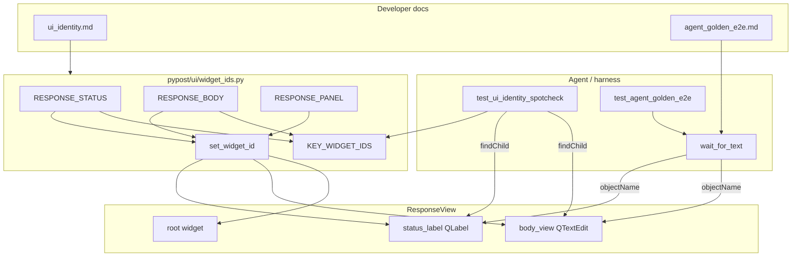

# PYPOST-920: Optional response status/body widget ids

## Research

### Jira / parent debt

- Issue: [PYPOST-920](https://pypost.atlassian.net/browse/PYPOST-920) —
  Optional `pypost_response_status` / `pypost_response_body` widget ids.
- Source: [PYPOST-853](https://pypost.atlassian.net/browse/PYPOST-853)
  (also noted under [PYPOST-889](https://pypost.atlassian.net/browse/PYPOST-889)).
- Acceptance: Stable ids on response status/body surfaces; docs + spot-check
  updated.
- Prior golden architecture ([PYPOST-838](https://pypost.atlassian.net/browse/PYPOST-838))
  deferred these ids and settled via `wait_for_snapshot` + panel walk.

### Current identity / settle state

| Surface | Widget | Identity today |
| --- | --- | --- |
| Response panel root | `ResponseView` | `RESPONSE_PANEL` via `set_widget_id` |
| Status label | `ResponseView.status_label` (`QLabel`) | None |
| Body view | `ResponseView.body_view` (`QTextEdit`) | None |
| Time / size / search chrome | sibling labels/inputs | None (out of scope) |

| Harness path | Behavior today |
| --- | --- |
| Golden settle | `session.wait_for_snapshot(_response_ready)` |
| Ready predicate | `joined_panel_values(snap)` contains status label +
  `FIXTURE_BODY_IN_SNAPSHOT` |
| Body assert form | Compact JSON from snapshot `sanitize_text` re-dump —
  **not** the pretty-printed `QTextEdit` text |
| Shared panel helpers | `tests/helpers/agent_e2e_response_panel.py`
  (`walk_values`, `joined_panel_values`, …) |
| Spot-check | Asserts `RESPONSE_PANEL` only under the response surface |
| `KEY_WIDGET_IDS` | Includes `RESPONSE_PANEL`; no status/body entries |

`display_response` sets `status_label` to `Status: {code}` and pretty-prints
JSON into `body_view` (`indent_size`, default 2) unless the body exceeds
`LARGE_DOC_CHAR_THRESHOLD`. Snapshot sanitize re-dumps parseable JSON without
indent — that mismatch is the sanitize coupling this story removes for
readiness waits.

### Wait API already supports the targets

`pypost.agent.ui_wait.wait_for_text` reads:

- `QLabel.text()` (status)
- `QTextEdit.toPlainText()` (body)

Docs (`doc/dev/ui_wait.md`) already prefer `wait_for_text` / `wait_for_widget`
over full-tree `wait_for_snapshot` on hot paths (PYPOST-852). Missing piece is
stable `objectName` targets, not a new wait primitive.

`AgentAppSession.wait_for_text` roots at `session.window`. Same as today’s
golden `find_widget(session.window, …)` / snapshot settle: first matching
role wins. Per-tab role names stay shared; spot-check continues to scope
lookups to the current `RequestTab` / `ResponseView`.

### Qt / industry guidance (web + project stack)

- Squish / Qt testing KB (“Explicitly Naming Objects”): set
  `QObject.setObjectName` so tools and `findChild` locate widgets without
  fragile occurrence indexes
  ([Qt Squish KB](https://qatools.knowledgebase.qt.io/squish/howto/explicitly-naming-objects/)).
- Project contract (PYPOST-834): primary identity = `objectName`; mirror via
  `set_widget_id` → `accessibleIdentifier` on `QWidget`
  ([Qt `accessibleIdentifier`](https://doc.qt.io/qt-6/qwidget.html#accessibleIdentifier-prop)).
- Nested status/body children under a named panel still need their **own**
  `objectName` for targeted `findChild` / `wait_for_text`; panel id alone
  cannot address leaf text surfaces.

### Architectural decisions

| Decision | Choice | Rationale |
| --- | --- | --- |
| Status id | `RESPONSE_STATUS = "pypost_response_status"` on `status_label` | Jira acceptance / FR1 |
| Body id | `RESPONSE_BODY = "pypost_response_body"` on `body_view` | Jira acceptance / FR2 |
| Panel root | Keep `RESPONSE_PANEL` unchanged | FR3; migration-friendly |
| Apply how | Panel: keep `set_widget_id(self, RESPONSE_PANEL)` in
  `ResponseView.__init__` (existing). Status/body: apply in
  `init_ui` after `status_label` / `body_view` are created.
  Do **not** move the panel stamp into `init_ui`. | Matches existing
  panel identity; leaf widgets only exist after `init_ui` creates them |
| Catalog | Add both to `KEY_WIDGET_IDS` | Spot-check + locale-literal lock |
| Wait expected text | Match **display** text: `Status: 200` and
  `json.dumps(json.loads(FIXTURE_BODY), indent=2)` (same as
  `display_response` default `indent_size=2`) — not
  `FIXTURE_BODY_IN_SNAPSHOT` | `wait_for_text` reads widget APIs, not sanitize |
| Golden settle | `wait_for_text` on status then body with display
  expected strings (indent-2 pretty body) | Removes snapshot sanitize coupling |
| Sibling e2e | Leave panel walks; ids unlock future migration | Out of scope full migration |
| Time/size/search ids | Not added | Out of scope |

## Implementation Plan

1. **Failing repro (Step 3)** — extend identity spot-check (and optionally a
   thin golden-path red assertion) so CI fails until status/body ids exist and
   are applied. See mandatory failing-repro block below.
2. **Constants** — add `RESPONSE_STATUS` / `RESPONSE_BODY` to
   `pypost/ui/widget_ids.py`; append to `KEY_WIDGET_IDS`.
3. **Apply** — leave `set_widget_id(self, RESPONSE_PANEL)` in
   `ResponseView.__init__` (do not relocate it). In `init_ui`, after creating
   `status_label` and `body_view`, call `set_widget_id` with
   `RESPONSE_STATUS` / `RESPONSE_BODY`.
4. **Spot-check green** — find `QLabel` / `QTextEdit` by the new ids under the
   current tab’s `ResponseView`; assert `objectName` +
   `accessibleIdentifier`; cover second-tab role ids like other per-tab
   controls.
5. **Golden migrate** — replace post-Send `wait_for_snapshot(_response_ready)`
   with identity-scoped `wait_for_text` on status and body using **display**
   strings: status `Status: {FIXTURE_STATUS}`; body
   `json.dumps(json.loads(FIXTURE_BODY), indent=2)` (matches
   `ResponseView.display_response` default `indent_size=2`). Drop
   `FIXTURE_BODY_IN_SNAPSHOT` from the settle path. Keep the
   forced-timeout diagnostics test on snapshot unless a text-wait equivalent
   is equally clear.
6. **Docs** — update `doc/dev/ui_identity.md` catalog; update
   `doc/dev/agent_golden_e2e.md` (and `ui_wait.md` cross-link if needed) so
   golden guidance prefers status/body text waits.
7. **Siblings** — do not rewrite env/seed/matrix/double-body panel walks in
   this ticket; note optional adoption in Step 7 tech-debt if useful.

**Mandatory — Failing Repro (next Step 3):**

- **Where (primary):** `tests/test_ui_identity_spotcheck.py`
  - Import `RESPONSE_STATUS`, `RESPONSE_BODY`.
  - In `_assert_key_identities` (and multi-tab role loop): under the current
    tab’s `ResponseView`, `findChild(QLabel, RESPONSE_STATUS)` and
    `findChild(QTextEdit, RESPONSE_BODY)` must be non-`None` and pass
    `_assert_id`.
  - Existing `test_widget_ids_are_locale_independent_literals` will cover the
    new strings once they are in `KEY_WIDGET_IDS` (Step 4); Step 3 may assert
    membership explicitly if constants are imported from a test-local expected
    list — prefer failing on missing widgets first.
- **Where (secondary / behavioral proof):** `tests/test_agent_golden_e2e.py`
  (or a focused companion under the same file) — after stubbed Send, call
  `session.wait_for_text(RESPONSE_STATUS, "Status: 200", …)` and
  `session.wait_for_text(RESPONSE_BODY,
  json.dumps(json.loads(FIXTURE_BODY), indent=2), …)` with the
  existing HTTP stub (`stub_agent_e2e_http(CANNED_GOLDEN_OK)`). No live
  network. Body expected text is pretty-printed display form (indent 2),
  not `FIXTURE_BODY_IN_SNAPSHOT`.
- **Asserts (desired):**
  - Status and body surfaces expose the catalog ids after UI ready.
  - Golden can settle on those ids via `wait_for_text` without
    `joined_panel_values` / `FIXTURE_BODY_IN_SNAPSHOT`.
- **Force red without production fix:** do not edit `widget_ids.py` or
  `response_view.py` in Step 3. Today:
  - Import of `RESPONSE_STATUS` / `RESPONSE_BODY` raises `ImportError`, **or**
  - if constants are stubbed only in the test, `findChild` returns `None` /
    `wait_for_text` times out with `found=False` — proving the surfaces lack
    stable identities.
- **Preferred Step 3 signal:** `ImportError` (missing catalog constants) is
  the clearest “API missing” red; after Step 4 adds constants but before
  `set_widget_id`, spot-check/`wait_for_text` stay red until apply lands.
- **Run:**

```bash
make test PYTEST_ARGS='tests/test_ui_identity_spotcheck.py -v'
make test PYTEST_ARGS='tests/test_agent_golden_e2e.py::test_agent_golden_request_response_flow -v'
```

Sequencing: research → red spot-check (+ golden text-wait) → add constants +
`set_widget_id` → green spot-check → finish golden migration + docs → green.

## Architecture

### Module diagram



### Module responsibilities

| Module | Responsibility |
| --- | --- |
| `pypost/ui/widget_ids.py` | Canonical `RESPONSE_STATUS` / `RESPONSE_BODY`; extend `KEY_WIDGET_IDS` |
| `pypost/ui/widgets/response_view.py` | Keep panel id in `__init__`; apply status/body ids in `init_ui` after those widgets exist |
| `pypost/agent/ui_wait.py` | Unchanged: `wait_for_text` already supports label + text edit |
| `tests/test_ui_identity_spotcheck.py` | Assert new key identities (window + multi-tab) |
| `tests/test_agent_golden_e2e.py` | Settle via text waits on the new ids |
| `doc/dev/ui_identity.md` | Catalog + lookup notes for status/body |
| `doc/dev/agent_golden_e2e.md` | Document text-wait settle vs former sanitize snapshot |
| `tests/helpers/agent_e2e_response_panel.py` | Remains for siblings; golden may stop importing settle helpers |

### Interface sketch

```python
# pypost/ui/widget_ids.py
RESPONSE_PANEL = "pypost_response_panel"
RESPONSE_STATUS = "pypost_response_status"
RESPONSE_BODY = "pypost_response_body"

KEY_WIDGET_IDS = (
    # ... existing ...
    RESPONSE_PANEL,
    RESPONSE_STATUS,
    RESPONSE_BODY,
    # ...
)

# ResponseView.__init__ (existing — do not move)
set_widget_id(self, RESPONSE_PANEL)
# ... then self.init_ui()

# ResponseView.init_ui (concept) — after status_label / body_view created
set_widget_id(self.status_label, RESPONSE_STATUS)
set_widget_id(self.body_view, RESPONSE_BODY)

# Golden settle (concept) — display text, not FIXTURE_BODY_IN_SNAPSHOT
EXPECTED_BODY = json.dumps(json.loads(FIXTURE_BODY), indent=2)  # indent_size=2
session.wait_for_text(
    RESPONSE_STATUS, f"Status: {FIXTURE_STATUS}", timeout=SEND_SETTLE_TIMEOUT_S
)
session.wait_for_text(
    RESPONSE_BODY, EXPECTED_BODY, timeout=SEND_SETTLE_TIMEOUT_S
)
```

### Interaction scheme

1. `ResponseView.__init__` stamps `RESPONSE_PANEL` (existing). `init_ui`
   creates `status_label` / `body_view`, then stamps `RESPONSE_STATUS` /
   `RESPONSE_BODY`.
2. After Send, response worker calls `display_response` (unchanged visually).
3. Harness waits for status text on `RESPONSE_STATUS`, then body text on
   `RESPONSE_BODY`.
4. Spot-check and docs keep the triad discoverable; panel root remains valid
   for snapshots and unmigrated siblings.

### Selected patterns

| Pattern | Why |
| --- | --- |
| Extend existing identity catalog | One contract; no parallel naming scheme |
| `set_widget_id` at construction | Panel stays in `__init__`; status/body in `init_ui` after create; theme/locale-stable |
| Shared per-tab role names | Same lookup rules as Send / URL / panel |
| Prefer `wait_for_text` | Existing API; avoids full-tree snapshot polls |
| Display-text expectations | Body: `json.dumps(json.loads(FIXTURE_BODY), indent=2)`; not sanitize compact |

### Dependency rules

- Production UI imports `widget_ids` only; never `tests/` or `pypost.agent`.
- Tests/agents import constants from `widget_ids` and wait helpers from
  `pypost.agent`.
- Do not redefine id string literals inline in tests or docs examples when
  the constant exists.

### Out of scope (architecture boundary)

- New wait primitive family or settle redesign.
- Ids for time/size/search chrome or headers tab.
- Migrating every sibling that still uses `joined_panel_values`.
- Changing HTTP stubs, canned golden payloads, or Send behaviour.
- User-facing `doc/user/` docs.

## Q&A

| Q | A |
| --- | --- |
| Why not keep snapshot settle only? | Sanitize coupling + mixed panel text; acceptance requires ids + text waits. |
| Why display body vs `FIXTURE_BODY_IN_SNAPSHOT`? | `wait_for_text` reads `toPlainText()`; expect `json.dumps(json.loads(FIXTURE_BODY), indent=2)` to match `display_response` default `indent_size=2`. Snapshot compact form is the coupling being removed. |
| Must siblings migrate now? | No — optional adoption; golden proves the path. |
| Change `RESPONSE_PANEL`? | No — finer targets are additive (FR3). |
| Ids on time/size labels? | Out of scope; only status + body per acceptance. |
| Extend `wait_for_text` session with `in_current_tab`? | Not required for this ticket; window-first match matches golden’s single-tab pattern. Follow-up if multi-tab Send proofs need scoped waits. |
| Approval gate? | Sprint-task-runner autonomy: Step 2 completed without a separate user pause. |
