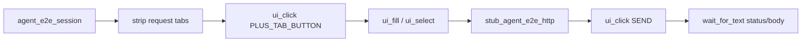

# PYPOST-921: Plus-tab create path in golden flow

## Research

### Jira / parent debt

- Issue: [PYPOST-921](https://pypost.atlassian.net/browse/PYPOST-921) —
  Plus-tab create path in golden flow.
- Source: [PYPOST-853](https://pypost.atlassian.net/browse/PYPOST-853) TD-4
  (from [PYPOST-838](https://pypost.atlassian.net/browse/PYPOST-838) missing
  tests: “No coverage of plus-tab create when restore does not open a blank
  tab”).
- Acceptance: Golden or agent_e2e covers creating a request via plus-tab when
  restore does not open a blank tab.

### Current restore + golden behavior

| Path | Behavior today |
| --- | --- |
| `TabsPresenter.restore_tabs` | No saved tabs → `add_new_tab` + log
  `restore_tabs_no_saved_tabs opened_blank_tab=true` |
| Golden happy path | Uses that blank; fill URL/method; Send; `wait_for_text`
  on `RESPONSE_STATUS` / `RESPONSE_BODY` |
| Docs | “Fresh agent sessions restore one blank request tab — no plus-tab
  click is required” (`doc/dev/agent_golden_e2e.md`) |

Closing the last request tab via `close_tab` **also** calls `add_new_tab`, so
normal close cannot produce a durable “only plus placeholder” UI. The e2e
precondition must strip request tabs **without** going through that
auto-replacement (direct `QTabWidget.removeTab` on request indices, leaving
the plus placeholder).

### Plus-tab chrome vs agent click

| Surface | Identity today | Agent-clickable? |
| --- | --- | --- |
| Plus placeholder page | `PLUS_TAB_PLACEHOLDER` |
  (`pypost_plus_tab_placeholder`) | Page widget only — `ui_click` does **not**
  emit `new_tab_requested` |
| Embedded `+` `QPushButton` | None | Unit tests use
  `tabBar.tabButton(plus_idx, LeftSide)` + `QTest.mouseClick` |
| Presenter | `handle_new_tab("plus_button")` | Bypass — not the chrome path
  acceptance asks to cover |

Qt guidance: tab segments themselves are not addressable widgets; automation
targets the widget passed to `QTabBar.setTabButton` by setting `objectName`
before attach
([QTabBar::setTabButton](https://doc.qt.io/qt-6/qtabbar.html#setTabButton);
Squish/Qt testing practice of naming tab-button widgets).

Primary click path (already documented in `doc/dev/request_actions.md`):
`plus_btn.clicked` → `new_tab_requested` → `TabsPresenter.handle_new_tab(
"plus_button")` → `add_new_tab()`.

### Architectural decisions

| Decision | Choice | Rationale |
| --- | --- | --- |
| Plus button id | `PLUS_TAB_BUTTON = "pypost_plus_tab_button"` | Distinct from
  placeholder page id; agent `ui_click` target |
| Apply where | `RequestTabHeader.ensure_plus_tab` after creating `plus_btn` |
  via `set_widget_id` | Same site as existing `PLUS_TAB_PLACEHOLDER` stamp |
| KEY catalog | Keep **out** of `KEY_WIDGET_IDS` (like placeholder) | Chrome
  control; spot-check optional assert via constant, not KEY membership |
| Precondition | Helper strips all `RequestTab` widgets via `removeTab`, leaves
  plus | Simulates “restore did not open blank” without changing product
  restore |
| Covered path | `session.ui_click(PLUS_TAB_BUTTON)` then golden fill/Send/wait |
  | Real plus chrome, not `add_new_tab` / shortcut |
| Where to put test | New test in `tests/test_agent_golden_e2e.py` (same
  module marks / HTTP / settle) | Acceptance allows golden **or** agent_e2e;
  golden module already owns Send → response composition |
| Existing golden | Leave blank-restore happy path unchanged | Regression lock
  for current restore |

## Implementation Plan

1. **Failing repro (Step 3)** — add golden test that strips request tabs,
   `ui_click(PLUS_TAB_BUTTON)`, then runs Send → settle. Fails today:
   `PLUS_TAB_BUTTON` missing / plus button has no `objectName`.
2. **Constant** — add `PLUS_TAB_BUTTON` to `pypost/ui/widget_ids.py` (not
   `KEY_WIDGET_IDS`).
3. **Apply** — `set_widget_id(plus_btn, PLUS_TAB_BUTTON)` in
   `ensure_plus_tab`.
4. **Green** — same test passes; optionally tighten unit test that already
   asserts placeholder id to also assert button id.
5. **Docs (Step 8)** — update `agent_golden_e2e.md` (+ identity catalog row);
   keep `request_actions.md` aligned if button id is mentioned.

**Mandatory — Failing Repro (next Step 3):**

- **What:** `test_agent_golden_plus_tab_create_when_no_blank_tab` (name may
  vary) asserts: after removing all request tabs (leave plus),
  `session.ui_click(PLUS_TAB_BUTTON)` creates a navigable request tab; then
  fill/Send/`wait_for_text` on status/body with `CANNED_GOLDEN_OK` succeeds.
- **Where:** `tests/test_agent_golden_e2e.py` (module `pytestmark` timeout 60,
  `agent_e2e`).
- **Force without live HTTP:** reuse `stub_agent_e2e_http(CANNED_GOLDEN_OK)`.
- **Why red today:** `PLUS_TAB_BUTTON` does not exist / plus `QPushButton` has
  no stable id → `find_widget` / `ui_click` fails before Send.
- **Sequencing:** research → red test → stamp id + keep scenario → green →
  docs.

## Architecture

| Module | Responsibility |
| --- | --- |
| `pypost/ui/widget_ids.py` | Export `PLUS_TAB_BUTTON` |
| `pypost/ui/widgets/tab_header.py` | Stamp id on embedded `+` button |
| `tests/test_agent_golden_e2e.py` | Composition scenario + strip helper |
| `tests/test_tab_header.py` (optional) | Assert button `objectName` |
| `doc/dev/agent_golden_e2e.md` / `ui_identity.md` | Document path |

No new agent APIs; reuse `AgentAppSession.ui_click` / `ui_fill` / `ui_select` /
`wait_for_text`.

## Q&A

| Q | A |
| --- | --- |
| Click `PLUS_TAB_PLACEHOLDER` instead? | No — that is the empty page widget;
  primary path is `plus_btn.clicked`. |
| Use `handle_new_tab` in the test? | No — acceptance wants plus-tab create
  coverage for agents. |
| Change `restore_tabs`? | No — simulate missing blank in the test only. |
| Add to `KEY_WIDGET_IDS`? | No — chrome, same policy as placeholder. |
