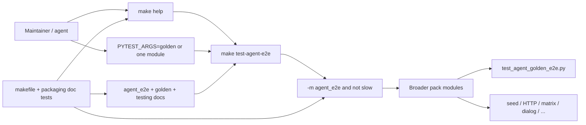

# PYPOST-922: Broader agent-e2e packaging make entry

## Research

### Jira / debt context

- Story: [PYPOST-922](https://pypost.atlassian.net/browse/PYPOST-922) —
  Debt from [PYPOST-853](https://pypost.atlassian.net/browse/PYPOST-853) TD-5
  (originally [PYPOST-838](https://pypost.atlassian.net/browse/PYPOST-838)
  TD-5).
- Acceptance (Jira): **Documented make target / packaging path for broader
  agent e2e beyond current golden.**
- Epic packaging context:
  [PYPOST-839](https://pypost.atlassian.net/browse/PYPOST-839) umbrella +
  early make entry;
  [PYPOST-858](https://pypost.atlassian.net/browse/PYPOST-858) marker
  selection;
  [PYPOST-861](https://pypost.atlassian.net/browse/PYPOST-861) help/CI/smoke
  for the env-pack make entry.
- Requirements: `ai-tasks/PYPOST-922/10-requirements.md`.

### What already exists (gap analysis)

| Piece | Today | Gap for 922 |
| --- | --- | --- |
| `make test-agent-e2e` | `-m "agent_e2e and not slow"` | Already broader than golden |
| `make help` `##` line | `Agent UI e2e + env pack …` | No “broader … beyond golden” |
| `tests/test_makefile.py` | Help name + marker smoke | No beyond-golden framing lock |
| `doc/dev/agent_e2e.md` | Umbrella + `PYTEST_ARGS` narrow | No primary=broader packaging close |
| `doc/dev/agent_golden_e2e.md` | Points at umbrella | Soft deferral; TD-5 bar open |
| `doc/dev/testing.md` | Make + golden example | Missing beyond-golden primary wording |
| CI job `agent-e2e` | Runs `make test-agent-e2e` | Keep as pointer; no redesign |

**Verdict:** The **runtime packaging path already selects the broader pack**.
This debt is **discoverability + wording + contract locks** so maintainers
do not treat golden-only as the packaging story, and so acceptance is
attributable here (not only to 839/861).

### External patterns (web)

- Self-documenting Make `##` help lines keep the primary entry discoverable
  without reading the recipe
  ([self-documenting Makefiles](https://blogsystem5.substack.com/p/make-help);
  common `##` + `make help` pattern).
- Industry agent/integration suites separate a **primary pack/gate** from a
  **narrow golden scenario override** (e.g. APM’s hermetic golden vs full
  e2e markers; greentic’s `make packs.test` vs single-scenario runs) —
  same shape as marker default + `PYTEST_ARGS` narrow.
- Prefer documenting one make entry over inventing parallel targets when
  selection already matches the pack (aligns with NFR Minimalism).

### Architectural decision: make target shape

| Option | Pros | Cons |
| --- | --- | --- |
| A. Reuse `test-agent-e2e`; clarify help/docs | One entry; 858/861 | Wording must be clear |
| B. Sibling `test-agent-e2e-broader` | Explicit name | Duplicate selection |
| C. Default golden-only + optional broader | — | Fails FR2 / acceptance |

**Decision: Option A.** Keep `make test-agent-e2e` as the sole project
packaging entry. Refresh `##` help and docs so primary meaning is the
**broader** `@pytest.mark.agent_e2e` pack (beyond
`tests/test_agent_golden_e2e.py`). Golden remains a documented
`PYTEST_ARGS` narrow.

### Architectural decision: contract locks

| Option | Pros | Cons |
| --- | --- | --- |
| A. Docs-only (no new tests) | Cheap | Wording drifts; TD-5 reopens |
| B. Makefile help + recipe locks only | Fast; mirrors 861 | Misses doc prose |
| C. B + doc-token test (873-style) | Locks FR1–FR5 | Slightly more surface |

**Decision: Option C.** Fast unit locks (no live GUI beyond existing
makefile workspace patterns):

1. Help / `##` text must frame **broader … beyond golden** (or equivalent
   stable tokens).
2. Default recipe must remain marker selection, **not** the golden file path.
3. Doc tokens in `agent_e2e.md`, `agent_golden_e2e.md`, and `testing.md`
   must name the broader path as primary and golden as override.

## Implementation Plan

1. **Step 3 (red):** Add failing contract tests (see Failing Repro below)
   before any Makefile/doc edit.
2. **Step 4 (green):** Update Makefile `##` help; align umbrella, golden,
   and testing docs (primary broader pack vs golden narrow); leave recipe
   selection unchanged unless a lock proves drift.
3. **Steps 5–7:** Cleanup / observability (likely N/A or pointer-only) /
   tech-debt.
4. **Step 8:** Finish any remaining `doc/dev/` cross-links; attribute
   packaging close to PYPOST-922 where useful.

**Mandatory — Failing Repro (next Step 3):**

- **What it asserts (desired behavior):**
  1. `make help` (and/or Makefile `##` on `test-agent-e2e`) describes the
     entry as the **broader** agent e2e pack **beyond** the golden scenario
     (stable substrings, e.g. `broader` and `beyond golden`,
     case-insensitive on help output / comment text).
  2. Default recipe (empty `PYTEST_ARGS`) uses
     `-m "agent_e2e and not slow"` and does **not** hardcode
     `tests/test_agent_golden_e2e.py` as the sole selection.
  3. `doc/dev/agent_e2e.md`, `doc/dev/agent_golden_e2e.md`, and
     `doc/dev/testing.md` contain tokens stating the primary packaging path
     is the broader pack (`make test-agent-e2e`) and golden-only is an
     optional `PYTEST_ARGS` narrow (include a `PYPOST-922` attribution
     anchor in at least one of those docs).
- **Where it lives:** Prefer extending `tests/test_makefile.py` for help +
  recipe locks; add
  `tests/test_agent_e2e_broader_packaging_doc.py` (or similar) for
  doc-token locks — pure unit, `@pytest.mark.timeout(10)`, **no**
  `agent_e2e` mark (same placement as harness-table / CI double-run doc
  guards).
- **How to force failure without live external deps:** Read Makefile /
  docs from disk; optionally run `make help` in the existing
  `make_workspace` fixture. No Qt session, no network, no full pack run.
  Today’s help line (`Agent UI e2e + env pack…`) and missing
  “beyond golden” / `PYPOST-922` doc anchors make the new asserts **red**
  before Step 4.
- **Sequencing:** research (this file) → write red tests only (Step 3) →
  Step 4 edits until green. Do **not** change Makefile/docs in Step 3.

## Architecture

### Modules and responsibilities

| Module | Responsibility |
| --- | --- |
| `Makefile` `test-agent-e2e` | Sole packaging entry; marker default |
| `Makefile` `##` / `make help` | Broader-beyond-golden discoverability |
| `tests/test_makefile.py` | Help framing + default ≠ golden-only |
| `tests/test_agent_e2e_broader_packaging_doc.py` | Doc-token primary vs override |
| `doc/dev/agent_e2e.md` | Umbrella: primary broader path |
| `doc/dev/agent_golden_e2e.md` | Scenario; points at broader entry |
| `doc/dev/testing.md` | Index: make entry + golden narrow |
| CI job `agent-e2e` | Unchanged; docs may note broader path |

### Interfaces

- **Make:** `make test-agent-e2e` [ `PYTEST_ARGS=...` ]
  - Default: `-m "agent_e2e and not slow"` → broader pack
  - Override: `PYTEST_ARGS` replaces default args (791) — e.g. golden file
- **Help:** `##` description must remain parseable by existing help target
  and must include broader-beyond-golden framing tokens
- **Docs:** Primary command string `make test-agent-e2e`; golden narrow
  example kept; no bare pytest as primary workflow
- **Tests:** No production → `tests/` imports; locks stay under `tests/`

### Patterns

- **Extend, don’t fork** — reuse 858/861 make target (same as 861 Option A).
- **Docs + fast contract locks** — 866/873 style token guards for
  discoverability debt.
- **Makefile-first** — workspace rule; ad-hoc pytest is not the documented
  primary path.
- **Marker as pack membership** — “broader agent e2e” == shared
  `agent_e2e` surface; golden is one module inside it.

## Q&A

- Q: Why is this still open if `make test-agent-e2e` already exists?
  A: 838/853 deferred **broader-than-golden** packaging documentation as
  debt. 839/861 delivered the entry and env-pack wording; 922 closes the
  acceptance bar that the **documented primary meaning** is the broader
  pack beyond the golden file.

- Q: New make target?
  A: No. A second target would duplicate marker selection and split the
  “which command?” answer.

- Q: Must Step 3 be N/A (docs-only, no behavioral change)?
  A: No. Contract locks change automated behavior (new asserts). Runtime
  GUI pack selection stays the same; red tests fail on missing help/doc
  framing until Step 4.

- Q: Change CI topology?
  A: No. Packaging path clarity only; job `agent-e2e` already runs the
  make entry.

- Q: Live MCP?
  A: Out of scope. In-process agent UI e2e / env pack only.
