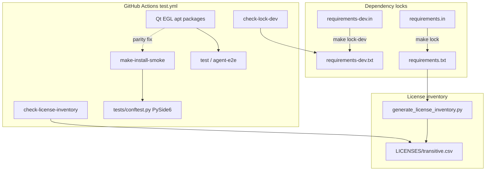

# PYPOST-923: Fix CI failures on dev (locks, license inventory, smoke Qt)

## Research

### Failure evidence (dev CI)

GitHub Actions run
[29912105656](https://github.com/koctep/pypost/actions/runs/29912105656)
(commit `604a496` on `dev`) shows three independent red jobs; main
`pytest` matrix and `agent-e2e` stayed green:

| Job | Exit | Root cause (requirements) |
| --- | --- | --- |
| `check-lock-dev` | 2 | Committed `requirements-dev.txt` ≠ fresh `uv pip compile` |
| `check-license-inventory` | 1 | `LICENSES/transitive.csv` ≠ inventory from current production lock |
| `make-install-smoke` | 4 | Pytest collection fails loading PySide6 without Qt/EGL apt libs |

### Existing module surface (no redesign)

| Module | Role today | Gap for 923 |
| --- | --- | --- |
| `requirements-dev.in` → `requirements-dev.txt` | Dev lock via `make lock-dev` / `check-lock-dev` (PYPOST-780) | Stale committed lock |
| `requirements.in` → `requirements.txt` | Prod lock via `make lock` / `check-lock` (local; no dedicated CI job) | Stale pins feeding inventory |
| `scripts/generate_license_inventory.py` | `--check` vs `LICENSES/transitive.csv` (PYPOST-809) | Inventory lags prod lock |
| `.github/workflows/test.yml` | Gates for locks, inventory, smoke, tests | Smoke job missing Qt apt step |
| `tests/conftest.py` | Imports `PySide6.QtWidgets` at collection | Expects Qt-capable runner |
| `tests/test_makefile.py` `@pytest.mark.slow` | `TestSlowInstallSmoke` install contract | Collection never reaches it without Qt |

Peer jobs that already provision Qt/EGL (`test`, `agent-e2e`):

```yaml
sudo apt-get install -y --no-install-recommends \
  libdbus-1-3 libegl1 libfontconfig1 libfreetype6 \
  libglib2.0-0 libgl1 libxcb-cursor0 libxkbcommon0
```

`make-install-smoke` sets `QT_QPA_PLATFORM: offscreen` but has **no** apt
step — confirmed parity gap in workflow YAML.

### External / toolchain notes

- **uv pip compile freshness:** Project already implements the pip-compile
  check pattern (`make check-lock*` → compile to `*.check`, strip header,
  `diff`). Native `uv lock --check` is for `uv.lock` project mode; this
  repo stays on requirements.txt locks ([uv pip compile](https://docs.astral.sh/uv/pip/compile/)).
- **PySide6 headless CI:** Ubuntu runners need EGL/GL/XCB system libs for
  Qt import even with `QT_QPA_PLATFORM=offscreen`
  ([pytest-qt troubleshooting](https://pytest-qt.readthedocs.io/en/stable/troubleshooting.html);
  common packages: `libegl1`, `libgl1`, `libxcb-cursor0`, `libxkbcommon0`).
  Repo already chose a working package set for `test` / `agent-e2e` — reuse
  it; do not invent a new list.
- **Contract-test precedent:** PYPOST-874 / PYPOST-861 assert workflow YAML
  job blocks from pytest without live Actions
  (`tests/test_agent_e2e_ci_failure_upload_doc.py`).

### Architectural decisions

| Decision | Choice | Why |
| --- | --- | --- |
| Lock refresh | Regenerate via existing `make lock` / `make lock-dev` | Gates already encode the contract; no new toolchain |
| Inventory refresh | `make generate-license-inventory` after prod lock | Same as PYPOST-809 |
| Smoke Qt env | Copy apt step from `test`/`agent-e2e` into `make-install-smoke` (full package-list equality) | Environment parity; conftest Qt import stays (out of scope) |
| Production `check-lock` CI job | Do **not** add | Out of scope; inventory + local `make check-lock` suffice for this ticket |
| Shared composite action for apt | Defer | Scope discipline; duplicate YAML step is acceptable for three jobs |

## Implementation Plan

1. **Failing repro (Step 3)** — add a fast workflow-contract test that
   asserts `make-install-smoke` provisions the same Qt/EGL apt package set
   as the main `test` job (see Failing Repro below). Expect **red** on
   current HEAD.
2. **Confirm lock/inventory red (Step 3)** — run existing gates locally
   (or document CI exit codes) so Step 4 has a baseline; no new lock
   assertion modules required.
3. **Fix (Step 4)** — in order:
   - `make lock-dev` → commit refreshed `requirements-dev.txt`
   - `make lock` → commit refreshed `requirements.txt`
   - `make generate-license-inventory` → commit `LICENSES/transitive.csv`
   - Add Qt/EGL apt step to `make-install-smoke` in `test.yml` (mirror
     `test` / `agent-e2e`)
4. **Green** — `make check-lock-dev`, `make check-lock`,
   `make check-license-inventory` (or script `--check`), and the new
   workflow contract test; `make check` for the change set.
5. **Docs (Step 8)** — light note in `doc/dev/setup.md` / `testing.md` that
   smoke job installs the same Qt runtime packages as the main matrix
   (if not already implied).

**Mandatory — Failing Repro (next Step 3):**

Not N/A — CI workflow behavior must change for smoke collection.

- **Where:** `tests/test_ci_make_install_smoke_qt_runtime.py` (new; timeout
  ≤10s; **no** `slow` / `agent_e2e` marks).
- **Asserts (desired):**
  - `.github/workflows/test.yml` defines job `make-install-smoke`.
  - That job’s YAML block includes an apt install whose package set is a
    **full copy** of the peer Qt/EGL set on job `test` (and matches
    `agent-e2e`): equality / parity, not a subset. Required packages
    (exact peer list):
    `libdbus-1-3`, `libegl1`, `libfontconfig1`, `libfreetype6`,
    `libglib2.0-0`, `libgl1`, `libxcb-cursor0`, `libxkbcommon0`.
  - Prefer also matching the peer step name/comment
    (`Install Qt / EGL runtime`); package-list equality is the hard gate
    so Step 4 cannot ship a partial apt install.
- **Force red:** Do not edit `test.yml` in Step 3; asserts fail because
  smoke job currently lacks the apt step.
- **No live external deps:** Pure filesystem/YAML read of the committed
  workflow (same pattern as PYPOST-874).
- **Lock/inventory:** Step 3 also records that existing gates fail
  (`make check-lock-dev`; `python scripts/generate_license_inventory.py
  --check` after `pip install -e ".[dev]"`). Those gates are the red
  signal for artifact refresh; Step 4 regenerates until they pass.
- **Run:**

```bash
make test PYTEST_ARGS='tests/test_ci_make_install_smoke_qt_runtime.py -v'
```

Sequencing: research → red workflow contract (+ confirm lock/inventory
red) → regenerate locks/inventory + add smoke apt step → green contract
+ gates.

## Architecture



### Modules and responsibilities

| Module | Responsibility | Change in 923 |
| --- | --- | --- |
| Makefile `lock*` / `check-lock*` | Compile and verify requirement locks | Invoke only (refresh outputs) |
| `requirements*.txt` | Committed resolved graphs | Regenerated pins |
| `generate_license_inventory.py` | Build/check transitive CSV | Invoke `--check` / regenerate |
| `LICENSES/transitive.csv` | Attribution snapshot | Regenerated |
| `.github/workflows/test.yml` `make-install-smoke` | Slow makefile install smoke | Add Qt/EGL apt parity |
| `tests/test_ci_make_install_smoke_qt_runtime.py` | Lock smoke-job env contract | **New** (Step 3 red → Step 4 green) |
| `pypost/` application code | Product behavior | **None** |

### Patterns

1. **Artifact freshness gates** — compile/diff (locks) and regenerate/compare
   (inventory); treat committed files as the source of truth for CI.
2. **Environment parity** — any job that collects the shared pytest suite
   must use the **same** Qt/EGL apt package set as jobs that already
   succeed (`test` / `agent-e2e`); equality / full copy, not a subset.
3. **YAML contract tests** — assert CI hygiene in-repo without calling
   GitHub Actions APIs.

### Interfaces

| From | To | Contract |
| --- | --- | --- |
| Maintainer / CI | `make check-lock-dev` | Exit 0 iff body of `requirements-dev.txt` matches compile |
| Maintainer | `make check-lock` | Exit 0 iff body of `requirements.txt` matches compile |
| CI `check-license-inventory` | `generate_license_inventory.py --check` | Exit 0 iff CSV matches prod lock metadata |
| CI `make-install-smoke` | apt + pytest `-m slow` | Collection succeeds with PySide6 under offscreen |
| Contract test | `test.yml` smoke job | Smoke apt set = peer `test`/`agent-e2e` set (full copy) |

## Q&A

| Question | Answer |
| --- | --- |
| Why not change `conftest.py` Qt import? | Out of scope (requirements); peer jobs already fix via apt. |
| Is there a CI `check-lock` for production? | No dedicated job today; inventory gate + local `make check-lock` cover this ticket. Adding a job is future debt if desired. |
| Will exact pin versions match 2026-07-21? | No — regenerate against current PyPI at fix time. |
| Interactive Step 2 approval? | Skipped — sprint-task-runner autonomous mode. |
| Related prior work | PYPOST-780 (dev lock), PYPOST-809 (inventory), PYPOST-806 (editable CI install), PYPOST-861/874 (workflow contract tests). |
