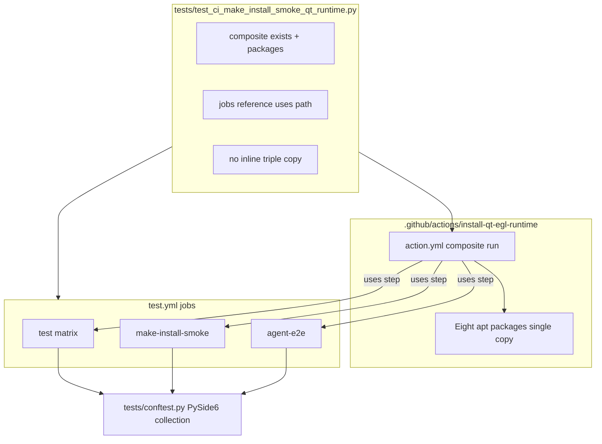

# PYPOST-924: Shared Qt/EGL apt composite for test, smoke, and agent-e2e

## Research

### Current state (post PYPOST-923)

`.github/workflows/test.yml` repeats the same inline apt install in three jobs
(`test`, `make-install-smoke`, `agent-e2e`):

```yaml
- name: Install Qt / EGL runtime (PySide6 headless)
  run: |
    sudo apt-get update
    sudo apt-get install -y --no-install-recommends \
      libdbus-1-3 libegl1 libfontconfig1 libfreetype6 \
      libglib2.0-0 libgl1 libxcb-cursor0 libxkbcommon0
```

Each job sets `QT_QPA_PLATFORM: offscreen` and runs the step after checkout,
before `actions/setup-python`, so PySide6 import during pytest collection
succeeds on Ubuntu runners.

| Module | Role today | Gap for 924 |
| --- | --- | --- |
| `.github/workflows/test.yml` | Three Qt-using jobs + other gates | Triple inline apt copy |
| `tests/test_ci_make_install_smoke_qt_runtime.py` | Smoke parity | Inline parse; no composite |
| `tests/conftest.py` | PySide6 at collection | Unchanged — needs apt on CI |
| `doc/dev/setup.md`, `doc/dev/testing.md` | Document inline apt step | Step 8 may name composite |

The repo has **no** `.github/actions/` directory today. Workflow contract tests
(PYPOST-861, PYPOST-874, PYPOST-923) read committed YAML from disk — no live
Actions API calls.

### Parent context

[PYPOST-923](https://pypost.atlassian.net/browse/PYPOST-923) deferred a shared
provisioner (TD-1 in `ai-tasks/PYPOST-923/60-tech-debt.md`) to restore CI
quickly. PYPOST-924 implements that follow-up only; package set and job
ordering stay the same.

### Composite action vs reusable workflow

| Criterion | Composite action | Reusable workflow |
| --- | --- | --- |
| Invocation level | Step inside an existing job | Entire job (`jobs.<id>.uses`) |
| Runner / workspace | Same job runner and checkout tree | Separate job and runner |
| Fit for apt between checkout and setup-python | **Yes** — drop-in | **No** — wraps jobs |
| Secrets / multi-job graphs | Not needed here | Overkill for one shell sequence |
| Repo precedent | PYPOST-861 composites for setup | First-class job gates, not single apt |
| GitHub guidance | Step bundles → composite | Job reuse → reusable workflow |

**Decision: local composite action** at
`.github/actions/install-qt-egl-runtime/action.yml`. All three jobs keep their
current structure and replace the inline `run:` block with one `uses:` step.

Reusable workflow rejected because it is job-level only: embedding apt install
between checkout and Python setup would require restructuring jobs or adding
wrapper jobs, increasing scope and Actions cost without benefit.

### Architectural decisions

| Decision | Choice | Why |
| --- | --- | --- |
| Mechanism | **Composite action** | Step-level reuse in three jobs |
| Location | `.github/actions/install-qt-egl-runtime/` | Co-located with `test.yml` |
| Reference style | `uses: ./.github/actions/install-qt-egl-runtime` | Local action; no tag drift |
| Package list | Single copy in composite `run:` | FR1 single source of truth |
| Step display name | `Install Qt / EGL runtime (PySide6 headless)` | Log label + doc anchors |
| `security-audit`, lock jobs | No composite | They do not import PySide6 at collection |
| Contract test | Extend existing module | Assert composite exists, is referenced, packages match |
| Product code | **None** | CI hygiene only (FR5) |

## Implementation Plan

1. **Failing repro (Step 3)** — extend
   `tests/test_ci_make_install_smoke_qt_runtime.py` with assertions that fail on
   current HEAD (see Failing Repro below). Existing parity tests stay green until
   Step 4 removes inline blocks.
2. **Implement composite (Step 4)** — add `action.yml` with the current eight
   packages and `apt-get` flags; replace three inline steps in `test.yml` with
   `uses: ./.github/actions/install-qt-egl-runtime`.
3. **Adapt contract tests (Step 4)** — point parity checks at `action.yml`
   (canonical package set) plus per-job `uses:` reference; remove reliance on
   inline apt lines inside job blocks.
4. **Green** — `make check`; CI workflow contract module passes.
5. **Docs (Step 8, optional light touch)** — if dev docs still describe three
   inline steps, name the composite path once.

**Mandatory — Failing Repro (next Step 3):**

Not N/A — CI workflow structure must change.

- **Where:** `tests/test_ci_make_install_smoke_qt_runtime.py` (same module as
  PYPOST-923; timeout ≤10s; no `slow` / `agent_e2e` marks).
- **Asserts (desired, new tests — expect RED on current HEAD):**
  1. **Composite exists:** `.github/actions/install-qt-egl-runtime/action.yml`
     is present, uses `runs.using: composite`, and its `run:` body installs
     exactly `_PEER_QT_EGL_PACKAGES` (same eight names as today).
  2. **Job coverage:** Jobs `test`, `make-install-smoke`, and `agent-e2e` each
     reference `uses: ./.github/actions/install-qt-egl-runtime` (stable path
     constant in the test module).
  3. **No inline triple copy:** `test.yml` must not contain more than zero
     inline `sudo apt-get install` blocks listing `libegl1` outside the
     composite (i.e. duplicated inline install removed from workflow).
- **Force red:** Do not add the composite or edit job `uses:` in Step 3.
  Assertions (1) and (2) fail because only inline copies exist today; (3) fails
  because three inline blocks remain.
- **No live external deps:** Pure filesystem read of `test.yml` and
  `action.yml` (same pattern as PYPOST-874 / PYPOST-923).
- **Existing tests:** `test_make_install_smoke_has_full_peer_qt_egl_apt_set`
  stays **green** on HEAD (inline parity still holds). Step 4 must update it
  when inline blocks are removed so parity is checked via composite + `uses:`.
- **Run:**

```bash
make test PYTEST_ARGS='tests/test_ci_make_install_smoke_qt_runtime.py -v'
```

Sequencing: research → red composite/coverage assertions → add composite +
wire three jobs + adapt parity test → green.

## Architecture



### Modules and responsibilities

| Module | Responsibility | Change in 924 |
| --- | --- | --- |
| `.github/actions/install-qt-egl-runtime/action.yml` | Qt/EGL apt | **New** — single package list |
| `.github/workflows/test.yml` | CI gates | Inline steps → composite `uses:` |
| `tests/test_ci_make_install_smoke_qt_runtime.py` | Contract | Step 3 red; Step 4 adapt |
| `tests/conftest.py` | PySide6 at collection | **None** |
| `pypost/` | Product | **None** |
| `doc/dev/setup.md`, `testing.md` | Dev troubleshooting | Optional Step 8 path update |

### Patterns

1. **Single source of truth** — package names live only in composite
   `action.yml`; workflow jobs reference the action, not the list.
2. **YAML contract tests** — enforce structure in-repo without GitHub API
   (extends PYPOST-923 parity pattern).
3. **Minimal scope** — no reusable workflow, no conftest import changes
   (PYPOST-926), no cross-job frozenset derivation (PYPOST-925).

### Interfaces

| From | To | Contract |
| --- | --- | --- |
| `test.yml` job step | `./.github/actions/install-qt-egl-runtime` | `uses:` after checkout |
| Composite action | Ubuntu runner | `apt-get update` + eight packages, `--no-install-recommends` |
| Contract test | `action.yml` | Package set equals documented frozenset |
| Contract test | `test.yml` jobs | Each Qt job contains composite `uses:`; no inline duplicate |
| CI jobs | pytest collection | Same headless Qt env as pre-924 (FR3) |

### Composite action sketch (Step 4)

```yaml
name: Install Qt / EGL runtime (PySide6 headless)
description: Ubuntu apt packages for headless PySide6 on CI runners
runs:
  using: composite
  steps:
    - name: Install Qt / EGL runtime (PySide6 headless)
      shell: bash
      run: |
        sudo apt-get update
        sudo apt-get install -y --no-install-recommends \
          libdbus-1-3 \
          libegl1 \
          libfontconfig1 \
          libfreetype6 \
          libglib2.0-0 \
          libgl1 \
          libxcb-cursor0 \
          libxkbcommon0
```

### Workflow consumption sketch (Step 4)

```yaml
- uses: actions/checkout@… # v4.2.2
- uses: ./.github/actions/install-qt-egl-runtime
- uses: actions/setup-python@… # v5.3.0
```

Applied identically in `test`, `make-install-smoke`, and `agent-e2e` after
checkout, before Python setup.

## Q&A

| Question | Answer |
| --- | --- |
| Why composite over reusable workflow? | Shared **step** in three jobs, not a job graph. |
| Why not a YAML anchor in `test.yml`? | Anchors do not merge across jobs; use composite. |
| Will the contract test stay? | Yes — composite + `uses:`; parity preserved (FR4). |
| Does `test` job get explicit coverage? | Step 3 asserts `uses:` on all three jobs. |
| Interactive Step 2 approval? | Skipped — sprint-task-runner autonomous mode. |
| Related follow-ups | PYPOST-925 derivation; PYPOST-926 lazy Qt import. |
