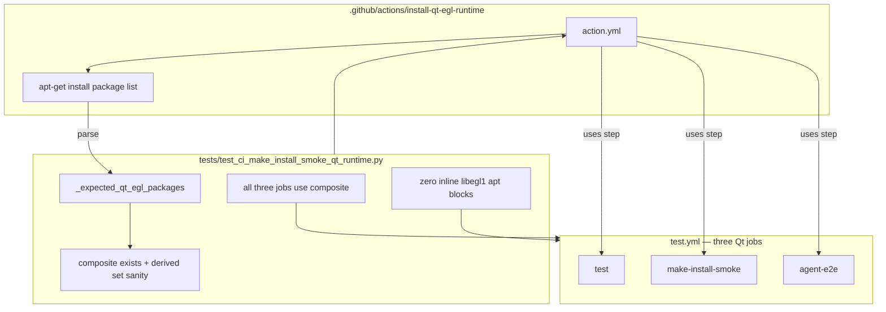

# PYPOST-925: Strengthen smoke Qt contract peer equality

## Research

### Current state (post PYPOST-924)

PYPOST-924 consolidated Qt/EGL apt provisioning into a shared composite action
consumed by all three Qt-using jobs in `.github/workflows/test.yml`. The contract
module `tests/test_ci_make_install_smoke_qt_runtime.py` still treats
`_PEER_QT_EGL_PACKAGES`, a hardcoded frozenset, as the authoritative expected set.
Every package assertion intersects or diffs against that frozenset:

| Location | Role today | Gap for 925 |
| --- | --- | --- |
| `.github/actions/install-qt-egl-runtime/action.yml` | Single apt install definition | **Authoritative in CI** but not in tests |
| `tests/test_ci_make_install_smoke_qt_runtime.py` | Contract guards | Duplicate frozenset gate; smoke-centric peer test |
| `.github/workflows/test.yml` | Three jobs reference composite | Covered by `uses:` test; no per-job package drift beyond composite |
| `doc/dev/setup.md`, `doc/dev/testing.md` | Maintainer docs | Still describe dual-edit until 925 (Step 8) |

Current test coverage matrix:

| Test | What it checks | Three-job? | Frozenset gate? |
| --- | --- | --- | --- |
| `test_install_qt_egl_composite_action_exists_with_full_package_set` | Composite exists + package set | N/A (action only) | **Yes** — diffs vs `_PEER_QT_EGL_PACKAGES` |
| `test_qt_using_jobs_reference_install_qt_egl_composite` | Each job has `uses:` composite | **Yes** — all three | No |
| `test_workflow_has_zero_inline_libegl1_apt_install_blocks` | No inline apt duplication | Workflow-wide | No |
| `test_make_install_smoke_job_exists` | Smoke job defined | Smoke only | No |
| `test_make_install_smoke_has_full_peer_qt_egl_apt_set` | Composite packages match frozenset; smoke vs agent-e2e `uses:` | Partial — smoke/agent-e2e emphasis | **Yes** |

`_apt_packages_in_block` also depends on `_PEER_QT_EGL_PACKAGES` for token
filtering (`stripped in _PEER_QT_EGL_PACKAGES`), so the parser cannot serve as a
neutral reader of `action.yml`.

### Derivation mechanism options

| Option | Pros | Cons | Decision |
| --- | --- | --- | --- |
| **A. Parse composite `action.yml` only** | True single source; one edit point; matches FR1/FR2 | Heuristic apt-line parser (existing pattern) | **Selected** |
| B. Parse all three job YAML blocks | Detects per-job inline drift | Redundant after 924 composite; triple maintenance | Rejected |
| C. Keep frozenset + composite cross-check | Simple diff | Dual maintenance persists (TD-2) | Rejected |
| D. Structured YAML parser (PyYAML) | Robust parsing | Out of scope (PYPOST-928 / TD-5) | Rejected |

**Decision:** derive the expected package set exclusively from
`.github/actions/install-qt-egl-runtime/action.yml` via a dedicated parser helper.
Remove `_PEER_QT_EGL_PACKAGES` as the authoritative gate. Keep workflow-level
sentinels (composite `uses:` on all three jobs, zero inline `libegl1` apt blocks)
unchanged in intent.

### Parser design

Reuse the existing filesystem-read pattern (PYPOST-861, PYPOST-874, PYPOST-923/924):
no GitHub Actions API, no live apt calls. Refactor package extraction to:

1. Locate `sudo apt-get install` (or `apt-get install`) within the composite `run:` block.
2. Collect continuation-line tokens matching Debian package name pattern
   `[a-z0-9][a-z0-9+._-]*` (same regex as today).
3. Return `frozenset[str]` — **no intersection** with a hardcoded expected set.

Structural sanity checks (no duplicate package list):

- Derived set is non-empty.
- Derived set includes `libegl1` (PySide6/EGL sentinel; aligns with existing
  inline-apt sentinel test).
- Every token matches the Debian name pattern (already enforced by regex).

These checks preserve contract signal without reintroducing an eight-name frozenset.
The eight-package set remains unchanged because `action.yml` is not edited in this
task; parity is preserved by leaving the composite as-is (DoD FR4).

### PYPOST-924 inline-libegl1 sentinel

Keep `test_workflow_has_zero_inline_libegl1_apt_install_blocks` unchanged in intent.
It guards against reintroducing inline apt duplication workflow-wide and complements
composite-derived package checks. No fold-into-other-test required.

## Implementation Plan

1. **Failing repro (Step 3)** — add contract assertions that fail on current HEAD
   (see Failing Repro below). Existing tests stay green until Step 4 refactors.
2. **Refactor parser (Step 4)** — introduce `_expected_qt_egl_packages()` (or rename
   `_composite_qt_egl_packages`) that reads `action.yml` and returns the full derived
   set without frozenset intersection; refactor `_apt_packages_in_block` to drop
   `_PEER_QT_EGL_PACKAGES` filter (scope to apt install lines + package regex).
3. **Remove frozenset gate (Step 4)** — delete `_PEER_QT_EGL_PACKAGES`; update all
   tests to compare against derived set only.
4. **Three-job parity (Step 4)** — refactor
   `test_make_install_smoke_has_full_peer_qt_egl_apt_set` into a three-job-focused
   assertion: all `_QT_USING_JOBS` reference the composite **and** the composite
   derived set passes structural sanity checks. Remove smoke-vs-agent-e2e peer framing;
   `test_qt_using_jobs_reference_install_qt_egl_composite` remains the explicit
   per-job `uses:` guard (no duplication — smoke test asserts composite package
   integrity that all three jobs inherit via shared `uses:`).
5. **Green (Step 4)** — `make check`; contract module passes on unchanged composite.
6. **Docs (Step 8, light touch)** — remove dual-edit step from `doc/dev/setup.md` /
   troubleshooting in `doc/dev/testing.md` (single edit in `action.yml` only).

**Mandatory — Failing Repro (next Step 3):**

Not N/A — contract enforcement changes (test-module structure).

- **Where:** `tests/test_ci_make_install_smoke_qt_runtime.py` (same module; timeout
  ≤10s; no `slow` / `agent_e2e` marks).
- **Asserts (desired, new test — expect RED on current HEAD):**
  1. **No duplicate authoritative frozenset:** module must not define
     `_PEER_QT_EGL_PACKAGES` (inspect via `importlib` or `getattr` on the loaded
     module). Current HEAD defines it → **RED**.
  2. **Derived-only package helper:** a public or test-visible
     `_expected_qt_egl_packages()` returns the composite parsed set **without**
     intersecting a hardcoded frozenset; a companion test asserts
     `_expected_qt_egl_packages()` equals parsing `action.yml` directly and that
     composite validation tests call this helper, not `_PEER_QT_EGL_PACKAGES`.
     On HEAD, helper intersects with frozenset → **RED** once assertion added in
     Step 3 before helper exists / after stub that fails.
- **Force red:** Do not remove frozenset or refactor helpers in Step 3. Add
  assertions (1) and/or (2) only.
- **No live external deps:** Pure filesystem read of `action.yml` and module
  introspection (same pattern as prior CI contract tasks).
- **Existing tests:** Remain **green** on HEAD until Step 4 removes frozenset and
  rewires assertions.
- **Run:**

```bash
make test PYTEST_ARGS='tests/test_ci_make_install_smoke_qt_runtime.py -v'
```

Sequencing: research → red no-frozenset / derived-only assertions → refactor parser
+ tests → green.

## Architecture



### Modules and responsibilities

| Module | Responsibility | Change in 925 |
| --- | --- | --- |
| `.github/actions/install-qt-egl-runtime/action.yml` | Qt/EGL apt package list | **None** — remains sole maintained definition |
| `.github/workflows/test.yml` | CI job wiring | **None** — three composite `uses:` references |
| `tests/test_ci_make_install_smoke_qt_runtime.py` | Contract enforcement | **Refactor** — derive expected set; drop frozenset; three-job parity |
| `tests/conftest.py` | PySide6 at collection | **None** |
| `pypost/` | Product | **None** |
| `doc/dev/setup.md`, `doc/dev/testing.md` | Maintainer workflow | Step 8 — remove dual-edit note |

### Patterns

1. **Single source of truth (completed in 924, enforced in 925)** — package names
   live only in composite `action.yml`; contract tests **read** that file rather
   than mirroring the list.
2. **YAML contract tests** — filesystem reads of committed YAML; no GitHub API
   (extends PYPOST-923/924 pattern).
3. **Structural sanity without duplicate lists** — non-empty derived set + `libegl1`
   sentinel instead of an eight-name frozenset gate.
4. **Equal three-job weight** — explicit `_QT_USING_JOBS` tuple drives all job
   coverage; no smoke-centric peer comparison against a static set.

### Interfaces

| From | To | Contract |
| --- | --- | --- |
| `_expected_qt_egl_packages()` | `action.yml` | Parse apt install lines → `frozenset[str]` |
| `test_install_qt_egl_composite_action_exists_with_full_package_set` | Derived set | Composite type + non-empty + contains `libegl1` |
| `test_qt_using_jobs_reference_install_qt_egl_composite` | `test.yml` jobs | Each of `test`, `make-install-smoke`, `agent-e2e` contains `uses: ./.github/actions/install-qt-egl-runtime` |
| `test_workflow_has_zero_inline_libegl1_apt_install_blocks` | `test.yml` | Zero inline apt blocks listing `libegl1` |
| Refactored smoke/parity test | Derived set + composite | Composite package integrity inherited by all three jobs via shared `uses:` |
| CI jobs | pytest collection | Same headless Qt env as pre-925 (FR4) |

### Helper sketch (Step 4)

```python
_APT_PKG_RE = re.compile(r"^[a-z0-9][a-z0-9+._-]*$")
_QT_EGL_SENTINEL_PKG = "libegl1"


def _packages_from_apt_install_block(text: str) -> frozenset[str]:
    """Extract Debian package names from apt-get install continuation lines."""
    ...


def _expected_qt_egl_packages() -> frozenset[str]:
    """Authoritative Qt/EGL package set from the shared composite action."""
    text = _QT_EGL_COMPOSITE_ACTION.read_text(encoding="utf-8")
    return _packages_from_apt_install_block(text)
```

Remove `_PEER_QT_EGL_PACKAGES` entirely. Update error messages to reference
`action.yml` path, not an internal frozenset name.

## Q&A

| Question | Answer |
| --- | --- |
| Why derive from composite only, not three job blocks? | PYPOST-924 consolidated install; jobs reference composite via `uses:` — parsing three blocks adds no signal. |
| How do we detect a bad package removal without a frozenset? | Structural checks (non-empty, `libegl1` present) plus unchanged `action.yml` in this task; runtime failures surface on CI if libs missing. |
| Keep inline-libegl1 sentinel? | Yes — preserves anti-duplication guard from PYPOST-924; independent of package derivation. |
| Does `test` job get explicit coverage? | Yes — via `_QT_USING_JOBS` in `test_qt_using_jobs_reference_install_qt_egl_composite` and equal-weight parity refactor. |
| Step 8 doc changes? | Remove dual-edit step; point maintainers at `action.yml` only. |
| Interactive Step 2 approval? | Skipped — sprint-task-runner autonomous mode. |
