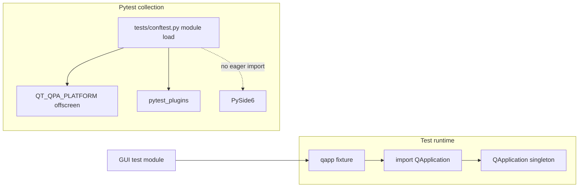

# PYPOST-926: Lazy PySide6 import in tests/conftest.py

## Research

### Current behavior

| Module | Behavior | Gap |
| --- | --- | --- |
| `tests/conftest.py` | Top-level `from PySide6.QtWidgets import QApplication` | Loads Qt during any conftest import |
| `qapp` fixture | Creates `QApplication.instance() or QApplication([])` | Depends on eager import today |
| GUI test modules | Own PySide6 imports at module level | Unchanged; still need Qt when collected |
| CI Qt/EGL provision | Composite action on three jobs (PYPOST-924/925) | Still required for full GUI suite |

`os.environ.setdefault("QT_QPA_PLATFORM", "offscreen")` must remain **before** the first
Qt import in any code path; today it runs at conftest module load (still true after fix).

### Architectural decisions

| Decision | Choice | Why |
| --- | --- | --- |
| Lazy boundary | Import `QApplication` inside `qapp` fixture only | Smallest change; fixture is the sole conftest Qt consumer |
| Env var timing | Keep offscreen default at module top | Must precede deferred import when `qapp` runs |
| Contract test | Subprocess imports `tests.conftest`, asserts `"PySide6" not in sys.modules` | Isolated process avoids pollution from pytest session |
| qapp regression | Same module: `test_qapp_fixture_still_provides_qapplication` | Proves fixture still works under pytest |
| Individual test imports | No change | Out of scope; conftest-only debt |

## Implementation Plan

1. **Step 3** — Add `tests/test_conftest_lazy_qt_import.py` (red while conftest eager).
2. **Step 4** — Remove top-level PySide6 import; move into `qapp`; green contract + GUI spot check.
3. **Step 8** — Note lazy import in `doc/dev/gui_testing.md` and parity row in `testing.md`.

**Failing Repro (Step 3):**

- **Where:** `tests/test_conftest_lazy_qt_import.py` (`pytestmark` timeout 10).
- **Assert:** Fresh subprocess `import tests.conftest` leaves `"PySide6" not in sys.modules`.
- **Force red:** Eager import in conftest until Step 4.
- **Run:** `make test PYTEST_ARGS='tests/test_conftest_lazy_qt_import.py -v'`

## Architecture

### Modules and responsibilities

| Module | Change |
| --- | --- |
| `tests/conftest.py` | Lazy PySide6 import in `qapp` only |
| `tests/test_conftest_lazy_qt_import.py` | **New** contract + qapp smoke |
| `pypost/` | **None** |
| CI workflow | **None** |

## Q&A

| Question | Answer |
| --- | --- |
| Will `pytest_plugins` load Qt? | `agent_e2e` plugin imports lifecycle, not PySide6 at plugin load |
| Subprocess vs AST check? | Subprocess proves runtime behavior; AST would not catch conditional imports |
