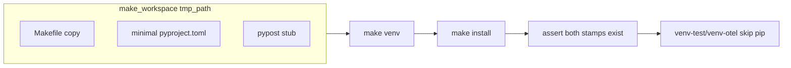

# PYPOST-929: Contract test — make install touches extra stamps

## Research

- Root `Makefile` `install` target (lines 39–41) runs
  `pip install -e ".[dev,otel]"` then
  `touch "$(VENV_TEST_STAMP)" "$(VENV_OTEL_STAMP)"`.
- `tests/test_makefile.py` already covers stamp idempotency for
  `venv-test` / `venv-otel` (`TestVenvExtraStampIdempotency`) and
  dependency chains (`TestDependencyChain.test_install_depends_on_marker_only`).
- Gap: no behavioral assert that `make install` materializes both stamps.
- PYPOST-905 follow-up spec: `ai-tasks/PYPOST-905/60-tech-debt.md` § Follow-Up
  Tasks item 1.

## Implementation Plan

1. Add class `TestInstallExtraStampContract` to `tests/test_makefile.py`.
2. **Test A — stamp existence:** run `venv` then `install` in `make_workspace`;
   assert both stamp files exist (absent before `install`).
3. **Test B — skip pip (optional but valuable):** after `install`, run
   `venv-test` and `venv-otel` a second time; assert no `pip install` in output
   via existing `_assert_no_pip_install`.
4. Run focused pytest; then `make test` subset for makefile tests.
5. Update `doc/dev/testing.md` Makefile automation table and “Extra stamps” row.

**Failing Repro (Step 3):** Regression contract — test **passes** on current
Makefile because PYPOST-905 already implements the touch. Removing the
`touch` lines from `install` would make Test A fail (stamps missing). No
production fix in Step 4 unless the test reveals a gap.

## Architecture

| Module | Responsibility |
| --- | --- |
| `tests/test_makefile.py` | Contract tests; reuses `_run_make`, stamp constants, pip asserts |
| `Makefile` | Unchanged (install already touches stamps) |
| `doc/dev/testing.md` | Document PYPOST-929 scope in Makefile automation section |

## Q&A

- **New file vs extend test_makefile.py?** Extend existing module — same
  fixtures, constants, and timeout `pytestmark` already present.
