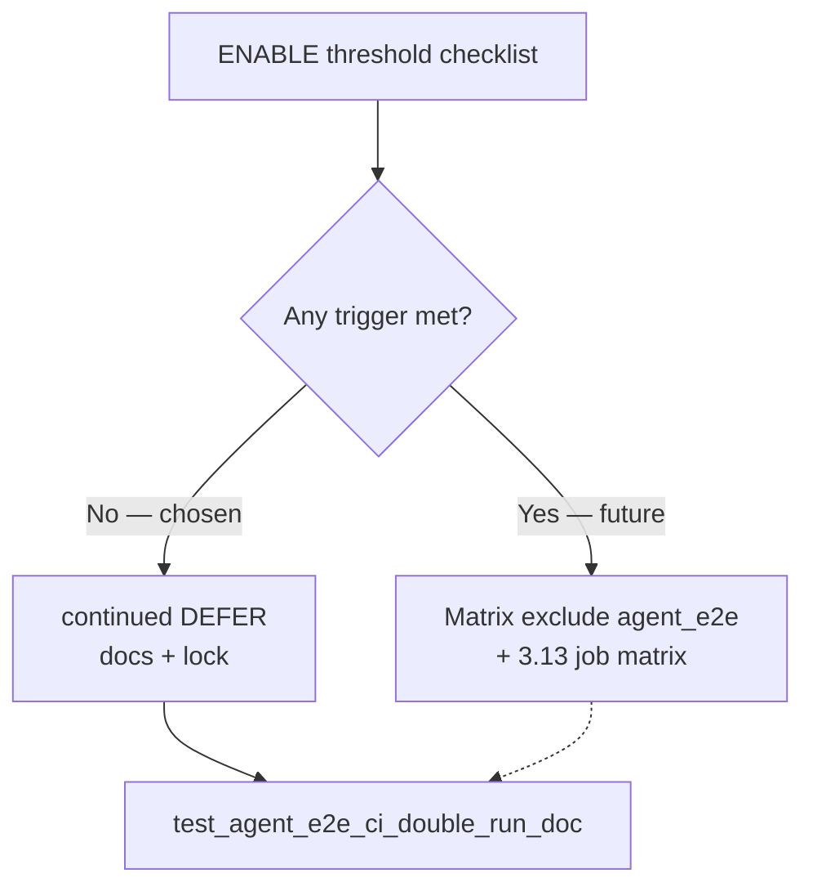

# PYPOST-930: ENABLE CI cost trim when ENABLE threshold met

## Research

### Parent / source

- [PYPOST-907](https://pypost.atlassian.net/browse/PYPOST-907) — evidence +
  DEFER + ENABLE threshold in `doc/dev/testing.md`.
- Lock: `tests/test_agent_e2e_ci_double_run_doc.py` (873 / 907 / 908 anchors).

### ENABLE threshold (from testing.md)

| Trigger | Bar | Evidence (2026-08-01 revisit) |
| --- | --- | --- |
| Dedicated pack step duration | ≥6m across ≥3 recent green runs | **Not met** — n=2; max ~172s (~2.9m) |
| Maintainer pain | Double failures / queue cost reported | **Not met** — no report |
| Pack size + domination | ≥120 `agent_e2e and not slow` + main pytest pack-dominated | **Not met** — collect **82** (was 64 at 907); main job ~670s total pytest, not pack-only |

Local collect (this workspace):

```bash
pytest --collect-only -q -m "agent_e2e and not slow"
# 82 tests collected
```

Fresh Actions API fetch was unavailable in this run (`gh` empty); assessment
uses published PYPOST-907 table plus updated local collect count.

### Decision: **continued DEFER** (ENABLE threshold not met)

**Rationale:** No trigger satisfied. Sample still thin (n=2 < 3), pack step
well under 6m, pack size 82 < 120, wall clock still matrix-dominated. Premature
ENABLE would drop dual-run safety without documented pain.

**ENABLE sketch (unchanged for future):**

1. Main matrix: `-m "not slow and not agent_e2e"`.
2. Expand `agent-e2e` to Python **3.11 + 3.13** matrix.
3. Flip lock to require exclusion + expanded job; remove DEFER anchors.

### Architectural decisions

| Decision | Choice | Rationale |
| --- | --- | --- |
| ENABLE vs DEFER | **continued DEFER** | Threshold not met |
| Workflow | Unchanged | Lock forbids `not agent_e2e` until ENABLE |
| Docs | Add PYPOST-930 checklist | Explicit not-met per trigger |
| Lock | Extend 907 lock | PYPOST-930 + threshold-not-met wording |

## Implementation Plan

1. **Step 3** — extend `test_agent_e2e_ci_double_run_doc.py`: require
   `PYPOST-930`, `ENABLE threshold not met`, continued DEFER after 930
   revisit; workflow still dual-coverage.
2. **Step 4** — update `doc/dev/testing.md` + `agent_e2e.md` with checklist;
   no YAML change.
3. **Green** — run lock test.

## Architecture


