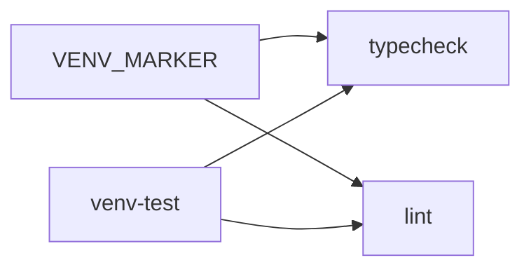

# PYPOST-932: Contract test typecheck depends on venv-test

## Research

### Parent debt (PYPOST-906)

- Follow-up #1: add `test_typecheck_depends_on_marker_and_venv_test` (same
  shape as lint) so the peer pattern cannot regress silently.
- Makefile already has `typecheck: $(VENV_MARKER) venv-test` (unchanged since
  PYPOST-872 era); lint gained the same edge in PYPOST-906.

### Current Makefile

```makefile
typecheck: $(VENV_MARKER) venv-test ## Optional mypy on pypost/core/, models/, and ui/
```

No production edit required.

### Contract tests today

- `test_lint_depends_on_marker_and_venv_test` (906) — template to mirror.
- Pytest targets assert `venv-test` (872); no dedicated `typecheck` name.

### Architectural decision

| Option | Pros | Cons |
| --- | --- | --- |
| **A. Mirror lint test (chosen)** | Same assert shape; minimal diff | None |
| B. Parametrize lint + typecheck | DRY | Loses per-ticket docstrings / traceability |
| C. Makefile change | N/A | Edge already correct |

**Choice A:** One test method after lint lock:

```python
def test_typecheck_depends_on_marker_and_venv_test(...):
    prereqs = _prerequisites(make_workspace, "typecheck")
    assert MARKER_REL in prereqs
    assert "venv-test" in prereqs
    assert "install" not in prereqs
```

## Implementation Plan

1. **Step 3:** N/A — regression lock; test green on current Makefile.
2. **Step 4:** Add test in `TestDependencyChain`; run targeted pytest.
3. **Step 8:** Add PYPOST-932 to `doc/dev/testing.md` automation table;
   extend dependency-chain row to name `typecheck` explicitly.

Run:

```bash
make test PYTEST_ARGS='tests/test_makefile.py -q -k typecheck_depends'
```

## Architecture



| Module | Responsibility |
| --- | --- |
| Root `Makefile` | Unchanged; `typecheck` already depends on `venv-test` |
| `tests/test_makefile.py` | New contract test locks prerequisite edge |
| `doc/dev/testing.md` | Document PYPOST-932 in automation scope table |

### Patterns

- **Peer lock** — same assert trio as lint (marker, venv-test, not install).
- **Static prereq check** — `_prerequisites` via `make -p` in isolated workspace.

## Q&A

| Q | A |
| --- | --- |
| Why no failing repro? | Behavior already shipped; this ticket only adds the lock. |
| Does this change mypy? | No — prerequisite contract only. |
