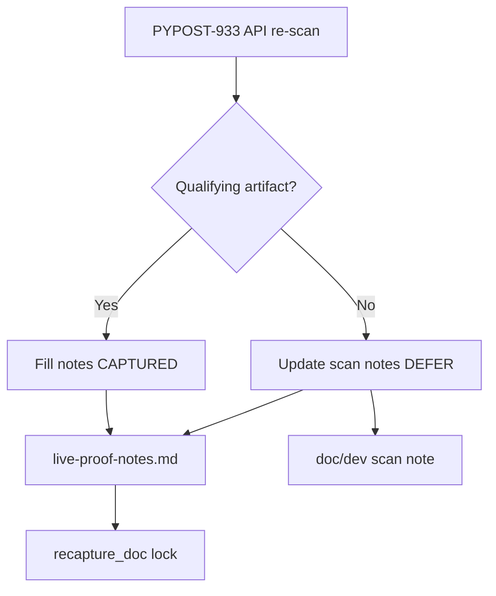

# PYPOST-933: Capture live Artifacts UI proof when red run exists

## Research

### Jira / parent debt

- Issue: [PYPOST-933](https://pypost.atlassian.net/browse/PYPOST-933) —
  follow-up to [PYPOST-911](https://pypost.atlassian.net/browse/PYPOST-911)
  item 1 (complete live Artifacts UI proof when qualifying red run exists).
- Parent notes stub: `ai-tasks/PYPOST-911/live-proof-notes.md`.
- Procedure locked by PYPOST-911 in `doc/dev/agent_e2e_failure_artifacts.md`.

### Public Actions evidence (PYPOST-933 re-scan, 2026-08-01)

Queried `https://api.github.com/repos/koctep/pypost/actions/runs`
(`per_page=100`, `status=completed`):

| Result | Detail |
| --- | --- |
| Runs scanned | 23 completed |
| Failed conclusions | 10 |
| Qualifying `agent-e2e-failure-artifacts*` | **0** |
| Recent failure artifacts | `test-results-*`, `coverage-report-*` only (or none) |
| `gh` CLI | Not installed; used GitHub REST API |

Conclusion: **continued DEFER** — no honest CAPTURED proof available today.

### Decision: **DEFER** (continued)

| Option | Pros | Cons |
| --- | --- | --- |
| CAPTURE now | Closes with hard evidence | Impossible without inventing proof |
| **DEFER + updated scan** (chosen) | Honest; checklist intact; SAFE TO CLOSE | Proof still pending |
| Invent screenshot | Appears done | Forbidden |

## Implementation Plan

1. **Failing repro (Step 3)** — add
   `tests/test_agent_e2e_ci_failure_artifacts_ui_proof_recapture_doc.py`
   asserting `live-proof-notes.md` records PYPOST-933 re-scan and honest
   DEFER/CAPTURED status. Red until notes updated.
2. **Development (Step 4)** — append PYPOST-933 re-scan section to
   `live-proof-notes.md`; add scan note to
   `doc/dev/agent_e2e_failure_artifacts.md`.
3. **Green** — re-run recapture + PYPOST-911 locks.

**Mandatory — Failing Repro (Step 3):**

- **Where:** `tests/test_agent_e2e_ci_failure_artifacts_ui_proof_recapture_doc.py`
- **Asserts:** PYPOST-933 re-scan recorded; DEFER or CAPTURED status explicit.
- **Run:**

```bash
make test PYTEST_ARGS='tests/test_agent_e2e_ci_failure_artifacts_ui_proof_recapture_doc.py -v'
```

## Architecture



| Module | Responsibility |
| --- | --- |
| `ai-tasks/PYPOST-911/live-proof-notes.md` | Capture record / re-scan evidence |
| `doc/dev/agent_e2e_failure_artifacts.md` | Proof status + scan date |
| `tests/..._recapture_doc.py` | Lock re-scan record |

## Q&A

| Q | A |
| --- | --- |
| Why not force agent-e2e fail? | Out of scope; optional debt. |
| Where is proof stored? | Same PYPOST-911 notes stub path. |
