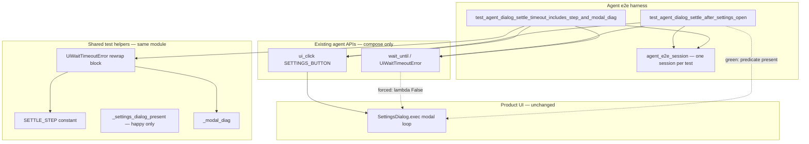

# PYPOST-934: Agent e2e timeout companion for dialog settle step diagnostics

## Research

### Jira / debt lineage

- Story: [PYPOST-934](https://pypost.atlassian.net/browse/PYPOST-934) — timeout
  companion for dialog-settle failure diagnostics.
- Parent: [PYPOST-919](https://pypost.atlassian.net/browse/PYPOST-919) — happy-path
  product dialog settle (`tests/test_agent_dialog_settle_e2e.py`); timeout rewrap
  with `step` + modal scalars is **implemented** in the happy-path timer callback
  but **not regression-tested** (PYPOST-919 TD-1 → this ticket).
- Reference pattern: golden Send forced-timeout companion
  `test_agent_golden_settle_timeout_includes_step_and_excerpt` in
  `tests/test_agent_golden_e2e.py` (PYPOST-853 TD-3) — business parity for
  step + context scalars on forced timeout, not a mandate to copy structure
  verbatim.

### What already exists (compose only)

| Artifact | State |
| --- | --- |
| `tests/test_agent_dialog_settle_e2e.py` | Happy-path test +
  `SETTLE_STEP`, `_modal_diag()`, `_settings_dialog_present()`, modal-safe
  `QTimer.singleShot` + `ui_click` pattern |
| Timeout rewrap in happy path | `UiWaitTimeoutError` with
  `diagnostics["step"] == "wait_dialog_after_settings_open"` and
  `dialog_title` / `active_modal_type` from `_modal_diag()` |
| Golden timeout companion | `wait_for_snapshot(lambda _: False, timeout=0.05)`
  + rewrap + `pytest.raises` / direct diagnostics asserts |
| Production agent APIs | Unchanged — `wait_until`, `UiWaitTimeoutError`,
  `ui_click`, `SETTINGS_BUTTON` |

### Modal constraint (same as PYPOST-919)

`SettingsDialog.exec()` blocks `ui_click` until dismiss. Forced-timeout proof
must run the settle wait **inside** a `QTimer.singleShot` callback scheduled
**before** `session.ui_click(SETTINGS_BUTTON)`, with fail-closed `reject()` in
`finally` — same green-path architecture, different settle budget and assertions.

### Session / segfault constraint

PYPOST-919 Step 4 observed a second full `agent_e2e_session` after the modal
path segfaulting locally (PYPOST-429 lineage). **Decision:** one session, one
companion test function in the **same module** as the happy-path proof — no
second fixture invocation in one test file run beyond what pytest already
schedules per test.

### Near-zero forced timeout (determinism)

Golden companion uses an **impossible predicate** (`lambda _: False`) with a
short budget (`0.05` s), not ambient flakiness. Dialog settle companion should
mirror that intent inside the timer callback:

- `session.wait_until(lambda: False, timeout=NEAR_ZERO_S, …)` — always times
  out regardless of when the modal appears.
- On timeout, apply the **same rewrap block** as the happy-path test (copy
  inline for now; shared helper is PYPOST-936 / out of scope).
- `_modal_diag()` at timeout may still see the live Settings modal (title +
  type name) if the dialog opened before the budget expired — assert key
  **presence**, not specific values, matching golden’s `response_excerpt` check.

### Docs / harness surface

- Module already listed in `doc/dev/agent_e2e.md` harness table (PYPOST-919).
- Step 4 may add a one-line note in `doc/dev/agent_dialog_settle.md` that a
  forced-timeout companion exists (optional polish; not required for acceptance).
- No harness-table row addition required (same module file).

## Implementation Plan

Test-only story: **no production changes**, no new wait subsystem, no edits to
happy-path acceptance meaning.

### High-level steps

1. **Step 3 — failing repro (red):** add
   `test_agent_dialog_settle_timeout_includes_step_and_modal_diag` to
   `tests/test_agent_dialog_settle_e2e.py` (details below). Verify red by
   omitting rewrap or asserting a wrong `step` before restoring.
2. **Step 4 — green:** complete companion with near-zero impossible predicate,
   timeout rewrap, modal dismiss, and diagnostics asserts; confirm
   `make test-agent-e2e` green including existing happy-path test.
3. **Later steps:** cleanup / observability likely N/A (reuse PYPOST-919 notes);
   record any new unticketed follow-ups only in `60-tech-debt.md`.

### Mandatory — Failing Repro (next Step 3)

**Not N/A** — runtime behavioral **coverage** change (new automated failure-path
proof). Production rewrap already exists; the gap is missing assertions.

| Item | Plan |
| --- | --- |
| **Asserts (desired)** | Forced dialog-settle timeout raises
  `UiWaitTimeoutError` where `diagnostics["step"] ==
  "wait_dialog_after_settings_open"` and modal scalars `dialog_title` and
  `active_modal_type` are present (values may be `None` or Settings-scoped
  strings/types). |
| **Where** | `tests/test_agent_dialog_settle_e2e.py` — sibling to
  `test_agent_dialog_settle_after_settings_open`; reuse module
  `pytestmark = [pytest.mark.timeout(60), pytest.mark.agent_e2e]`. |
| **Force failure (no live network)** | Offscreen Qt only. Schedule
  `QTimer.singleShot(0, _on_forced_timeout)` then `ui_click(SETTINGS_BUTTON)`.
  Inside callback: `wait_until(lambda: False, timeout=0.05, condition_name=…)`.
  Catch `UiWaitTimeoutError`, rewrap with `step=SETTLE_STEP` and
  `**_modal_diag()` (same shape as happy-path lines 69–78). Collect exception
  via `settle_error` list (async timer — cannot wrap `ui_click` in
  `pytest.raises` directly). After `ui_click` returns, assert one
  `UiWaitTimeoutError` and inspect `diagnostics`. |
| **Red verification (before green)** | (a) Land test with assertions but **without**
  rewrap → fails on missing/wrong `step`. (b) Or assert wrong step string →
  fails. (c) Restore rewrap + correct asserts → passes. Optionally confirm
  regression signal: temporarily delete `"step"` from rewrap dict → companion
  fails while happy path still passes. |
| **Sequencing** | Research (done) → Step 3 red companion skeleton + failing
  assert → Step 4 full rewrap + dismiss + green under
  `make test-agent-e2e` → no production edits expected. |
| **External deps** | None (no HTTP stub; no second agent session). |

Suggested test name (mirror golden):

`test_agent_dialog_settle_timeout_includes_step_and_modal_diag`

Suggested near-zero constant (module-local, match golden inline `0.05`):

`FORCED_SETTLE_TIMEOUT_S = 0.05`

## Architecture

### Module diagram



### Module responsibilities

| Module / component | Responsibility in this story |
| --- | --- |
| `tests/test_agent_dialog_settle_e2e.py` | Add forced-timeout companion;
  reuse constants and `_modal_diag()`; keep happy-path test unchanged |
| `SETTLE_STEP` | Stable `diagnostics["step"]` contract (already defined) |
| `_modal_diag()` | Scalar modal context on timeout (`dialog_title`,
  `active_modal_type`) |
| Timer + `ui_click` pattern | Modal-safe scheduling from PYPOST-919 |
| `AgentAppSession.wait_until` | Bounded poll; near-zero budget for forced fail |
| `UiWaitTimeoutError.diagnostics` | Assertion surface (FR3, FR4) |
| Golden timeout companion | Precedent for impossible predicate + scalar asserts |
| Production `pypost.agent` / Settings | No changes |

### Interaction scheme (companion path)

```text
1. agent_e2e_session → is_ui_ready
2. find_widget(SETTINGS_BUTTON)   # optional pre-flight (match happy path)
3. settle_error = []
4. QTimer.singleShot(0, _on_forced_timeout):
     try:
       session.wait_until(lambda: False, timeout=0.05, condition_name=…)
     except UiWaitTimeoutError as exc:
       raise UiWaitTimeoutError(…, diagnostics={
         **exc.diagnostics,
         "step": SETTLE_STEP,
         **_modal_diag(),
       }) from exc
     except BaseException as exc:
       settle_error.append(exc)
     finally:
       modal = QApplication.activeModalWidget()
       if modal is not None:
         modal.reject()
5. session.ui_click(SETTINGS_BUTTON)   # blocks until reject
6. assert len(settle_error) == 1 and isinstance(…, UiWaitTimeoutError)
7. assert diagnostics step + modal scalar keys (FR3, FR4)
```

### Settle / wall-clock budgets

| Budget | Value | Notes |
| --- | --- | --- |
| Module `pytest.mark.timeout` | 60 s | Unchanged; hang guard for modal path |
| Forced settle `wait_until` | ~0.05 s | Match golden companion intent |
| Happy-path `DIALOG_SETTLE_TIMEOUT_S` | 10 s | Untouched |

### Architectural patterns

| Pattern | Justification |
| --- | --- |
| **Sibling test in existing module** | FR1; harness table already references file |
| **Golden timeout companion parity** | FR7; step + context scalars on forced fail |
| **Timer-before-exec** | Required for live `SettingsDialog.exec()` under test |
| **Impossible predicate + near-zero budget** | Deterministic timeout (FR2); avoids race with fast modal open |
| **Async exception capture (`settle_error`)** | Timer callback cannot use outer `pytest.raises` around `ui_click` |
| **Fail-closed dismiss** | CI boundedness if assert fails mid-callback |
| **Single session per test** | Mitigate PYPOST-429 multi-session segfault risk |
| **Inline rewrap duplication** | Minimal scope; shared helper deferred (PYPOST-936) |

### Interfaces / APIs (unchanged)

Consumed surfaces (same as PYPOST-919):

```python
from PySide6.QtCore import QTimer
from PySide6.QtWidgets import QApplication

from pypost.agent import AgentAppSession, UiWaitTimeoutError, find_widget
from pypost.ui.widget_ids import SETTINGS_BUTTON
```

No new production interfaces. Tests must not be imported from production code.

### Diagnostics contract (assertions)

On forced timeout, companion must verify:

| Key | Expected |
| --- | --- |
| `diagnostics["step"]` | `"wait_dialog_after_settings_open"` (`SETTLE_STEP`) |
| `diagnostics["dialog_title"]` | key present; typically `"Settings"` when modal open |
| `diagnostics["active_modal_type"]` | key present; typically `"SettingsDialog"` when modal open |

Assert **membership and types** (as golden does for `response_excerpt`), not
full widget trees (FR4, NFR minimalism).

### FR mapping

| Requirement | Architectural answer |
| --- | --- |
| FR1 companion under `agent_e2e` | New test in existing marked module |
| FR2 forced deterministic timeout | `lambda: False` + ~0.05 s inside timer |
| FR3 step on timeout | Assert `diagnostics["step"] == SETTLE_STEP` |
| FR4 modal scalars | Assert `dialog_title`, `active_modal_type` keys present |
| FR5 bounded CI | Module timeout + fail-closed dismiss + short forced budget |
| FR6 happy path unchanged | No edits to happy-path test acceptance |
| FR7 golden companion parity | Same failure-path diagnosability intent |

### Risks and mitigations

| Risk | Mitigation |
| --- | --- |
| Second session segfault | One test function, one fixture use; no chained sessions |
| Hang on undismissed modal | `finally: reject()` in timer callback |
| Flaky “timeout” if predicate can succeed | Use impossible `lambda: False`, not `_settings_dialog_present` alone |
| Over-abstraction | Duplicate small rewrap block; defer helper to PYPOST-936 |
| Silent regression in rewrap | Companion asserts; red verification removes `step` to prove signal |

## Q&A

- Q: Why not a second `agent_e2e_session` in the same test?
  A: PYPOST-919 observed segfault on multi-session after modal; single-session
  companion satisfies acceptance.

- Q: Will Step 3 go red if rewrap already exists in the happy-path test?
  A: The gap is **coverage**, not production. Red is proven by landing assertions
  without the companion rewrap (or with wrong `step`); green completes the
  mirrored rewrap in the forced-timeout callback.

- Q: Why `lambda: False` instead of `_settings_dialog_present` with 0.05 s?
  A: Modal may appear within 0.05 s and satisfy the predicate — timeout would not
  fire. Golden companion uses the same impossible-predicate pattern.

- Q: Production code changes?
  A: No (requirements Q&A). Test-only debt closing PYPOST-919 TD-1.

- Q: New harness table row?
  A: No — same module already registered in `doc/dev/agent_e2e.md`.

- Q: External references?
  A: In-repo `tests/test_agent_golden_e2e.py`, `tests/test_agent_dialog_settle_e2e.py`,
  PYPOST-919 architecture/observability; [pytest-qt modal note](https://pytest-qt.readthedocs.io/en/stable/note_dialogs.html).
