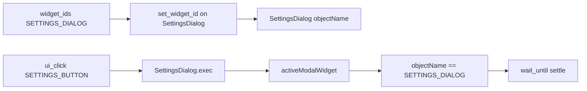
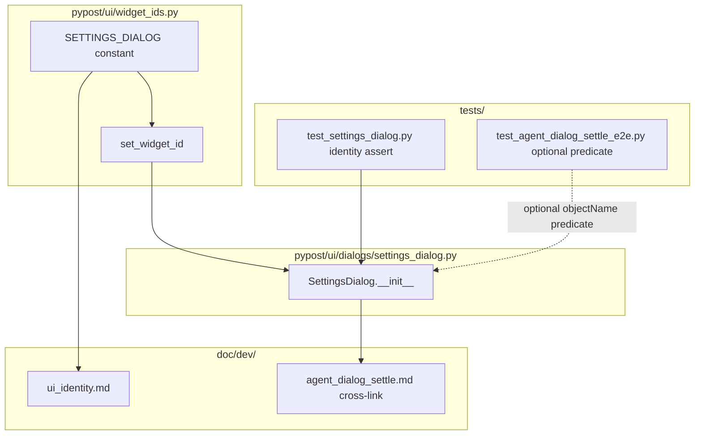

# PYPOST-935: SETTINGS_DIALOG objectName on SettingsDialog

## Research

### Jira / parent debt

- Issue: [PYPOST-935](https://pypost.atlassian.net/browse/PYPOST-935) —
  `SETTINGS_DIALOG` objectName on `SettingsDialog`.
- Source: [PYPOST-919](https://pypost.atlassian.net/browse/PYPOST-919) TD-2
  (Low — identity hygiene deferred from product dialog settle).
- Parent architecture:
  `ai-tasks/PYPOST-919/20-architecture.md` explicitly deferred
  `SETTINGS_DIALOG`; settle proof uses `activeModalWidget()` + title +
  `isinstance`.
- Acceptance: SettingsDialog has `SETTINGS_DIALOG` objectName; optional settle
  predicate update; existing dialog settle e2e still green.

### Current SettingsDialog identity state

| Surface | Widget | Identity today |
| --- | --- | --- |
| Settings entry control | `MainWindow.settings_btn` | `SETTINGS_BUTTON`
  (`pypost_settings_button`) via `set_widget_id` |
| Settings dialog root | `SettingsDialog` (`QDialog`) | **None** — default empty
  `objectName`; window title `"Settings"` only |

`SettingsDialog.__init__` calls `setWindowTitle("Settings")` and builds layout;
no `set_widget_id` call today (`pypost/ui/dialogs/settings_dialog.py`).

### Dialog-settle consumer (PYPOST-919 / PYPOST-934)

| Piece | Role today |
| --- | --- |
| `tests/test_agent_dialog_settle_e2e.py` | Happy path + forced-timeout companion |
| `_settings_dialog_present()` | `activeModalWidget()` + `windowTitle() == "Settings"` +
  `isinstance(modal, SettingsDialog)` |
| `_modal_diag()` | Exposes `dialog_title`, `active_modal_type` on timeout |
| Modal pattern | `QTimer.singleShot` before `ui_click(SETTINGS_BUTTON)` because
  `exec()` blocks |

Docs (`doc/dev/agent_dialog_settle.md`) note Settings has no `objectName` and
presence uses title + type — this story closes that gap.

### Widget-id catalog patterns (in-repo)

| Pattern | Example | Applies here |
| --- | --- | --- |
| Constant + `set_widget_id` at construct | `MAIN_WINDOW`, `SETTINGS_BUTTON` | Yes — stamp dialog in `__init__` |
| `KEY_WIDGET_IDS` membership | Main-window spot-check targets | **No** — modal not under main window during spot-check (same policy as `PLUS_TAB_BUTTON` / `PLUS_TAB_PLACEHOLDER`, PYPOST-921) |
| Dedicated id assertion test | `test_plus_tab_button_uses_pypost_prefix` | Yes — construction-level proof in settings dialog tests |
| Locale-literal lock | `test_widget_ids_are_locale_independent_literals` | Optional export-only; constant need not join `KEY_WIDGET_IDS` |

`set_widget_id` sets `objectName` and mirrors `accessibleIdentifier` on
`QWidget` (`pypost/ui/widget_ids.py`, `doc/dev/ui_identity.md`).

### Agent lookup note

`find_widget(root, widget_id)` searches under a **root** widget
(`pypost/agent/ui_actions.py`). During modal `exec()`, the dialog is not a
descendant of `session.window`, so settle continues to use
`QApplication.activeModalWidget()` — but the predicate can check
`modal.objectName() == SETTINGS_DIALOG` instead of title + `isinstance`.

Future identity-based waits could also use
`activeModalWidget().objectName()` or `findChild` on the modal itself; no new
agent API is required for this ticket.

### Architectural decisions

| Decision | Choice | Rationale |
| --- | --- | --- |
| Constant name | `SETTINGS_DIALOG` | Matches Jira / TD-2 naming |
| Constant value | `"pypost_settings_dialog"` | `pypost_<surface>` convention |
| Apply site | `SettingsDialog.__init__` immediately after `super().__init__` | Single construct path; all tests construct dialog this way |
| Apply how | `set_widget_id(self, SETTINGS_DIALOG)` | Project standard (PYPOST-834) |
| `KEY_WIDGET_IDS` | **Exclude** | Modal; not asserted by main-window spot-check |
| Settle predicate | **Update** `_settings_dialog_present()` to require `objectName` | Simplifies proof; keeps `activeModalWidget()` gate; drops title/`isinstance` coupling (FR5 optional → recommended) |
| `_modal_diag()` | Add `dialog_object_name` scalar (optional) | Better timeout diagnostics; non-breaking additive |
| Docs | Add row to `doc/dev/ui_identity.md` | FR6 discoverability |
| Dialog-settle e2e | Must stay green | FR4 — regression lock |



## Implementation Plan

1. **Step 3 — failing repro (red):** add construction-level identity assertion
   (details below). Expect red: missing constant and/or empty `objectName`.
2. **Step 4 — green:**
   - Export `SETTINGS_DIALOG` in `pypost/ui/widget_ids.py`.
   - Import and call `set_widget_id(self, SETTINGS_DIALOG)` in
     `SettingsDialog.__init__`.
   - Optionally update `_settings_dialog_present()` and `_modal_diag()` in
     `tests/test_agent_dialog_settle_e2e.py`.
   - Update `doc/dev/ui_identity.md` (+ cross-link in
     `doc/dev/agent_dialog_settle.md` if predicate changes).
3. **Verify:** `make test` (new assertion) + `make test-agent-e2e
   PYTEST_ARGS="tests/test_agent_dialog_settle_e2e.py -v"` (FR4).
4. Later workflow steps: cleanup, observability (likely N/A — identity only),
   tech-debt, dev-doc polish.

### Mandatory — Failing Repro (next Step 3)

**Not N/A** — production UI identity change with automated proof.

| Item | Plan |
| --- | --- |
| **Asserts (desired)** | Constructed `SettingsDialog` exposes
  `objectName == SETTINGS_DIALOG` and `accessibleIdentifier` mirror (when
  available). Optionally: dialog-settle predicate requires the same
  `objectName` on `activeModalWidget()`. |
| **Where (primary)** | `tests/test_settings_dialog.py` — new test class or
  method, e.g. `test_settings_dialog_has_stable_widget_id`, with existing
  `pytestmark = pytest.mark.timeout(60)` and `qapp` fixture. Construct
  `SettingsDialog(AppSettings())`, assert id, `close()` in `finally`. |
| **Where (secondary / optional in Step 3 or Step 4)** | `tests/test_agent_dialog_settle_e2e.py` — tighten `_settings_dialog_present()` to check `modal.objectName() == SETTINGS_DIALOG` (import constant). Can land in Step 3 as red behavioral proof or Step 4 together with production stamp. |
| **Force failure (no live network / no HTTP)** | Pure Qt unit test — no agent
  session, no modal timer pattern required for primary red. Today:
  - `ImportError` when importing `SETTINGS_DIALOG` from `widget_ids`, **or**
  - assertion `dlg.objectName() == SETTINGS_DIALOG` fails (empty name) after
    constant is stubbed only in test. |
| **Preferred Step 3 signal** | `ImportError` (missing catalog constant) is the
  clearest “API missing” red; after Step 4 adds constant but before
  `set_widget_id`, construction assertion stays red until apply lands. |
| **Sequencing** | Research (done) → Step 3 red construction test (+ optional
  settle predicate red) → Step 4 constant + `set_widget_id` + optional
  predicate/doc updates → green under `make test` and dialog-settle
  `agent_e2e`. |
| **External deps** | None. |

**Run (Step 3 red / Step 4 green):**

```bash
make test PYTEST_ARGS='tests/test_settings_dialog.py::TestSettingsDialogWidgetIdentity -v'
make test-agent-e2e PYTEST_ARGS='tests/test_agent_dialog_settle_e2e.py -v'
```

## Architecture

### Module diagram



### Module responsibilities

| Module / component | Responsibility in this story |
| --- | --- |
| `pypost/ui/widget_ids.py` | Export `SETTINGS_DIALOG = "pypost_settings_dialog"` |
| `pypost/ui/dialogs/settings_dialog.py` | `set_widget_id(self, SETTINGS_DIALOG)` in `__init__` |
| `tests/test_settings_dialog.py` | Construction-level identity lock (primary proof) |
| `tests/test_agent_dialog_settle_e2e.py` | Optional predicate migration; must remain green |
| `doc/dev/ui_identity.md` | Catalog row for `SETTINGS_DIALOG` |
| `doc/dev/agent_dialog_settle.md` | Note identity-based presence (if predicate updated) |
| PYPOST-919 settle flow | Unchanged timer-before-click + `wait_until` + dismiss |

### Settle predicate (optional green-path update)

Replace title + type check:

```python
# Before (PYPOST-919)
modal.windowTitle() == "Settings" and isinstance(modal, SettingsDialog)

# After (recommended)
modal.objectName() == SETTINGS_DIALOG
```

Keep `activeModalWidget() is not None` gate. Title may remain in `_modal_diag()`
for human-readable timeout output.

### Interfaces / APIs (no new production API)

Surfaces consumed:

```python
from pypost.ui.widget_ids import SETTINGS_DIALOG, set_widget_id

# In SettingsDialog.__init__:
set_widget_id(self, SETTINGS_DIALOG)
```

No changes to `AgentAppSession`, `ui_wait`, or `open_settings` required.

### FR mapping

| Requirement | Architectural answer |
| --- | --- |
| FR1 catalog constant | `SETTINGS_DIALOG` in `widget_ids.py` |
| FR2 apply on dialog | `set_widget_id` in `SettingsDialog.__init__` |
| FR3 automated proof | `test_settings_dialog.py` construction assert |
| FR4 dialog settle green | No change to timer/modal pattern; optional predicate only |
| FR5 optional predicate | `_settings_dialog_present()` uses `objectName` |
| FR6 docs | `ui_identity.md` catalog row |

### Risks and mitigations

| Risk | Mitigation |
| --- | --- |
| Predicate too strict before stamp lands | Step 3 red is intentional; Step 4 applies stamp before predicate ships |
| Spot-check gap for modal | Dedicated construction test; document modal lookup pattern |
| Breaking dialog-settle | Run full `test_agent_dialog_settle_e2e.py` after predicate change |
| Duplicate id with button | Distinct constants: `SETTINGS_BUTTON` vs `SETTINGS_DIALOG` |

## Q&A

| Q | A |
| --- | --- |
| Add to `KEY_WIDGET_IDS`? | No — modal; same policy as plus-tab chrome ids. |
| Use `find_widget(session.window, SETTINGS_DIALOG)` for settle? | No — dialog is not under main window during `exec()`; keep `activeModalWidget()` + `objectName` check. |
| Change window title? | No — human title unchanged; automation uses `objectName`. |
| Must settle predicate migrate? | Optional per acceptance; architecture recommends it once stamp exists. |
| New agent API? | No — identity-only additive change. |
