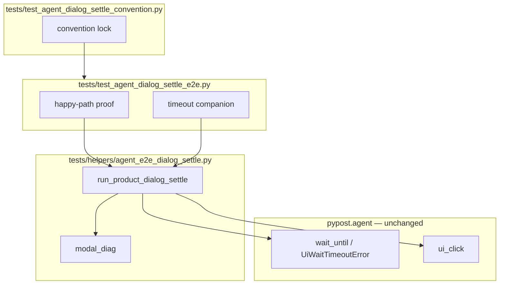

# PYPOST-936: Shared modal settle helper for product dialog proofs

## Research

### Debt lineage

- Story: [PYPOST-936](https://pypost.atlassian.net/browse/PYPOST-936) — extract shared
  modal settle helper.
- Parent: [PYPOST-919](https://pypost.atlassian.net/browse/PYPOST-919) TD-3 — defer
  until second proof.
- Trigger met: [PYPOST-934](https://pypost.atlassian.net/browse/PYPOST-934) added
  `test_agent_dialog_settle_timeout_includes_step_and_modal_diag` in the same module.
- Precedent: `tests/helpers/agent_e2e_send_settle.py` (PYPOST-948) — shared Send settle
  + convention lock in `test_agent_e2e_response_panel.py`.

### Duplicated blocks (both proofs)

| Block | Lines (approx) | Shared? |
| --- | --- | --- |
| `_modal_diag()` | 7 | Yes → helper |
| `UiWaitTimeoutError` rewrap with `step` + modal scalars | 10 | Yes → helper |
| Timer callback try/except/finally + `reject()` | 12 | Yes → helper |
| `QTimer.singleShot` + `ui_click` orchestration | 3 | Yes → helper |
| `_settings_dialog_present()` | 5 | No — Settings-specific, test-local |
| Timeout/budget constants | 2 | No — test-local |

### Modal constraint (unchanged)

`SettingsDialog.exec()` blocks `ui_click`. Helper must schedule settle + dismiss via
`QTimer.singleShot(0, …)` **before** `session.ui_click(click_widget_id)`.

## Implementation Plan

1. **Step 3 — red convention test:** `tests/test_agent_dialog_settle_convention.py`
   asserts `test_agent_dialog_settle_e2e.py` imports and calls
   `run_product_dialog_settle` from `tests.helpers.agent_e2e_dialog_settle`.
2. **Step 4 — helper + refactor:**
   - Add `tests/helpers/agent_e2e_dialog_settle.py` with:
     - `modal_diag()` — scalar modal context
     - `run_product_dialog_settle(...)` — timer + wait + rewrap + dismiss + click
   - Refactor both proofs to call the helper; keep predicates/constants local.
3. **Verify:** `make test-agent-e2e PYTEST_ARGS="tests/test_agent_dialog_settle_e2e.py -v"`.
4. **Steps 5–8:** cleanup notes, observability N/A, tech-debt, dev docs.

### Mandatory — Failing Repro (Step 3)

| Item | Plan |
| --- | --- |
| **Where** | `tests/test_agent_dialog_settle_convention.py` |
| **Assert** | `test_agent_dialog_settle_e2e.py` imports `agent_e2e_dialog_settle` and uses `run_product_dialog_settle` at least twice (both proofs) |
| **Red** | Land convention test before helper/refactor — fails on missing import |
| **Green** | After Step 4 helper + refactor |

## Architecture

### Module diagram



### Helper interface (proposed)

```python
def modal_diag() -> dict[str, object]: ...

def run_product_dialog_settle(
    session: AgentAppSession,
    *,
    click_widget_id: str,
    wait_condition: Callable[[], bool],
    timeout: float,
    message: str,
    condition_name: str,
    step: str,
) -> tuple[bool, list[BaseException]]:
    """Timer-before-click modal settle; returns (settled_ok, callback_errors)."""
```

### FR mapping

| Requirement | Answer |
| --- | --- |
| FR1 shared helper | `tests/helpers/agent_e2e_dialog_settle.py` |
| FR2–FR3 both proofs use helper | Refactor both test functions |
| FR4 diagnostics | Rwrap inside helper with `modal_diag()` |
| FR5 fail-closed dismiss | `finally: reject()` inside helper callback |
| FR6 convention red/green | New convention module |
| FR7 suite green | `make test-agent-e2e` on dialog module |

### Out of scope

- Production API changes.
- New dialog scenarios.
- Golden Send helper edits.

## Q&A

- Q: Why not put helper in conftest?
  A: Follow PYPOST-948 precedent — dedicated `tests/helpers/` module + convention lock.

- Q: Does helper own Settings predicate?
  A: No — callers pass `wait_condition`; Settings proof keeps `_settings_dialog_present`.
