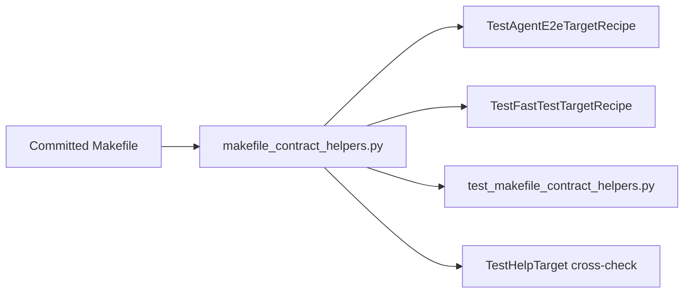

# PYPOST-937: Share Makefile help/recipe parse helpers

## Research

### Source debt

- [PYPOST-922](https://pypost.atlassian.net/browse/PYPOST-922) `60-tech-debt.md`
  follow-up 2: deduplicate `_test_agent_e2e_help_comment` /
  `_test_agent_e2e_default_recipe_body` when more make-entry locks land.
- [PYPOST-937](https://pypost.atlassian.net/browse/PYPOST-937) implements that
  follow-up proactively (ticket prefers implementing the shared helper).

### Current state

| Piece | Location | Notes |
| --- | --- | --- |
| Local help parser | `tests/test_makefile.py` | Hard-coded `test-agent-e2e:` |
| Local recipe parser | `tests/test_makefile.py` | Hard-coded `test-agent-e2e:` |
| PYPOST-922 locks | `TestAgentE2eTargetRecipe` | 3 tests |
| Runtime help lock | `TestHelpTarget` | Parses `make help` stdout only |

### Architectural decision: module placement

| Option | Pros | Cons |
| --- | --- | --- |
| A. `tests/makefile_contract_helpers.py` | Clear import path; mirrors CI YAML helpers pattern (PYPOST-928) | New file |
| B. Inline in `test_makefile.py` | No new file | Still duplicated when second file imports |
| C. `tests/conftest.py` | Shared fixture home | Wrong abstraction for pure functions |

**Decision: Option A.** Small dedicated module imported by lock tests.

### Architectural decision: second consumer

| Option | Pros | Cons |
| --- | --- | --- |
| A. `TestFastTestTargetRecipe` on `test` | Proves reuse; locks existing `-m "not slow"` default | Slightly expands lock surface |
| B. Unit tests only | Minimal diff | Does not meet “multiple make-entry locks” wording |
| C. Doc-only N/A | Cheapest | Fails Jira acceptance |

**Decision: Option A** plus dedicated unit tests in
`tests/test_makefile_contract_helpers.py`.

## Implementation Plan

1. **Step 3:** Add `tests/test_makefile_contract_helpers.py` importing
   `tests.makefile_contract_helpers` — fails with `ImportError` until Step 4.
2. **Step 4:** Implement helpers; refactor `TestAgentE2eTargetRecipe` and
   `TestHelpTarget`; add `TestFastTestTargetRecipe`.
3. **Steps 5–7:** Cleanup, observability N/A, tech-debt.
4. **Step 8:** Pointer in `doc/dev/testing.md` Makefile automation section.

## Architecture

### Modules

| Module | Responsibility |
| --- | --- |
| `tests/makefile_contract_helpers.py` | `makefile_target_help_comment`, `makefile_target_recipe_body` |
| `tests/test_makefile.py` | Make-entry lock consumers |
| `tests/test_makefile_contract_helpers.py` | Unit tests for both target shapes |

### Failing Repro (Step 3)

- **Assert:** `from tests.makefile_contract_helpers import ...` succeeds and
  functions return expected substrings for `test-agent-e2e` and `test`.
- **Red reason:** Module does not exist until Step 4.
- **No production edits in Step 3.**

## Q&A

- Q: Will PYPOST-922 tests change semantics?
  A: No. Same substrings; parameterized target name only.

- Q: Observability?
  A: N/A — test-only refactor.
